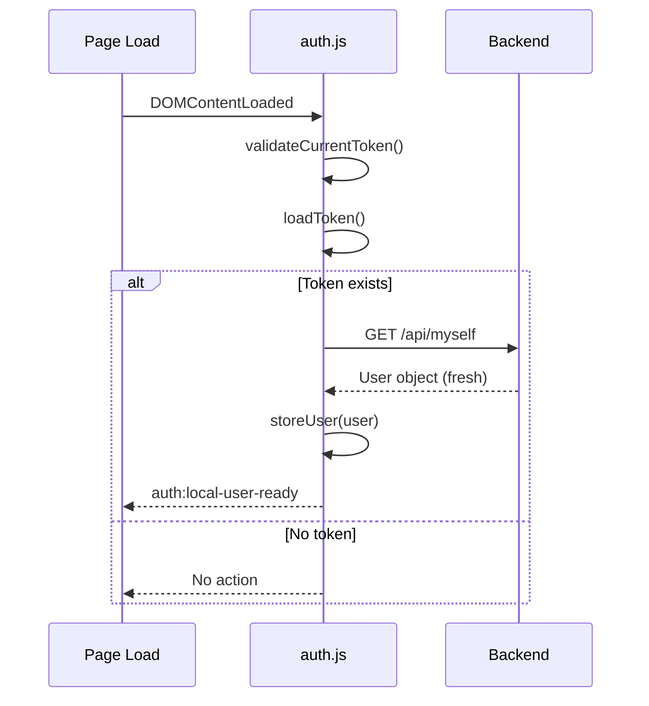
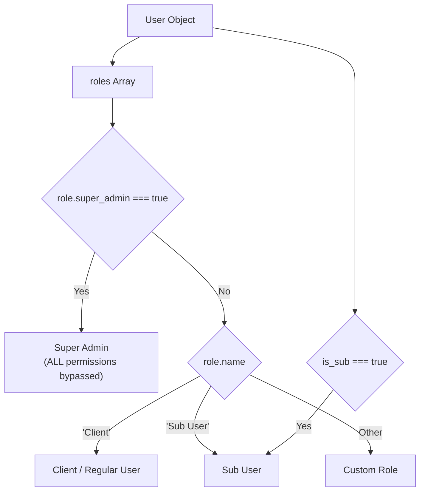
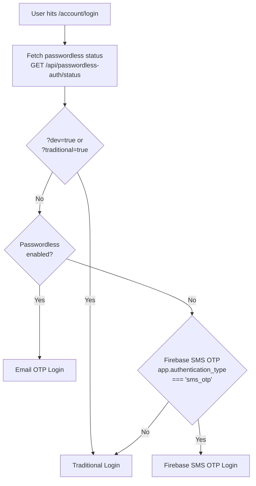
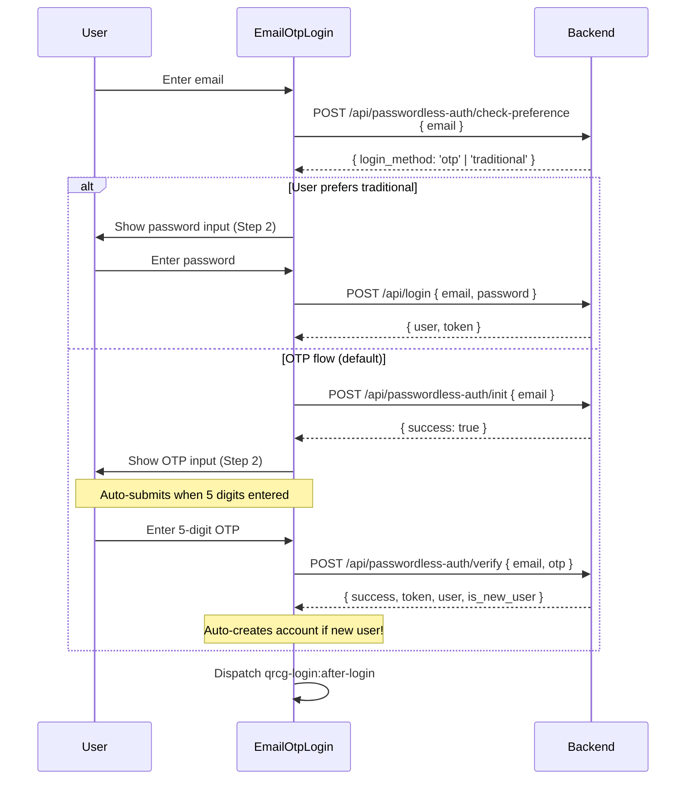
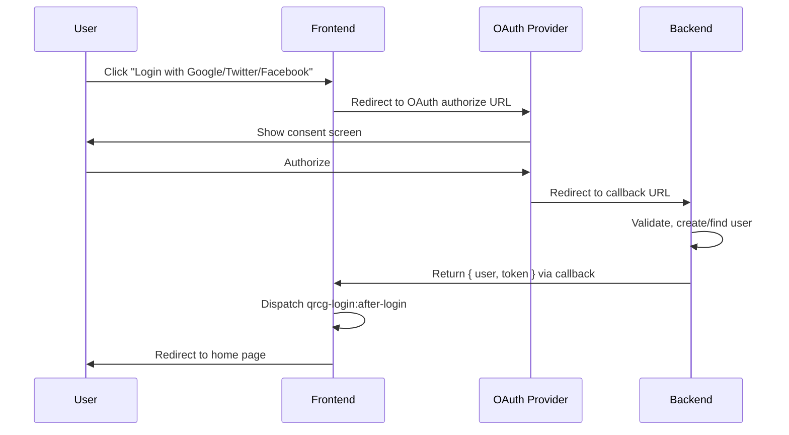
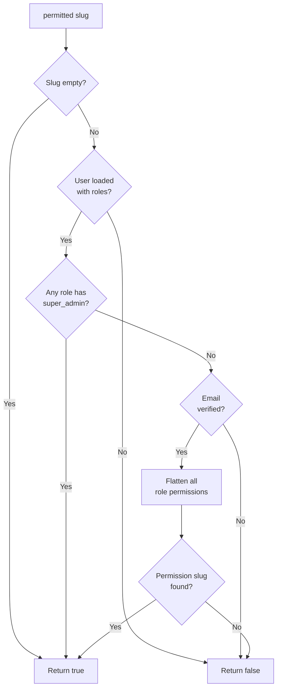
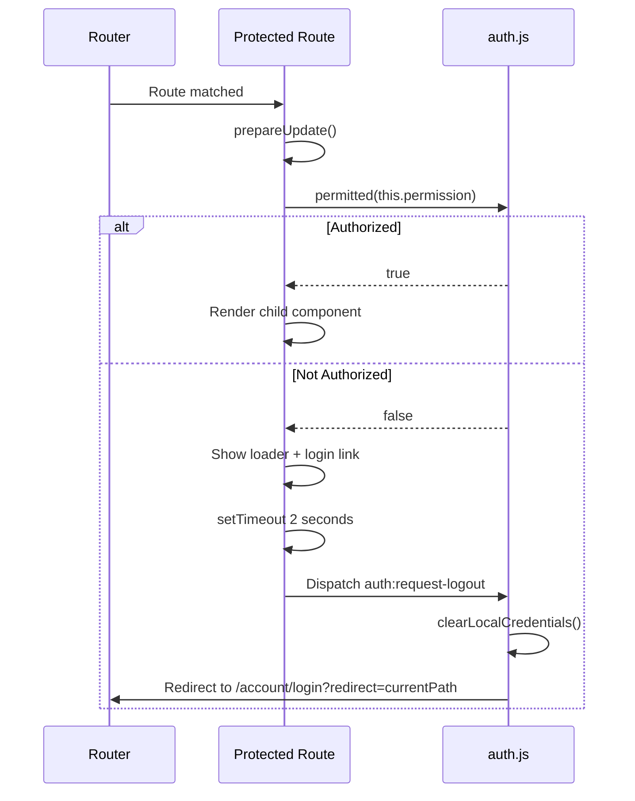
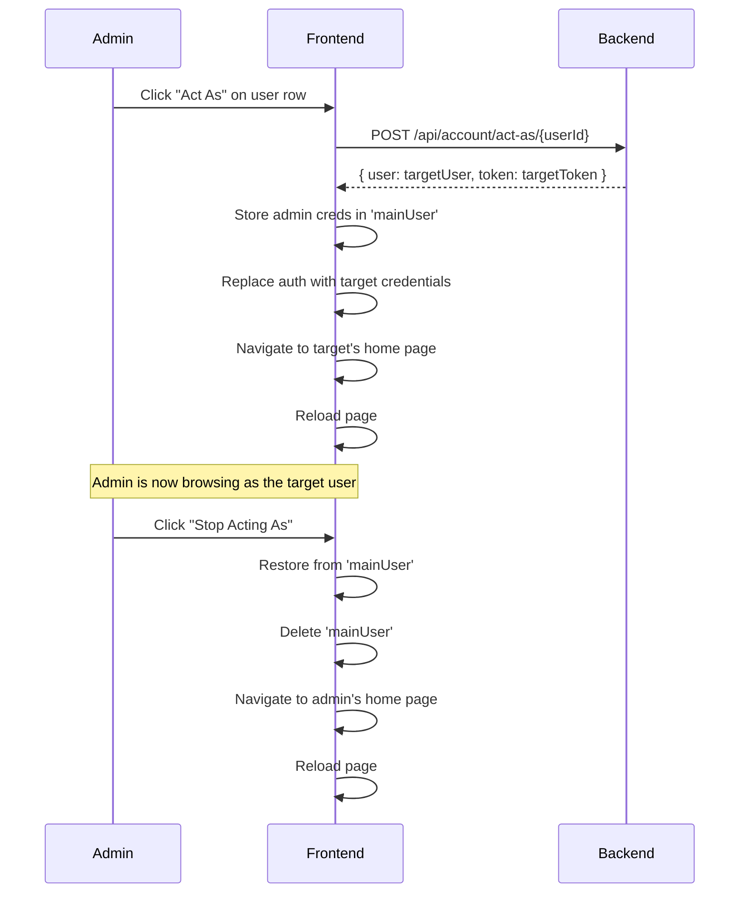
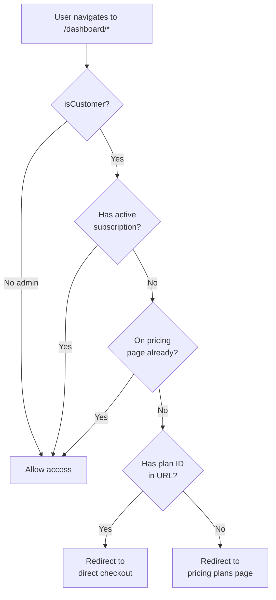
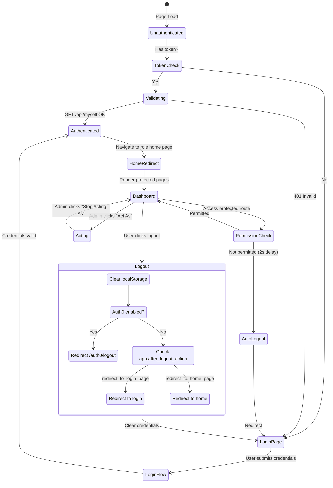

# Admin/User Authentication & Authorization Flow

Comprehensive documentation of the authentication, authorization, user identification, and access control systems in the `qr-code-frontend` project.

---

## Table of Contents

1. [Architecture Overview](#1-architecture-overview)
2. [Authentication Core (`core/auth.js`)](#2-authentication-core)
3. [API Token Management](#3-api-token-management)
4. [User Identity Functions](#4-user-identity-functions)
5. [Login Flows](#5-login-flows)
6. [Registration Flow](#6-registration-flow)
7. [Email Verification](#7-email-verification)
8. [Password Recovery](#8-password-recovery)
9. [OAuth / Social Login](#9-oauth--social-login)
10. [Auth0 Integration](#10-auth0-integration)
11. [Permission System (RBAC)](#11-permission-system-rbac)
12. [Protected Route Enforcement](#12-protected-route-enforcement)
13. [User Roles & Management](#13-user-roles--management)
14. [Sub-User System](#14-sub-user-system)
15. [Admin Capabilities](#15-admin-capabilities)
16. [Checkout Enforcement](#16-checkout-enforcement)
17. [Session Lifecycle](#17-session-lifecycle)
18. [Account Routes Summary](#18-account-routes-summary)
19. [Security Rules & Regulations](#19-security-rules--regulations)
20. [API Endpoints Reference](#20-api-endpoints-reference)

---

## 1. Architecture Overview

```mermaid
graph TB
    subgraph "Authentication Layer"
        LOGIN[Login Page] --> LTS[Login Type Selector]
        LTS --> TL[Traditional Login]
        LTS --> EOL[Email OTP Login]
        LTS --> PL[Passwordless/Firebase SMS]
        SIGNUP[Sign Up] --> REG[Register Flow]
        OAUTH[OAuth Buttons] --> AM[AuthManager]
        AM --> GOOGLE[Google]
        AM --> TWITTER[Twitter]
        AM --> FACEBOOK[Facebook]
    end

    subgraph "Token Management"
        TL --> |POST /api/login| TOKEN[Bearer Token]
        EOL --> |POST /api/passwordless-auth/verify| TOKEN
        PL --> |POST /api/passwordless-login| TOKEN
        OAUTH --> |POST /api/auth-workflow/{provider}/callback| TOKEN
        TOKEN --> LS[localStorage]
        LS --> |auth:token| API_HEADER[Authorization: Bearer ...]
        LS --> |auth:user| USER_OBJ[User Object + Roles + Permissions]
    end

    subgraph "Authorization Layer"
        API_HEADER --> API[API Requests]
        USER_OBJ --> PERM[permitted slug]
        PERM --> |check| SA{Super Admin?}
        SA --> |Yes| ALLOW[Allow ALL]
        SA --> |No| VERF{Verified?}
        VERF --> |No| DENY[Deny]
        VERF --> |Yes| SLUG{Slug in roles.permissions?}
        SLUG --> |Yes| ALLOW
        SLUG --> |No| DENY
    end

    subgraph "Route Protection"
        PERM --> PR[qrcg-protected-route]
        PR --> |authorized| RENDER[Render Page]
        PR --> |unauthorized| LOGOUT[Auto-Logout 2s]
    end
```

---

## 2. Authentication Core

**File:** `src/core/auth.js` (399 lines)

The central authentication module manages all user identity, token storage, login/logout events, and permission checks.

### State Storage

| Key | Storage | Content |
|-----|---------|---------|
| `auth:user` | `localStorage` (JSON) | Full user object with roles, permissions, subscriptions |
| `auth:token` | `localStorage` (string) | Bearer token string |
| `mainUser` | `localStorage` (JSON) | Original admin user/token when impersonating |

### Core Functions

| Function | Purpose |
|----------|---------|
| `login(user, token)` | Stores user + token in localStorage |
| `loggedIn()` | Returns `true` if both user and token exist |
| `verified()` | Returns `true` if `email_verified_at` is not empty |
| `loadUser()` | Returns parsed user object from localStorage |
| `loadToken()` | Returns token string from localStorage |
| `hasToken()` | Returns `true` if token exists |
| `logout()` | Dispatches `auth:request-logout` event |
| `clearLocalCredentials()` | Removes user, token, and mainUser from localStorage |

### Event System

| Event | Fired When | Handler |
|-------|-----------|---------|
| `qrcg-login:after-login` | Login succeeds | Stores credentials, redirects to home page |
| `auth:local-user-ready` | User data refreshed from API | Components can react to updated user |
| `auth:request-logout` | Logout requested | Clears credentials, redirects to login |
| `auth:invalid-token` | Token validation fails (401) | Clears credentials, triggers logout |
| `subscription:changed` | User data refreshed | Notifies subscription-dependent components |

---

## 3. API Token Management

**File:** `src/core/api.js` (166 lines)

### Token Transmission

Every API request automatically includes the Bearer token:

```javascript
if (hasToken()) {
    defaultHeaders['Authorization'] = `Bearer ${loadToken()}`
}
```

### Request Headers

| Header | Value |
|--------|-------|
| `Accept` | `application/json` |
| `content-type` | `application/json` (removed for FormData uploads) |
| `Authorization` | `Bearer {token}` (when logged in) |

### Token Validation

On page load, the system validates the stored token:



### Refresh User Data

`refreshUserData()` is called after subscription changes or payments:
- Clears cached user
- Fetches fresh user from `GET /api/myself`
- Processes subscription data, finds active plan
- Fires `subscription:changed` then `auth:local-user-ready`

---

## 4. User Identity Functions

The system identifies users through role-based checks on the locally stored user object.

### Identity Hierarchy



### Identity Functions

| Function | Logic | Returns `true` when |
|----------|-------|---------------------|
| `isSuperAdmin(user?)` | `user.roles.some(r => r.super_admin)` | Any role has `super_admin: true` flag |
| `isCustomer()` | `roles[0].name === 'Client' \|\| 'Sub User'` | First role is Client or Sub User |
| `isClient()` | `roles.filter(r => r.name === 'Client').length > 0` | Any role named "Client" |
| `isSubUser()` | `loadUser()?.is_sub` | User has `is_sub` flag set |

### Home Page Resolution

```javascript
function userHomePage() {
    const user = loadUser()
    const path = user.is_sub
        ? 'parent_user.roles[0].home_page'  // Sub user → parent's role home
        : 'roles[0].home_page'              // Regular → own role home
    return getObjectProperty(user, path)
}
```

Each role defines its own `home_page` path (e.g., `/dashboard/qrcodes`), so admins and clients land on different pages after login.

---

## 5. Login Flows

**Router:** `src/account/qrcg-account-router.js` → `/account/login`  
**Selector:** `src/account/login-type-selector.js` (85 lines)

### Login Mode Selection



### 5.1 Traditional Login

**Component:** `src/account/login/traditional.js` (208 lines)

| Step | Action |
|------|--------|
| 1 | User enters email + password |
| 2 | Submit → `POST /api/login` with `{ email, password }` |
| 3 | Receives `{ user, token }` in response |
| 4 | Fires `qrcg-login:after-login` event |
| 5 | `core/auth.js` stores credentials + redirects to `userHomePage()` or `?redirect` param |

**UI Elements:**
- Email input (autofocus)
- Password input
- "Did you forget your password?" link → `/account/forgot-password`
- Login button
- Register button (hidden when `app.new_user_registration === 'disabled'`)
- OAuth buttons from AuthManager
- Google Auth button ("OR" section)

### 5.2 Email OTP Login (Passwordless)

**Component:** `src/account/login/email-otp.js` (595 lines)

3-step flow with per-user preference override:



**Key Features:**
- Step indicator (1 → 2) with visual progress
- Auto-submit on 5-digit OTP completion
- 60-second resend countdown
- "Change Email" back button
- Per-user login preference (allows traditional password for specific users even when OTP mode is global)
- Creates new accounts automatically if email is not registered

### 5.3 Firebase SMS OTP Login (Legacy)

**Component:** `src/account/login/passwordless.js` (203 lines)

| Step | Action |
|------|--------|
| 1 | User enters mobile number via `qrcg-mobile-input` |
| 2 | Firebase sends SMS OTP → `POST /api/passwordless-login` |
| 3 | User enters 6-digit OTP code |
| 4 | Firebase verifies OTP → gets Google token |
| 5 | Sends Google token + mobile data to `POST /api/passwordless-login` |
| 6 | Receives `{ user, token }` → triggers login event |

---

## 6. Registration Flow

**Route:** `/account/sign-up`  
**Component:** `src/account/qrcg-sign-up.js` (246 lines)

### Registration Process

```mermaid
flowchart TD
    START[User navigates to /account/sign-up] --> DISABLED{Registration<br/>enabled?}
    DISABLED --> |app.new_user_registration<br/>=== 'disabled'| BLOCKED[Show "Registrations disabled"]
    DISABLED --> |Enabled| FORM[Show Sign-Up Form]
    FORM --> FILL[User fills:<br/>Name, Email, Mobile?,<br/>Password, Confirm Password]
    FILL --> TERMS{Terms<br/>consent?}
    TERMS --> |No| TOAST["You must agree to terms"]
    TERMS --> |Yes| SUBMIT[POST /api/register]
    SUBMIT --> VERIFY{Email verification<br/>enabled?}
    VERIFY --> |Yes| OTP_PAGE[Redirect to /account/verify-email<br/>OTP expires in 10 minutes]
    VERIFY --> |No| AUTO_LOGIN[Auto login via<br/>TraditionalLogin.login]
```

### Registration Fields

| Field | Name | Required | Notes |
|-------|------|----------|-------|
| Name | `name` | Yes | Full name |
| Email | `email` | Yes | Must be unique |
| Mobile | `mobile` | Conditional | Based on `QrcgMobileInput.renderBasedOnConfigs()` |
| Password | `password` | Yes | Subject to password rules |
| Confirm Password | `password_confirmation` | Yes | Must match |
| Terms Consent | `terms_consent` | Yes | Checkbox required |

### Registered User Default State

- **Role:** Client (assigned server-side)
- **Permissions:** Only those granted to Client role
- **Email Verified:** No (if email verification enabled)
- **Subscription:** None (will be redirected to pricing plans)

---

## 7. Email Verification

**Route:** `/account/verify-email`  
**Component:** `src/account/qrcg-verify-email.js` (150 lines)

| Step | Action |
|------|--------|
| 1 | User enters 5-digit OTP received via email |
| 2 | Auto-submits when 5 digits entered |
| 3 | `POST /api/account/verify-otp-code` with `{ otp, email }` |
| 4 | On success: triggers `TraditionalLogin.login(signUpData)` → auto-login |
| 5 | On failure: shows "Invalid or expired OTP" toast |

**Actions:**
- Submit OTP
- Resend OTP → `POST /api/account/resend-otp-code`
- Go to sign up page

---

## 8. Password Recovery

### 8.1 Forgot Password

**Route:** `/account/forgot-password`  
**Component:** `src/account/qrcg-forgot-password.js` (7,975 bytes)

- User enters email
- System sends password reset link via email
- Redirected after successful request

### 8.2 Reset Password

**Route:** `/account/reset-password`  
**Component:** `src/account/qrcg-reset-password.js` (14,619 bytes)

- User enters new password + confirmation
- Token from email link validates the reset request
- On success: auto-login or redirect to login page

---

## 9. OAuth / Social Login

**Files:** `src/auth-workflow/`

### AuthManager Singleton

`auth-manager.js` manages OAuth workflow registration:

```javascript
// Registered providers
AuthManager.register(GoogleAuthWorkflow)
AuthManager.register(TwitterAuthWorkflow)
AuthManager.register(FacebookAuthWorkflow)

// Enabled check via window.QRCG_ENABLED_WORKFLOWS
instance.getEnabledWorkflows()
```

### OAuth Flow



### Provider Configuration (Admin)

| Provider | Config Keys |
|----------|-------------|
| Google | `auth-workflow.google.enabled`, `auth-workflow.google.client_id`, `auth-workflow.google.client_secret` |
| Twitter | `auth-workflow.twitter.enabled`, `auth-workflow.twitter.client_id`, `auth-workflow.twitter.client_secret` |
| Facebook | `auth-workflow.facebook.enabled`, `auth-workflow.facebook.client_id`, `auth-workflow.facebook.client_secret` |

---

## 10. Auth0 Integration

**File:** `src/account/auth0-manager.js`

- Enabled via system configuration
- Overrides logout flow: redirects to `/auth0/logout` instead of standard logout
- Callback handler: `src/account/qrcg-auth0-callback-handler.js`

---

## 11. Permission System (RBAC)

### Permission Check Flow



### Code Implementation

```javascript
export function permitted(slug) {
    if (isEmpty(slug)) return true            // No permission required
    const user = loadUser()
    if (isEmpty(user) || isEmpty(user.roles)) return false

    // Super admin bypasses ALL permission checks
    const superAdmin = user.roles.reduce(
        (sa, role) => sa || role.super_admin, false
    )
    if (superAdmin) return true

    if (!verified()) return false              // Must verify email first

    // Flatten all permissions from all roles
    const permissions = user.roles
        .map(role => role.permissions)
        .reduce((perms, arr) => perms.concat(arr), [])

    return !!permissions.find(p => p.slug === slug)
}
```

### Permission Slug Convention

Permissions follow a `resource.action` pattern:

| Group | Example Slugs |
|-------|---------------|
| **system** | `system.status`, `system.settings`, `system.notifications`, `system.sms-portals`, `system.logs`, `system.cache` |
| **user** | `user.list-all`, `user.store` |
| **role** | `role.list-all`, `role.store` |
| **domain** | `domain.list-all`, `domain.update-any`, `domain.add` |
| **qrcode** | `qrcode.list-all`, `qrcode.store` (inferred) |

### Permission Groups (UI)

**File:** `src/roles-module/permissions-input/`

Permissions are fetched from `GET /api/permissions` and grouped by slug prefix:

```
permission.slug = "system.settings"
                    ↓
group.slug = "system" (extracted via slug.split('.')[0])
```

Each group shows a checkbox header (toggles all) + individual permission checkboxes.

---

## 12. Protected Route Enforcement

**File:** `src/core/qrcg-protected-route.js` (130 lines)

### How It Works



### Usage Pattern

```html
<qrcg-protected-route
    route="/dashboard/system/settings$"
    permission="system.settings"
>
    <template>
        <qrcg-system-settings-form></qrcg-system-settings-form>
    </template>
</qrcg-protected-route>
```

### Unauthorized View

When access is denied, the component shows:
- A centered loader animation
- "Click here if you are not redirected automatically" login link
- After 2 seconds: auto-redirects to `/account/login?redirect={currentPath}`

---

## 13. User Roles & Management

### Roles Module

**Router:** `src/roles-module/router.js`

| Route | Permission | Component |
|-------|-----------|-----------|
| `/dashboard/roles` | `role.list-all` | Role List |
| `/dashboard/roles/new\|edit/{id}` | `role.store` | Role Form |

### Role Structure

| Property | Type | Description |
|----------|------|-------------|
| `id` | Number | Unique ID |
| `name` | String | Role display name (e.g., "Client", "Admin") |
| `home_page` | String | Default landing page path (e.g., `/dashboard/qrcodes`) |
| `super_admin` | Boolean | Bypasses all permission checks |
| `read_only` | Boolean | Cannot be edited/deleted in UI |
| `permissions` | Array | List of permission objects with `{ id, slug, name }` |
| `permission_count` | Number | Count of assigned permissions |
| `user_count` | Number | Count of users with this role |

### Role List Columns

| Column | Key |
|--------|-----|
| ID | `id` |
| Name | `name` (with `qrcg-role-name` badge) |
| Permissions | `permission_count` |
| Users | `user_count` |
| Created at | `created_at` |
| Actions | Edit, Delete (hidden for `read_only` roles) |

### Role Form Fields

| Field | Input | Purpose |
|-------|-------|---------|
| Name | Text | Role display name |
| Home Page Path | Text | Landing page after login (e.g., `/dashboard/qrcodes`) |
| Permissions | `qrcg-permissions-input` | Grouped checkbox selector |

### Users Module

**Router:** `src/users-module/qrcg-user-router.js`

| Route | Permission | Component |
|-------|-----------|-----------|
| `/dashboard/users` | `user.list-all` | User List |
| `/dashboard/users/new\|edit/{id}` | `user.store` | User Form |

### User List Columns

| Column | Key | Notes |
|--------|-----|-------|
| ID | `id` | — |
| Name | `name` | — |
| Email | `email` | — |
| Mobile | `mobile_number` | — |
| Role | `roles[0].name` | First role name |
| QRs | `qrcodes_count` | Number of QR codes |
| Scans | `scans` | Total scan count |
| Main User | `parent_user.name` | For sub-users: shows parent |
| Created at | `created_at` | — |
| Actions | — | Act As, Edit, Magic Login URL, Delete, Reset Role, Reset Scan Limits |

### User Form Fields

| Field | Input | Notes |
|-------|-------|-------|
| Name | Text | Required |
| Email | Email | Required, unique |
| Mobile | `qrcg-mobile-input` | Conditional on config |
| Password | Password | Leave empty to keep unchanged |
| Confirm Password | Password | Must match |
| Role | `qrcg-relation-select` (endpoint: roles) | Dropdown, shows "Sub User" label if `is_sub` |
| Email Verification | Button / Date | Admin can manually verify; shows date if verified |
| Account Balance | `qrcg-account-balance-input` | Manage user balance |
| Sub Users | `qrcg-subusers` | Manage sub-users inline |

---

## 14. Sub-User System

**Component:** `src/account/qrcg-subusers.js` (763 lines)

Sub-users are child accounts under a parent user, sharing resources with restricted access.

### Sub-User Properties

| Property | Description |
|----------|-------------|
| `is_sub` | Boolean flag indicating sub-user status |
| `parent_user` | Reference to main/parent user object |
| `parent_user.roles[0].home_page` | Sub-users use parent's role for home page resolution |

### Sub-User Management Flow

```mermaid
flowchart TD
    ADMIN[Admin / Parent User] --> VIEW[View Sub-Users Section]
    VIEW --> INVITE[Invite Sub User]
    INVITE --> |POST /api/sub-users/invite| EMAIL[Send email invitation<br/>with access details]
    VIEW --> LIST[List Existing Sub-Users]
    LIST --> FOLDER[Assign Folders<br/>folder-level access]
    LIST --> DELETE[Delete Sub-User<br/>DELETE /api/sub-users/{id}]
    VIEW --> LIMIT{Invited users<br/>limit reached?}
    LIMIT --> |Yes| MSG[Show limit reached message]
    LIMIT --> |No| INVITE
```

### Sub-User Capabilities

| Feature | Access |
|---------|--------|
| Home page | Inherited from parent's role |
| Permissions | Inherited as "Sub User" role |
| QR Codes | Restricted to assigned folders |
| Resources | Shared with parent account |

---

## 15. Admin Capabilities

Admins (Super Admin or users with `user.*` permissions) have elevated powers:

### Admin-Only Actions on Users

| Action | API Call | Description |
|--------|---------|-------------|
| **Act As** | `POST /api/account/act-as/{userId}` | Impersonate any user. Stores original admin credentials in `mainUser` localStorage key. Navigate as that user. Click "Stop Acting As" to return. |
| **Magic Login URL** | `POST /api/account/generate-magic-login-url/{userId}` | Generates a one-time login URL valid for 24 hours. Shown in a modal with copy button. |
| **Manual Email Verify** | `POST /api/users/verify-email/{userId}` | Admin can manually verify a user's email without OTP |
| **Reset Role** | `POST /api/users/{userId}/reset-role` | Clears user's role assignment |
| **Reset Scan Limits** | `POST /api/users/{userId}/reset-scans-limit` | Resets scan quota to zero |
| **Delete User** | `DELETE /api/users/{userId}` | Cascading delete: removes QR codes, subscriptions, and transactions |
| **Create User** | `POST /api/users` | Admin can create users directly with role assignment |

### Impersonation (Act As) Flow



---

## 16. Checkout Enforcement

**File:** `src/account/checkout-enforcement/enforce-checkout-when-user-has-no-plan.js`

### Rule: Customers Must Have a Subscription



**Only applies to:**
- Customers (`isCustomer()` = `true`)
- When on dashboard URLs (`/dashboard/*`)
- When user has no active subscription

**Does NOT apply to:**
- Super Admins
- Custom admin roles
- Non-dashboard pages

---

## 17. Session Lifecycle

### Complete Session Flow



### After Logout Actions

Configured via `app.after_logout_action`:

| Value | Behavior |
|-------|----------|
| `redirect_to_login_page` (default) | Go to `/account/login` + reload |
| `redirect_to_home_page` | Go to `/` |
| Auth0 enabled | Go to `/auth0/logout` (overrides above) |

---

## 18. Account Routes Summary

### Public Routes (No Auth Required)

| Route | Component | Purpose |
|-------|-----------|---------|
| `/account/login` | `qrcg-login-type-selector` | Login page with mode selection |
| `/account/sign-up` | `qrcg-sign-up` | Registration form |
| `/account/forgot-password` | `qrcg-forgot-password` | Request password reset |
| `/account/reset-password` | `qrcg-reset-password` | Set new password |
| `/account/verify-email` | `qrcg-verify-email` | OTP email verification |
| `/account/email-verified` | `qrcg-email-verified` | Verification success |
| `/account/privacy-policy` | `qrcg-privacy-policy` | Privacy policy page |
| `/account/terms-of-use` | `qrcg-terms-of-use` | Terms of use page |
| `/account/piecex-demo` | `qrcg-piecex-demo` | Demo page |

### Protected Routes (Auth Required)

| Route | Component | Permission |
|-------|-----------|-----------|
| `/account/my-account` | `qrcg-my-account-page` | Any authenticated user |
| `/account/upgrade` | `qrcg-hosted-account-upgrade` | Any authenticated user |
| `/dashboard/users` | `qrcg-user-list-page` | `user.list-all` |
| `/dashboard/users/new\|edit/{id}` | `qrcg-user-form-page` | `user.store` |
| `/dashboard/roles` | `qrcg-role-list-page` | `role.list-all` |
| `/dashboard/roles/new\|edit/{id}` | `qrcg-role-form-page` | `role.store` |

### Redirect Rules

| From | To | Condition |
|------|----|-----------|
| `/account/login` | `userHomePage()` | Already logged in |
| `/account/sign-up` | `userHomePage()` | Already logged in |
| `/account/sign-up` | `/account/login` | Passwordless auth enabled |
| `/account/forgot-password` | `userHomePage()` | Already logged in |
| `/account/reset-password` | `userHomePage()` | Already logged in |
| `/account/verify-email` | `userHomePage()` | Already verified |
| `/account/email-verified` | `userHomePage()` | Already verified |
| `/account/dashboard` | `userHomePage()` | Always |

---

## 19. Security Rules & Regulations

### For Admin (Super Admin)

| Rule | Enforcement |
|------|-------------|
| **Bypass all permissions** | `permitted()` returns `true` for any slug when `role.super_admin === true` |
| **No email verification required** | Super admin bypasses the `verified()` check in `permitted()` |
| **Can impersonate any user** | Act As feature stores original creds in `mainUser` |
| **Can generate magic login URLs** | 24-hour validity, one-time use |
| **Can manually verify emails** | Admin UI provides "Verify Email" button per user |
| **Can reset user roles** | Clears role assignment |
| **Can reset scan limits** | Resets usage counters |
| **Can delete users** | Cascades to QR codes, subscriptions, transactions |
| **Can manage all roles** | CRUD with permission assignment |
| **Can manage system settings** | All 10 settings tabs, notifications, SMS, auth-workflow |
| **Home page** | Defined by role's `home_page` (typically `/dashboard/system/status`) |

### For Regular Users (Client)

| Rule | Enforcement |
|------|-------------|
| **Must verify email** | `verified()` check blocks access to protected routes if `email_verified_at` is null |
| **Must have subscription** | `EnforceCheckoutWhenUserHasNoPlan` redirects to pricing when on dashboard without plan |
| **Limited permissions** | Only permissions assigned to their role are accessible |
| **No system access** | Cannot access `/dashboard/system/*` routes without `system.*` permissions |
| **No user management** | Cannot access `/dashboard/users` without `user.list-all` |
| **No role management** | Cannot access `/dashboard/roles` without `role.list-all` |
| **Can manage sub-users** | Within their subscription limits |
| **Home page** | Defined by Client role's `home_page` (typically `/dashboard/qrcodes`) |
| **Terms of Use consent** | Required during registration |

### For Sub-Users

| Rule | Enforcement |
|------|-------------|
| **Inherited permissions** | Gets "Sub User" role permissions |
| **Folder-restricted access** | Can only access QR codes in assigned folders |
| **Home page from parent** | Uses `parent_user.roles[0].home_page` |
| **No sub-user management** | Cannot invite their own sub-users |
| **Shared subscription** | Uses parent's subscription quota |

### Token & Session Rules

| Rule | Detail |
|------|--------|
| **Bearer token auth** | Every API request includes `Authorization: Bearer {token}` |
| **Token validates on load** | `GET /api/myself` called on every page load |
| **Invalid token → logout** | `auth:invalid-token` event clears all credentials |
| **Auto-logout on 403** | Protected routes auto-redirect after 2 seconds |
| **No session persistence** | Token stored in localStorage; survives page refresh but not clearing browser data |
| **Impersonation isolation** | Original admin credentials preserved in separate `mainUser` key |
| **Cross-tab sync** | `storage` event listener enables cross-tab credential sync |

### Password Security (Configurable)

Settings in `Advanced → Password Rules`:

| Setting | Description |
|---------|-------------|
| Min length | Minimum password character count |
| Require uppercase | Must include uppercase letter |
| Require lowercase | Must include lowercase letter |
| Require numbers | Must include digit |
| Require symbols | Must include special character |

### Account Lock (Configurable)

Settings in `Advanced → Account Lock`:

| Setting | Description |
|---------|-------------|
| Max failed attempts | Number of failed login attempts before lock |
| Lock duration | How long the account stays locked |

---

## 20. API Endpoints Reference

### Authentication

| Method | Endpoint | Purpose | Auth Required |
|--------|----------|---------|---------------|
| `POST` | `/api/login` | Traditional email+password login | No |
| `POST` | `/api/register` | New user registration | No |
| `GET` | `/api/myself` | Validate token + get user data | Yes |
| `POST` | `/api/passwordless-login` | Firebase SMS OTP login | No |
| `GET` | `/api/passwordless-auth/status` | Check if passwordless is enabled | No |
| `POST` | `/api/passwordless-auth/check-preference` | User login method preference | No |
| `POST` | `/api/passwordless-auth/init` | Send email OTP | No |
| `POST` | `/api/passwordless-auth/verify` | Verify email OTP + login/register | No |
| `POST` | `/api/passwordless-auth/resend` | Resend email OTP | No |
| `POST` | `/api/account/verify-otp-code` | Verify registration email OTP | Yes (token only) |
| `POST` | `/api/account/resend-otp-code` | Resend registration email OTP | Yes (token only) |

### Admin User Management

| Method | Endpoint | Purpose | Permission |
|--------|----------|---------|------------|
| `GET` | `/api/users` | List all users | `user.list-all` |
| `POST` | `/api/users` | Create user | `user.store` |
| `GET` | `/api/users/{id}` | Get user details | `user.store` |
| `PUT` | `/api/users/{id}` | Update user | `user.store` |
| `DELETE` | `/api/users/{id}` | Delete user (cascading) | `user.store` |
| `POST` | `/api/users/verify-email/{id}` | Admin verify user email | `user.store` |
| `POST` | `/api/users/{id}/reset-role` | Reset user role | `user.store` |
| `POST` | `/api/users/{id}/reset-scans-limit` | Reset scan limits | `user.store` |
| `POST` | `/api/account/act-as/{id}` | Impersonate user | Super Admin |
| `POST` | `/api/account/generate-magic-login-url/{id}` | Generate magic login | Super Admin |

### Roles & Permissions

| Method | Endpoint | Purpose | Permission |
|--------|----------|---------|------------|
| `GET` | `/api/roles` | List all roles | `role.list-all` |
| `POST` | `/api/roles` | Create role | `role.store` |
| `PUT` | `/api/roles/{id}` | Update role | `role.store` |
| `DELETE` | `/api/roles/{id}` | Delete role | `role.store` |
| `GET` | `/api/permissions` | List all permissions | `role.store` |

### Sub-Users

| Method | Endpoint | Purpose |
|--------|----------|---------|
| `GET` | `/api/sub-users` | List sub-users of current/target user |
| `POST` | `/api/sub-users/invite` | Invite new sub-user via email |
| `DELETE` | `/api/sub-users/{id}` | Remove sub-user |

---

*Generated from source analysis of `qr-code-frontend` authentication, authorization, and user management systems.*
