# QR Code Frontend — Billing & Subscription Routes: Comprehensive Flow Documentation

> **Project**: `qr-code-frontend` (Lit + Vite Web Components)  
> **Analyzed Routes**:  
> 1. `/dashboard/subscription-plans` — Subscription Plans Management  
> 2. `/dashboard/subscriptions` — Subscriptions Management  
> 3. `/dashboard/billing` — Billing Configuration  
> 4. `/dashboard/transactions` — Transactions List  
> 5. `/dashboard/payment-processors?tab-id=stripe` — Payment Processors Config  
> 6. `/dashboard/currencies` — Currency Management  

---

## Architecture Overview

### Billing Mode Branching

The system operates in one of two billing modes, configured via `Config.get('billing.mode')`:

| Mode | Value | Plans Route Shows | Menu Label |
|---|---|---|---|
| **Subscription** | ≠ `account_credit` | Plan list + form CRUD | "Plans" |
| **Account Credit** | `account_credit` | Credit pricing settings | "Pricing" |

[billing-mode.js](file:///d:/Karsaaz_QR/qr-code-frontend/src/subscription-plan-module/billing-mode.js) controls this branching.

### Key Base Classes

| Base Class | Pattern | Used By |
|---|---|---|
| `QRCGDashboardList` | Table + Search + Pagination + Delete | Plans list, Subscriptions list, Transactions list, Currencies list |
| `QrcgDashboardForm` | CRUD form with auto-redirect | Plan form, Subscription form, Currency form |
| `QrcgSystemSettingsFormBase` | Key-value config store | Billing form, Credit pricing form, Payment processor forms |
| `QrcgDashboardPage` | Dashboard layout wrapper | Billing page, Payment processors page, Credit pricing page |

---

## Route 1: `/dashboard/subscription-plans` — Plans Management

### Routing & Permissions

| Property | Value |
|---|---|
| **Router** | [qrcg-subscription-plan-router.js](file:///d:/Karsaaz_QR/qr-code-frontend/src/subscription-plan-module/qrcg-subscription-plan-router.js) |
| **Route Pattern** | `/dashboard/subscription-plans$` |
| **Permission** | `subscription-plan.list-all` |
| **Billing Mode** | Only shown when mode = `subscription` |
| **Page Component** | [qrcg-subscription-plan-list-page.js](file:///d:/Karsaaz_QR/qr-code-frontend/src/subscription-plan-module/qrcg-subscription-plan-list-page.js) |
| **List Component** | [qrcg-subscription-plan-list.js](file:///d:/Karsaaz_QR/qr-code-frontend/src/subscription-plan-module/qrcg-subscription-plan-list.js) |

### Page Layout

> [!WARNING]
> The list displays a warning: *"Users will be automatically onboarded to trial plan, if no trial plan is available then to free plan, otherwise they will be asked to subscribe after every login and they will not be able to access the dashboard area."*

### Table Columns

| # | Key | Label | Notes |
|---|---|---|---|
| 1 | `name` | Name | — |
| 2 | `price` | Price | — |
| 3 | `frequency` | Frequency | Translated: Monthly / Yearly / Life Time |
| 4 | `number_of_dynamic_qrcodes` | Allowed QRs | — |
| 5 | `number_of_scans` | Scans | — |
| 6 | `is_trial` | Trial | YES/NO badge |
| 7 | `actions` | Actions (15rem) | Duplicate, Edit, Delete |

### Row Actions (3)

| # | Action | Behavior |
|---|---|---|
| 1 | **Duplicate** | Confirmation → `POST /api/subscription-plans/{id}/duplicate` → refetch |
| 2 | **Edit** | → `/dashboard/subscription-plans/edit/{id}` |
| 3 | **Delete** | Confirmation → `DELETE /api/subscription-plans/{id}` |

---

### Sub-Route: `/dashboard/subscription-plans/new|edit/:id` — Plan Form

| Property | Value |
|---|---|
| **Permission** | `subscription-plan.store` |
| **Form Component** | [qrcg-subscription-plan-form.js](file:///d:/Karsaaz_QR/qr-code-frontend/src/subscription-plan-module/qrcg-subscription-plan-form.js) (577 lines) |

The form is organized into **5 major sections**:

#### Section 1: Checkout Link (display only)

Shows a direct checkout URL: `/checkout?plan-id={id}` — only visible for existing plans.

#### Section 2: Basic Details

| Field | Name | Type | Notes |
|---|---|---|---|
| Name | `name` | Text | With field translator for i18n |
| Frequency | `frequency` | Balloon selector | Monthly, Yearly, Life Time (extensible via plugins) |
| Price | `price` | Number (min 0) | "Type 0 to make the plan free" |
| Sort Order | `sort_order` | Number | — |
| Hidden | `is_hidden` | Checkbox | Hides plan from public |
| Is Trial | `is_trial` | Checkbox | — |
| Trial Days | `trial_days` | Number | Only visible if `is_trial` is checked |

#### Section 3: Plan Configuration

| Field | Name | Type | Notes |
|---|---|---|---|
| Dynamic QR codes | `number_of_dynamic_qrcodes` | Number (min -1) | -1 = unlimited |
| Scans | `number_of_scans` | Number | -1 = unlimited |
| Custom domains | `number_of_custom_domains` | Number (min -1) | — |
| File size limit | `file_size_limit` | Number (min -1) | MB; shows PHP max |
| Number of users | `number_of_users` | Number | Extended license only (Droplet check) |
| Restaurant menu items | `number_of_restaurant_menu_items` | Number | Extended license only |
| Product catalogue items | `number_of_product_catalogue_items` | Number | Extended license only |
| AI generations | `number_of_ai_generations` | Number | Extended license only |
| Bulk created QR codes | `number_of_bulk_created_qrcodes` | Number | Extended license only |

#### Section 4: Ads Settings

| Field | Name | Type | Notes |
|---|---|---|---|
| Show Ads | `show_ads` | Balloon (Enabled/Disabled) | — |
| Ads Timeout | `ads_timeout` | Number | Only shown if ads enabled; seconds before QR code |
| Ads Code | `ads_code` | Code input (HTML) | Only shown if ads enabled |

#### Section 5: Available Types + Features + Checkpoints

| Field | Name | Type | Notes |
|---|---|---|---|
| QR Code Types | `qr_types` | Multi-select balloon | All available QR types |
| Unavailable behaviour | `unavailable_types_behaviour` | Balloon | "Hide" or "Show upgrade message" |
| Dynamic Type Limits | `dynamic_type_limits` | Custom component | Per-type limits |
| Features | `features` | Multi-select balloon | Platform features |
| Checkpoints | `checkpoints` | Custom list builder | Add/remove/edit items with "Available" checkbox; displayed in pricing table |

### Checkpoints System

[qrcg-subscription-plan-checkpoints.js](file:///d:/Karsaaz_QR/qr-code-frontend/src/subscription-plan-module/qrcg-subscription-plan-checkpoints.js)

Each checkpoint has: `{ id, text, available }`. These are displayed in the pricing table on the public-facing homepage.

---

### Alternate Route (Account Credit Mode): `/dashboard/subscription-plans/credit-pricing`

| Property | Value |
|---|---|
| **Permission** | `subscription-plan.list-all` |
| **Page Component** | [qrcg-credit-pricing-page.js](file:///d:/Karsaaz_QR/qr-code-frontend/src/subscription-plan-module/qrcg-credit-pricing-page.js) |
| **Form Component** | [qrcg-credit-pricing-form.js](file:///d:/Karsaaz_QR/qr-code-frontend/src/subscription-plan-module/qrcg-credit-pricing-form.js) |
| **Base Class** | `QrcgSystemSettingsFormBase` |

| Field | System Config Key | Type |
|---|---|---|
| Dynamic QR Code Price | `account_credit.dynamic_qrcode_price` | Number (min 1) |
| Static QR Code Price | `account_credit.static_qrcode_price` | Number (min 1) |

Saves via: `POST /api/system/configs` with key-value pairs.

---

## Route 2: `/dashboard/subscriptions` — Subscriptions Management

### Routing & Permissions

| Property | Value |
|---|---|
| **Router** | [qrcg-subscription-router.js](file:///d:/Karsaaz_QR/qr-code-frontend/src/subscription-module/qrcg-subscription-router.js) |
| **Route Pattern** | `/dashboard/subscriptions$` |
| **Permission** | `subscription.list-all` |
| **Page Component** | [qrcg-subscription-list-page.js](file:///d:/Karsaaz_QR/qr-code-frontend/src/subscription-module/qrcg-subscription-list-page.js) |
| **List Component** | [qrcg-subscription-list.js](file:///d:/Karsaaz_QR/qr-code-frontend/src/subscription-module/qrcg-subscription-list.js) |

### Page Layout

### Header Actions

| Button | Behavior |
|---|---|
| **Create** | → `/dashboard/subscriptions/new` |
| **Delete** (Pending) | Confirmation → `POST /api/subscriptions/delete-pending` → shows count of deleted → refetches |

### Table Columns

| # | Key | Label | Notes |
|---|---|---|---|
| 1 | `id` | ID | 2rem |
| 2 | `user_name` | Name | Links to `/dashboard/users/edit/{user.id}` |
| 3 | `user_email` | Email | Links to `/dashboard/users/edit/{user.id}` |
| 4 | `subscription_plan_name` | Plan | Falls back to `plan.name - frequency` |
| 5 | `statuses[0].status` | Status | Latest status from statuses array |
| 6 | `expires_at` | Expires at | — |
| 7 | `created_at` | Started at | — |
| 8 | `actions` | Actions | Edit + View Billing Details |

### Row Actions (2)

| Action | Behavior |
|---|---|
| **Edit** | → `/dashboard/subscriptions/edit/{id}` |
| **View Billing Details** | Opens `BillingDetailsModal` with custom form response preview |

> [!NOTE]
> **Delete is deliberately disabled** for subscriptions — `renderDeleteRowLink()` returns `null`.

### Cross-Page Navigation

- **User Name/Email** cells link to `/dashboard/users/edit/{user.id}` — navigates to the Users module

### Billing Details Modal

[billing-details-modal.js](file:///d:/Karsaaz_QR/qr-code-frontend/src/subscription-module/billing-details-modal.js)

Displays a `qrcg-custom-form-response-preview` component showing the billing details form response submitted during checkout.

---

### Sub-Route: `/dashboard/subscriptions/new|edit/:id` — Subscription Form

| Property | Value |
|---|---|
| **Permission** | `subscription.store` |
| **Form Component** | [qrcg-subscription-form.js](file:///d:/Karsaaz_QR/qr-code-frontend/src/subscription-module/qrcg-subscription-form.js) |

### Form Fields

| # | Field | Name | Component | Notes |
|---|---|---|---|---|
| 1 | **User** | `user_id` | `qrcg-searchable-user-relation-select` | Searchable dropdown fetching from users API |
| 2 | **Subscription Plan** | `subscription_plan_id` | `qrcg-searchable-plan-relation-select` | Searchable dropdown fetching from plans API |
| 3 | **Status** | `subscription_status` | `qrcg-relation-select` | Fetches from `GET /api/subscriptions/statuses` |
| 4 | **Expires at** | `expires_at` | Date input | — |

After `api:success`, auto-syncs `subscription_status` from `data.statuses[0].status`.

---

## Route 3: `/dashboard/billing` — Billing Configuration

### Routing & Permissions

| Property | Value |
|---|---|
| **Router** | [billing/router.js](file:///d:/Karsaaz_QR/qr-code-frontend/src/billing/router.js) |
| **Route Pattern** | `/dashboard/billing$` |
| **Permission** | None (default protected route) |
| **Page Component** | [billing-page.js](file:///d:/Karsaaz_QR/qr-code-frontend/src/billing/dashboard/billing-page/billing-page.js) |
| **Form Component** | [billing-form.js](file:///d:/Karsaaz_QR/qr-code-frontend/src/billing/dashboard/billing-form/billing-form.js) |
| **Base Class** | `QrcgSystemSettingsFormBase` |

### Page Layout

### Form Fields

| # | Field | Name | Component | Description |
|---|---|---|---|---|
| 1 | **Billing Collection** | `billing_collection_enabled` | Balloon (Enabled/Disabled) | Default: disabled. Enables/disables billing data collection during checkout. |
| 2 | **Private Customer Details** | `billing_private_form` | `qrcg-form-builder` | Dynamic form builder — admin defines which fields to collect for private customers |
| 3 | **Company Details** | `billing_company_form` | `qrcg-form-builder` | Dynamic form builder — admin defines which fields to collect for company customers |

### Data Flow

---

## Route 4: `/dashboard/transactions` — Transactions List

### Routing & Permissions

| Property | Value |
|---|---|
| **Router** | [qrcg-transaction-router.js](file:///d:/Karsaaz_QR/qr-code-frontend/src/transaction-module/qrcg-transaction-router.js) |
| **Route Pattern** | `/dashboard/transactions$` |
| **Permission** | `transaction.list-all` |
| **Page Component** | [qrcg-transaction-list-page.js](file:///d:/Karsaaz_QR/qr-code-frontend/src/transaction-module/qrcg-transaction-list-page.js) |
| **List Component** | [qrcg-transaction-list.js](file:///d:/Karsaaz_QR/qr-code-frontend/src/transaction-module/qrcg-transaction-list.js) |

### Page Layout (Read-Only List)

> [!NOTE]
> Transaction list is **read-only** — no Create button, no form sub-route.

### Table Columns

| # | Key | Label | Width | Notes |
|---|---|---|---|---|
| 1 | `id` | ID | 2rem | — |
| 2 | `formatted_amount` | Amount | auto | Falls back to `{currency} {amount}` |
| 3 | `_user_` | User | auto | `subscription.user.name` or `user.name` |
| 4 | `_description_` | Description | auto | `subscription.subscription_plan.name` or raw `description` |
| 5 | `source` | Source | auto | e.g. `stripe`, `offline-payment`, `paypal` |
| 6 | `stripe_payment_intent_id` | Stripe Payment ID | 8rem | `---` if empty |
| 7 | `status` | Status | auto | — |
| 8 | `created_at` | Date | auto | — |
| 9 | `actions` | Actions | 7rem | Only for offline-payment transactions |

### Row Actions (Conditional — Only for `offline-payment` Source)

| Action | Behavior |
|---|---|
| **Payment Proof** | Opens file in new tab via `FileModel.directLink('inline')` |
| **Approve** | Confirmation → `POST /api/transactions/{id}/approve` → toast + refetch |
| **Reject** | Confirmation → `POST /api/transactions/{id}/reject` → toast + refetch |

For non-offline-payment transactions, the actions column shows `---`.

### Offline Payment Approval Flow

```mermaid
sequenceDiagram
    participant Admin
    participant List as TransactionList
    participant API as Backend

    Admin->>List: Views offline-payment transaction
    Admin->>List: Clicks "Payment Proof"
    List->>List: Opens proof file in new tab

    alt Approve
        Admin->>List: Clicks "Approve"
        List->>List: Confirmation modal
        List->>API: POST /api/transactions/{id}/approve
        API-->>List: Success
        List->>List: showToast("Transaction has been approved!")
        List->>List: fetchData() - refresh list
    else Reject
        Admin->>List: Clicks "Reject"
        List->>List: Confirmation modal
        List->>API: POST /api/transactions/{id}/reject
        API-->>List: Success
        List->>List: showToast("Transaction has been rejected!")
        List->>List: fetchData()
    end
```

---

## Route 5: `/dashboard/payment-processors` — Payment Gateway Configuration

### Routing & Permissions

| Property | Value |
|---|---|
| **Router** | [qrcg-payment-processors-router.js](file:///d:/Karsaaz_QR/qr-code-frontend/src/payment-processors/qrcg-payment-processors-router.js) |
| **Route Pattern** | `/dashboard/payment-processors$` |
| **Permission** | `payment-processors.manage` |
| **Page Component** | [qrcg-payment-processors-page.js](file:///d:/Karsaaz_QR/qr-code-frontend/src/payment-processors/qrcg-payment-processors-page.js) |

### Page Layout — Tab-Based Interface

### All 22 Payment Gateway Tabs

| # | Tab ID | Display Name | Form Component |
|---|---|---|---|
| 1 | `stripe` | Stripe | `qrcg-payment-processor-form-stripe` |
| 2 | `paypal` | PayPal | `qrcg-payment-processor-form-paypal` |
| 3 | `payu-international` | PayU International | `qrcg-payment-processor-form-payu-international` |
| 4 | `paddle` | Paddle (Classic) | `qrcg-payment-processor-form-paddle` |
| 5 | `paddle-billing` | Paddle (Billing) | `qrcg-payment-processor-form-paddle-billing` |
| 6 | `razorpay` | Razorpay | `qrcg-payment-processor-form-razorpay` |
| 7 | `mercadopago` | Mercado Pago | `qrcg-payment-processor-form-mercadopago` |
| 8 | `paytr` | PayTR | `qrcg-payment-processor-form-paytr` |
| 9 | `payfast` | PayFast | `qrcg-payment-processor-form-payfast` |
| 10 | `xendit` | Xendit | `qrcg-payment-processor-form-xendit` |
| 11 | `mollie` | Mollie | `qrcg-payment-processor-form-mollie` |
| 12 | `paystack` | PayStack | `qrcg-payment-processor-form-paystack` |
| 13 | `alipay-china` | Alipay China | `qrcg-payment-processor-form-alipay-china` |
| 14 | `yookassa` | YooKassa | `qrcg-payment-processor-form-yookassa` |
| 15 | `paykickstart` | PayKickstart | `qrcg-payment-processor-form-paykickstart` |
| 16 | `orange-bf` | Orange (Mobile Money) | `qrcg-payment-processor-form-orange-bf` |
| 17 | `payu-latam` | PayU Latam | `qrcg-payment-processor-form-payu-latam` |
| 18 | `2checkout` | 2Checkout | `qrcg-payment-processor-form-2checkout` |
| 19 | `dintero` | Dintero | `qrcg-payment-processor-form-dintero` |
| 20 | `fib` | FIB | `qrcg-payment-processor-form-fib` |
| 21 | `postfinance` | Post Finance | `qrcg-payment-processor-form-postfinance` |
| 22 | `flutterwave` | Flutter Wave | `qrcg-payment-processor-form-flutterwave` |
| 23 | `offline-payments` | Offline Payments | `qrcg-payment-processor-form-offline-payments` |

The active tab is controlled by the `?tab-id=` query parameter. Default active tab is **Stripe**.

### Payment Processor Form Base Class

[forms/base.js](file:///d:/Karsaaz_QR/qr-code-frontend/src/payment-processors/forms/base.js) extends `QrcgSystemSettingsFormBase`

All forms share this structure:

Each form provides:
- **Enabled/Disabled toggle** via `{slug}_enabled`
- **Display Name** via `{slug}_display_name`
- **Gateway-specific credential fields** (prefixed with slug)
- **Plan mapping** — fetches plans and maps each to gateway-specific product/price IDs
- **Webhook registration** → `POST /api/payment-processors/{slug}/register-webhook`
- **Credential testing** → `POST /api/payment-processors/{slug}/test-credentials`
- **Sort order** for checkout display ordering

### Stripe Form (Example)

| Field | Config Key | Type |
|---|---|---|
| Publisher Key | `stripe_publisher_key` | Password |
| Secret Key | `stripe_secret_key` | Password |
| Automatic Tax | `stripe_automatic_tax` | Enabled/Disabled |
| Tax Behavior | `stripe_tax_behavior` | Inclusive/Exclusive |

### Offline Payments Form (Special Case)

| Field | Config Key | Type |
|---|---|---|
| Customer Instructions | `offline-payment_customer_instructions` | Markdown |
| Payment Proof | `offline-payment_payment_proof` | Enabled/Disabled |

Includes a link to `/dashboard/transactions` for reviewing offline transactions. No credential testing.

### Payment Processor Save Flow

---

## Route 6: `/dashboard/currencies` — Currency Management

### Routing & Permissions

| Property | Value |
|---|---|
| **Router** | [qrcg-currency-router.js](file:///d:/Karsaaz_QR/qr-code-frontend/src/currency-module/qrcg-currency-router.js) |
| **Route Pattern** | `/dashboard/currencies$` |
| **Permission** | `currency.list-any` |
| **Page Component** | [qrcg-currency-list-page.js](file:///d:/Karsaaz_QR/qr-code-frontend/src/currency-module/qrcg-currency-list-page.js) |
| **List Component** | [qrcg-currency-list.js](file:///d:/Karsaaz_QR/qr-code-frontend/src/currency-module/qrcg-currency-list.js) |

### Page Layout

### Table Columns

| # | Key | Label | Notes |
|---|---|---|---|
| 1 | `id` | ID | 2rem |
| 2 | `name` | Name | — |
| 3 | `currency_code` | Currency code | e.g. USD, EUR |
| 4 | `symbol` | Symbol | e.g. $, € |
| 5 | `is_enabled` | Enabled | On/Off badge |
| 6 | `actions` | Actions (7rem) | Enable, Edit, Delete |

### Row Actions (3)

| Action | Behavior |
|---|---|
| **Enable** | Confirmation → `POST /api/currencies/{id}/enable` → toast + refetch |
| **Edit** | → `/dashboard/currencies/edit/{id}` |
| **Delete** | Confirmation → `DELETE /api/currencies/{id}` |

---

### Sub-Route: `/dashboard/currencies/new|edit/:id` — Currency Form

| Property | Value |
|---|---|
| **Permission** | `currency.update-any` |
| **Form Component** | [qrcg-currency-form.js](file:///d:/Karsaaz_QR/qr-code-frontend/src/currency-module/qrcg-currency-form.js) |

### Form Fields

| # | Field | Name | Type | Notes |
|---|---|---|---|---|
| 1 | Name | `name` | Text | Currency name (e.g. "US Dollar") |
| 2 | Currency Code | `currency_code` | Text | ISO code (e.g. "USD") |
| 3 | Symbol | `symbol` | Text | (e.g. "$") |
| 4 | Thousands Separator | `thousands_separator` | Text | Placeholder: `,` |
| 5 | Decimal Separator | `decimal_separator` | Text | Placeholder: `.` |
| 6 | Decimal Separator Enabled | `decimal_separator_enabled` | Balloon (On/Off) | Always add decimal even for whole numbers |
| 7 | Symbol Position | `symbol_position` | Balloon | "Before Number" or "After Number" |

---

## Inter-Page Navigation Map

---

## Complete API Endpoint Reference

### Subscription Plans

| Method | Endpoint | Used By | Purpose |
|---|---|---|---|
| `GET` | `/api/subscription-plans?keyword=&page=` | Plan list | Paginated plan list |
| `GET` | `/api/subscription-plans/{id}` | Plan form | Fetch single plan |
| `POST` | `/api/subscription-plans` | Plan form | Create plan |
| `PUT` | `/api/subscription-plans/{id}` | Plan form | Update plan |
| `DELETE` | `/api/subscription-plans/{id}` | Row action | Delete plan |
| `POST` | `/api/subscription-plans/{id}/duplicate` | Row action | Duplicate plan |

### Subscriptions

| Method | Endpoint | Used By | Purpose |
|---|---|---|---|
| `GET` | `/api/subscriptions?keyword=&page=` | Subscription list | Paginated list |
| `GET` | `/api/subscriptions/{id}` | Subscription form | Fetch single |
| `POST` | `/api/subscriptions` | Subscription form | Create subscription |
| `PUT` | `/api/subscriptions/{id}` | Subscription form | Update subscription |
| `POST` | `/api/subscriptions/delete-pending` | List page header | Bulk delete pending |
| `GET` | `/api/subscriptions/statuses` | Subscription form | List available statuses |

### Transactions

| Method | Endpoint | Used By | Purpose |
|---|---|---|---|
| `GET` | `/api/transactions?keyword=&page=` | Transaction list | Paginated list |
| `POST` | `/api/transactions/{id}/approve` | Row action | Approve offline transaction |
| `POST` | `/api/transactions/{id}/reject` | Row action | Reject offline transaction |

### Payment Processors

| Method | Endpoint | Used By | Purpose |
|---|---|---|---|
| `GET` | `/api/system/configs?keys=...` | All processor forms | Fetch config values |
| `POST` | `/api/system/configs` | All processor forms | Save config values |
| `POST` | `/api/payment-processors/{slug}/test-credentials` | Form action | Test gateway credentials |
| `POST` | `/api/payment-processors/{slug}/register-webhook` | Form action | Register webhook URL |

### Billing

| Method | Endpoint | Used By | Purpose |
|---|---|---|---|
| `GET` | `/api/system/configs?keys=billing_...` | Billing form | Fetch billing configs |
| `POST` | `/api/system/configs` | Billing form | Save billing configs |

### Credit Pricing (Account Credit Mode)

| Method | Endpoint | Used By | Purpose |
|---|---|---|---|
| `GET` | `/api/system/configs?keys=account_credit...` | Credit pricing form | Fetch pricing |
| `POST` | `/api/system/configs` | Credit pricing form | Save pricing |

### Currencies

| Method | Endpoint | Used By | Purpose |
|---|---|---|---|
| `GET` | `/api/currencies?keyword=&page=` | Currency list | Paginated list |
| `GET` | `/api/currencies/{id}` | Currency form | Fetch single |
| `POST` | `/api/currencies` | Currency form | Create |
| `PUT` | `/api/currencies/{id}` | Currency form | Update |
| `DELETE` | `/api/currencies/{id}` | Row action | Delete |
| `POST` | `/api/currencies/{id}/enable` | Row action | Enable currency |

---

## Key Component File Map

| Component | File | Role |
|---|---|---|
| **Subscription Plan Router** | [qrcg-subscription-plan-router.js](file:///d:/Karsaaz_QR/qr-code-frontend/src/subscription-plan-module/qrcg-subscription-plan-router.js) | Billing-mode-aware routing |
| **Plan List Page** | [qrcg-subscription-plan-list-page.js](file:///d:/Karsaaz_QR/qr-code-frontend/src/subscription-plan-module/qrcg-subscription-plan-list-page.js) | Page wrapper with Create |
| **Plan List** | [qrcg-subscription-plan-list.js](file:///d:/Karsaaz_QR/qr-code-frontend/src/subscription-plan-module/qrcg-subscription-plan-list.js) | 7-column table, Duplicate action |
| **Plan Form** | [qrcg-subscription-plan-form.js](file:///d:/Karsaaz_QR/qr-code-frontend/src/subscription-plan-module/qrcg-subscription-plan-form.js) | 577-line form with 5 sections |
| **Plan Checkout Link** | [qrcg-subscription-plan-checkout-link.js](file:///d:/Karsaaz_QR/qr-code-frontend/src/subscription-plan-module/qrcg-subscription-plan-checkout-link.js) | Direct checkout URL |
| **Plan Checkpoints** | [qrcg-subscription-plan-checkpoints.js](file:///d:/Karsaaz_QR/qr-code-frontend/src/subscription-plan-module/qrcg-subscription-plan-checkpoints.js) | Pricing table items builder |
| **Billing Mode** | [billing-mode.js](file:///d:/Karsaaz_QR/qr-code-frontend/src/subscription-plan-module/billing-mode.js) | Subscription vs account-credit switch |
| **Credit Pricing Page** | [qrcg-credit-pricing-page.js](file:///d:/Karsaaz_QR/qr-code-frontend/src/subscription-plan-module/qrcg-credit-pricing-page.js) | Account credit pricing |
| **Credit Pricing Form** | [qrcg-credit-pricing-form.js](file:///d:/Karsaaz_QR/qr-code-frontend/src/subscription-plan-module/qrcg-credit-pricing-form.js) | Dynamic/Static QR prices |
| **Subscription Router** | [qrcg-subscription-router.js](file:///d:/Karsaaz_QR/qr-code-frontend/src/subscription-module/qrcg-subscription-router.js) | List + form routes |
| **Subscription List Page** | [qrcg-subscription-list-page.js](file:///d:/Karsaaz_QR/qr-code-frontend/src/subscription-module/qrcg-subscription-list-page.js) | Create + Delete Pending actions |
| **Subscription List** | [qrcg-subscription-list.js](file:///d:/Karsaaz_QR/qr-code-frontend/src/subscription-module/qrcg-subscription-list.js) | 8-column table, View Billing Details |
| **Subscription Form** | [qrcg-subscription-form.js](file:///d:/Karsaaz_QR/qr-code-frontend/src/subscription-module/qrcg-subscription-form.js) | Searchable user/plan selects + status + expires |
| **Billing Details Modal** | [billing-details-modal.js](file:///d:/Karsaaz_QR/qr-code-frontend/src/subscription-module/billing-details-modal.js) | Custom form response preview |
| **Billing Router** | [billing/router.js](file:///d:/Karsaaz_QR/qr-code-frontend/src/billing/router.js) | Single /billing route |
| **Billing Page** | [billing-page.js](file:///d:/Karsaaz_QR/qr-code-frontend/src/billing/dashboard/billing-page/billing-page.js) | Dashboard page wrapper |
| **Billing Form** | [billing-form.js](file:///d:/Karsaaz_QR/qr-code-frontend/src/billing/dashboard/billing-form/billing-form.js) | Collection toggle + form builders |
| **Transaction Router** | [qrcg-transaction-router.js](file:///d:/Karsaaz_QR/qr-code-frontend/src/transaction-module/qrcg-transaction-router.js) | List-only route |
| **Transaction List Page** | [qrcg-transaction-list-page.js](file:///d:/Karsaaz_QR/qr-code-frontend/src/transaction-module/qrcg-transaction-list-page.js) | Read-only list wrapper |
| **Transaction List** | [qrcg-transaction-list.js](file:///d:/Karsaaz_QR/qr-code-frontend/src/transaction-module/qrcg-transaction-list.js) | 9-column table, offline approve/reject |
| **Payment Processors Router** | [qrcg-payment-processors-router.js](file:///d:/Karsaaz_QR/qr-code-frontend/src/payment-processors/qrcg-payment-processors-router.js) | Single page route |
| **Payment Processors Page** | [qrcg-payment-processors-page.js](file:///d:/Karsaaz_QR/qr-code-frontend/src/payment-processors/qrcg-payment-processors-page.js) | 22 tab-based gateway forms |
| **Payment Processor Base** | [forms/base.js](file:///d:/Karsaaz_QR/qr-code-frontend/src/payment-processors/forms/base.js) | Shared: save, test, webhook, plan mapping |
| **Stripe Form** | [forms/stripe.js](file:///d:/Karsaaz_QR/qr-code-frontend/src/payment-processors/forms/stripe.js) | Publisher key, secret key, tax settings |
| **Offline Payments Form** | [forms/offline-payments.js](file:///d:/Karsaaz_QR/qr-code-frontend/src/payment-processors/forms/offline-payments.js) | Customer instructions + payment proof toggle |
| **Currency Router** | [qrcg-currency-router.js](file:///d:/Karsaaz_QR/qr-code-frontend/src/currency-module/qrcg-currency-router.js) | List + form routes |
| **Currency List Page** | [qrcg-currency-list-page.js](file:///d:/Karsaaz_QR/qr-code-frontend/src/currency-module/qrcg-currency-list-page.js) | Page wrapper with Create |
| **Currency List** | [qrcg-currency-list.js](file:///d:/Karsaaz_QR/qr-code-frontend/src/currency-module/qrcg-currency-list.js) | 5-column table, Enable action |
| **Currency Form** | [qrcg-currency-form.js](file:///d:/Karsaaz_QR/qr-code-frontend/src/currency-module/qrcg-currency-form.js) | 7 fields: name, code, symbol, separators, position |
| **System Settings Base** | [system-module/qrcg-system-settings-form/base.js](file:///d:/Karsaaz_QR/qr-code-frontend/src/system-module/qrcg-system-settings-form/base.js) | Shared: key-value config persistence |
