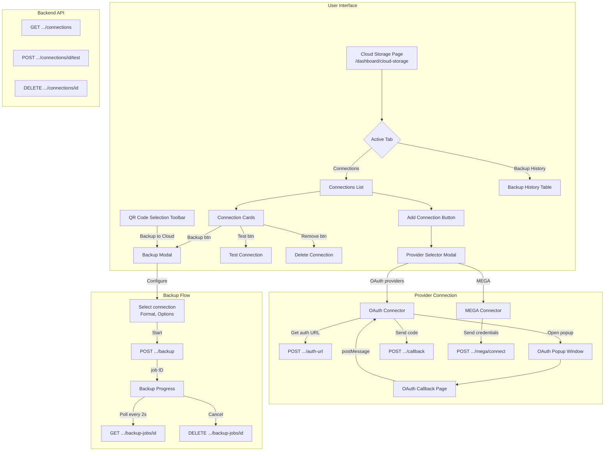
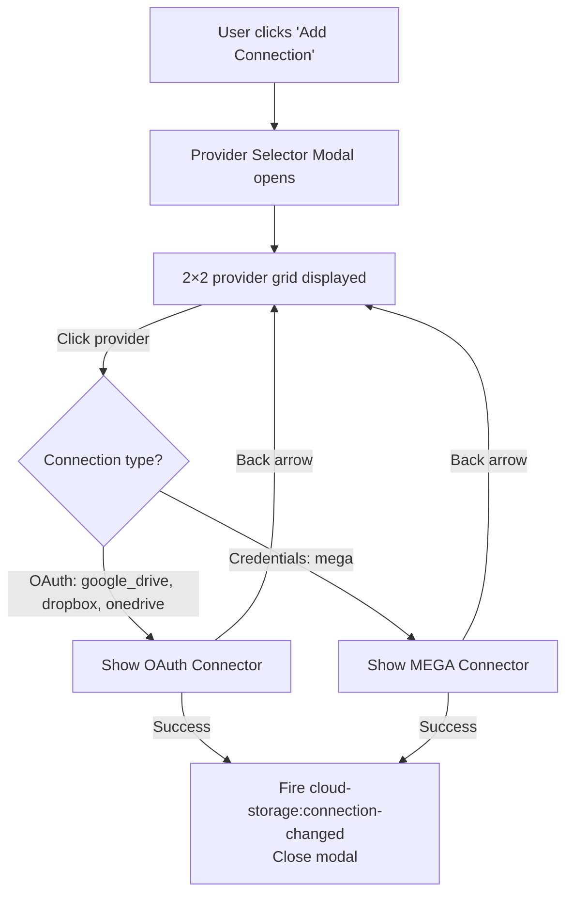
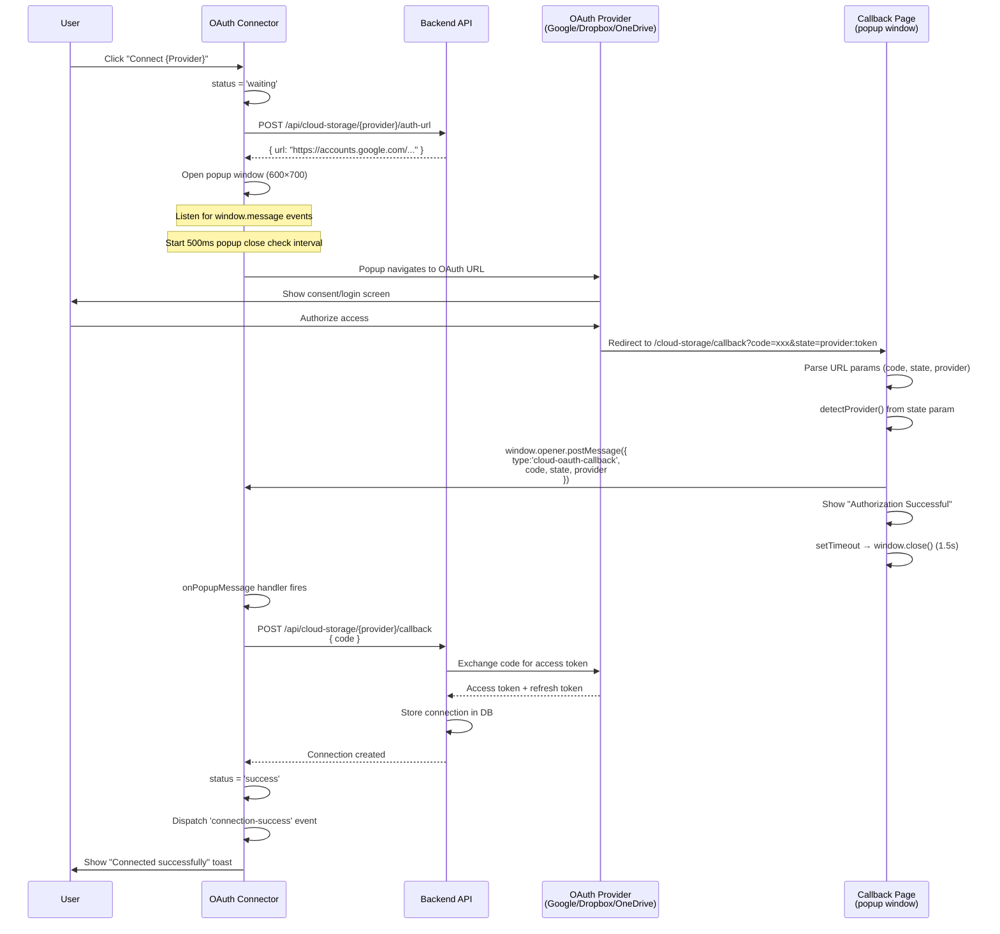
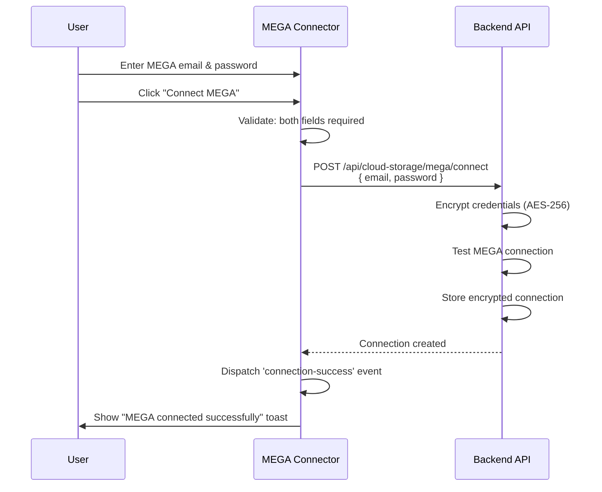
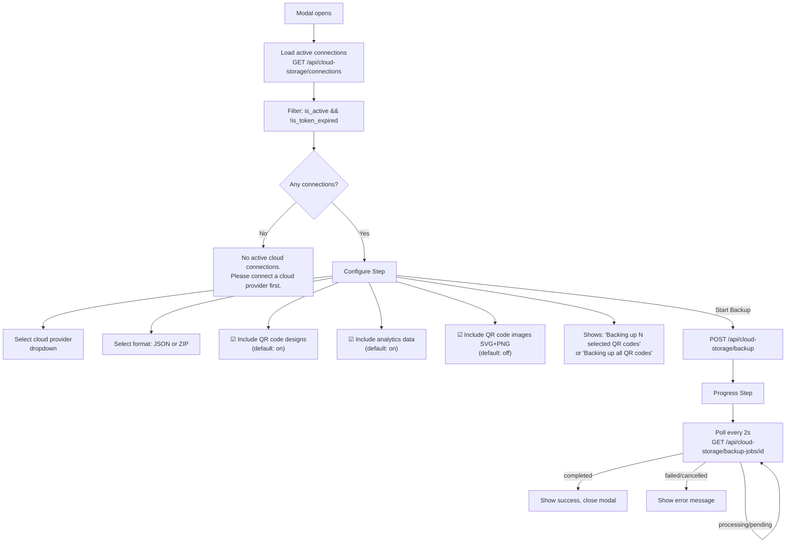
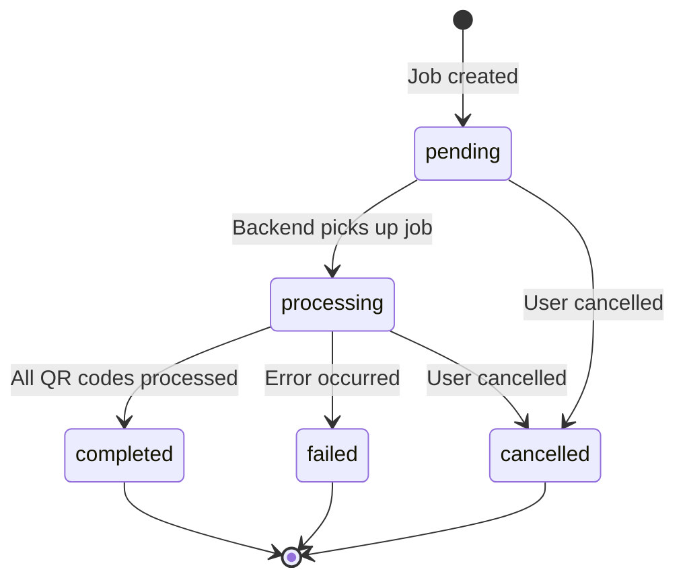
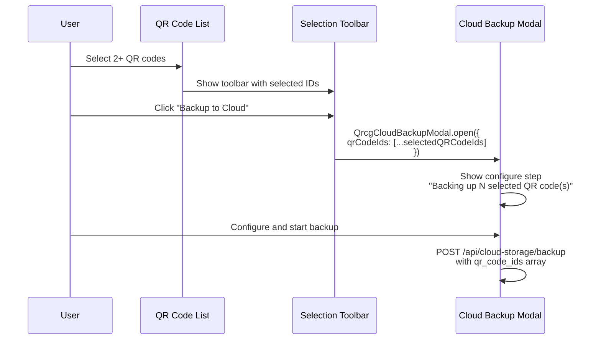

# Cloud Storage Module Documentation

Comprehensive documentation of the cloud storage (backup) functionality in the `qr-code-frontend` project, covering provider connections, OAuth flows, backup job lifecycle, and all API interactions.

---

## Table of Contents

1. [Architecture Overview](#1-architecture-overview)
2. [Module File Structure](#2-module-file-structure)
3. [Core API Layer (`cloud-storage-api.js`)](#3-core-api-layer)
4. [Routing](#4-routing)
5. [Cloud Storage Page (Main UI)](#5-cloud-storage-page)
6. [Provider System](#6-provider-system)
7. [OAuth Connection Flow](#7-oauth-connection-flow)
8. [MEGA Credential Connection Flow](#8-mega-credential-connection-flow)
9. [Connection Management](#9-connection-management)
10. [Backup System](#10-backup-system)
11. [Backup Progress & Polling](#11-backup-progress--polling)
12. [Backup History](#12-backup-history)
13. [QR Code Toolbar Integration](#13-qr-code-toolbar-integration)
14. [Event System](#14-event-system)
15. [Connection Object Schema](#15-connection-object-schema)
16. [Backup Job Object Schema](#16-backup-job-object-schema)
17. [Complete API Endpoints Reference](#17-complete-api-endpoints-reference)
18. [Security Considerations](#18-security-considerations)

---

## 1. Architecture Overview



---

## 2. Module File Structure

```
src/
├── core/
│   └── cloud-storage-api.js          ← API client (10 functions)
└── cloud-storage-module/
    ├── router.js                      ← Route definitions (2 routes)
    ├── qrcg-cloud-storage-page.js     ← Main page with tabs
    ├── qrcg-cloud-provider-selector.js ← Provider selection modal (4 providers)
    ├── qrcg-cloud-oauth-connector.js   ← OAuth popup-based connector
    ├── qrcg-cloud-oauth-callback.js    ← OAuth callback handler (popup page)
    ├── qrcg-cloud-mega-connector.js    ← MEGA credentials form
    ├── qrcg-cloud-connections-list.js  ← Connection cards grid
    ├── qrcg-cloud-connection-card.js   ← Individual connection card
    ├── qrcg-cloud-backup-modal.js      ← Backup configuration modal
    ├── qrcg-cloud-backup-progress.js   ← Real-time backup progress tracker
    └── qrcg-cloud-backup-history.js    ← Backup jobs history table
```

---

## 3. Core API Layer

**File:** `src/core/cloud-storage-api.js` (60 lines)

All functions use the base path `cloud-storage` and are built on top of `core/api.js` (which automatically attaches the Bearer token).

### Connection Management APIs

| Function | HTTP | Endpoint | Purpose |
|----------|------|----------|---------|
| `fetchConnections()` | `GET` | `/api/cloud-storage/connections` | List all saved cloud storage connections |
| `deleteConnection(id)` | `DELETE` | `/api/cloud-storage/connections/{id}` | Remove a cloud storage connection |
| `testConnection(id)` | `POST` | `/api/cloud-storage/connections/{id}/test` | Test if a connection is still valid |

### OAuth Provider APIs

| Function | HTTP | Endpoint | Purpose |
|----------|------|----------|---------|
| `getAuthUrl(provider)` | `POST` | `/api/cloud-storage/{provider}/auth-url` | Get OAuth authorization URL for popup redirect |
| `handleOAuthCallback(provider, code)` | `POST` | `/api/cloud-storage/{provider}/callback` | Exchange OAuth authorization code for access token, create/update connection |
| `refreshProviderToken(provider)` | `POST` | `/api/cloud-storage/{provider}/refresh` | Refresh an expired OAuth token |

### MEGA APIs

| Function | HTTP | Endpoint | Purpose |
|----------|------|----------|---------|
| `connectMega(email, password)` | `POST` | `/api/cloud-storage/mega/connect` | Connect MEGA account using email + password credentials |
| `testMegaConnection()` | `POST` | `/api/cloud-storage/mega/test` | Test MEGA connection validity |

### Backup Job APIs

| Function | HTTP | Endpoint | Purpose |
|----------|------|----------|---------|
| `createBackupJob(data)` | `POST` | `/api/cloud-storage/backup` | Create and start a new backup job |
| `fetchBackupJobs()` | `GET` | `/api/cloud-storage/backup-jobs` | List all backup jobs (history) |
| `fetchBackupJob(id)` | `GET` | `/api/cloud-storage/backup-jobs/{id}` | Get single backup job status + progress |
| `cancelBackupJob(id)` | `DELETE` | `/api/cloud-storage/backup-jobs/{id}` | Cancel an in-progress backup job |

---

## 4. Routing

**File:** `src/cloud-storage-module/router.js` (30 lines)

| Route | Protection | Component | Purpose |
|-------|-----------|-----------|---------|
| `/dashboard/cloud-storage` | `qrcg-protected-route` (auth required) | `qrcg-cloud-storage-page` | Main cloud storage management page |
| `/cloud-storage/callback` | None (public `qrcg-route`) | `qrcg-cloud-oauth-callback` | OAuth redirect callback (popup target) |

The callback route is intentionally **unprotected** because it renders in a popup window that receives the OAuth authorization code from the provider and communicates it back to the parent window via `postMessage`.

---

## 5. Cloud Storage Page

**File:** `src/cloud-storage-module/qrcg-cloud-storage-page.js` (120 lines)  
**Extends:** `QrcgDashboardPage`

### Tab Navigation

| Tab | Component | Description |
|-----|-----------|-------------|
| **Connections** (default) | `qrcg-cloud-connections-list` | View, add, test, and remove cloud provider connections |
| **Backup History** | `qrcg-cloud-backup-history` | View past backup jobs with status, size, and actions |

### Backup Event Handling

The page listens for `cloud-storage:start-backup` events (bubbled from connection cards) and opens the backup modal:

```javascript
onStartBackup = async (e) => {
    const connection = e.detail?.connection
    await QrcgCloudBackupModal.open({
        selectedConnectionId: connection ? String(connection.id) : '',
    })
}
```

---

## 6. Provider System

**File:** `src/cloud-storage-module/qrcg-cloud-provider-selector.js` (220 lines)  
**Extends:** `QrcgModal`

### Supported Providers

| Provider ID | Display Name | Connection Type | Icon Path |
|-------------|-------------|-----------------|-----------|
| `google_drive` | Google Drive | OAuth | `/assets/cloud-storage/google-drive.svg` |
| `dropbox` | Dropbox | OAuth | `/assets/cloud-storage/dropbox.svg` |
| `onedrive` | OneDrive | OAuth | `/assets/cloud-storage/onedrive.svg` |
| `mega` | MEGA | Credentials (email + password) | `/assets/cloud-storage/mega.svg` |

### Provider Selection Flow



**Steps:**
1. `select` — 2×2 grid of provider cards with icons and names
2. `connect` — Shows provider-specific connector component with "← Back to providers" link

On success, fires `cloud-storage:connection-changed` global event and closes the modal.

---

## 7. OAuth Connection Flow

**File:** `src/cloud-storage-module/qrcg-cloud-oauth-connector.js` (229 lines)

Handles Google Drive, Dropbox, and OneDrive connections via OAuth 2.0 popup flow.

### Complete OAuth Sequence



### Popup Management

| Feature | Implementation |
|---------|---------------|
| **Size** | 600×700px, centered on screen |
| **Name** | `cloud-oauth-popup` |
| **Close detection** | 500ms interval checks `popup.closed`, resets status if closed without completing |
| **Popup blocked** | Shows toast: "Popup was blocked. Please allow popups for this site." |

### Status States

| Status | Meaning | UI Display |
|--------|---------|------------|
| `idle` | Default, not connecting | Connect button shown |
| `waiting` | Awaiting OAuth authorization | "Waiting for authorization..." banner |
| `success` | Connection successful | "Connected successfully!" banner |
| `error` | Connection failed | "Connection failed. Please try again." banner |

---

## 8. MEGA Credential Connection Flow

**File:** `src/cloud-storage-module/qrcg-cloud-mega-connector.js` (171 lines)

Unlike OAuth providers, MEGA uses direct email + password authentication.



### Form Fields

| Field | Type | Placeholder | Required |
|-------|------|-------------|----------|
| Email | `email` | `your@email.com` | Yes |
| Password | `password` | `********` | Yes |

### Security Note

The UI displays: *"Your credentials are encrypted using AES-256 before storage."*

---

## 9. Connection Management

### Connections List

**File:** `src/cloud-storage-module/qrcg-cloud-connections-list.js` (148 lines)

| Feature | Detail |
|---------|--------|
| **Layout** | Responsive CSS grid: `repeat(auto-fill, minmax(280px, 1fr))` |
| **Loading** | Shows `qrcg-loader` while fetching |
| **Empty state** | "No cloud storage connections yet. Connect a cloud provider to start backing up your QR codes." |
| **Add button** | Opens `QrcgCloudProviderSelector` modal |
| **Auto-refresh** | Listens for `cloud-storage:connection-changed` global event → reloads list |
| **Data fetch** | `GET /api/cloud-storage/connections` → `json.data || json || []` |

### Connection Card

**File:** `src/cloud-storage-module/qrcg-cloud-connection-card.js` (304 lines)

Each connection displays as a card showing:

| Element | Source |
|---------|--------|
| **Provider icon** | SVG from `/assets/cloud-storage/{provider}.svg` |
| **Provider name** | Mapped from ID (e.g., `google_drive` → "Google Drive") |
| **Account email** | `connection.account_email` (if available) |
| **Status badge** | Connected (green) / Token Expired (amber) / Inactive (red) |

### Card Actions

| Action | API Call | Condition | Behavior |
|--------|---------|-----------|----------|
| **Backup** | — (opens modal) | Disabled if expired or inactive | Fires `cloud-storage:start-backup` event with connection detail |
| **Test** | `POST /api/cloud-storage/connections/{id}/test` | Always available | Shows "Connection is working" or "Connection test failed" toast |
| **Remove** | `DELETE /api/cloud-storage/connections/{id}` | Requires confirmation dialog | Shows "Connection removed" toast, fires `cloud-storage:connection-changed` |

### Status Badge Logic

```javascript
get isExpired() { return this.connection.is_token_expired }

renderStatus() {
    if (!this.connection.is_active)  → "Inactive" (red)
    if (this.isExpired)              → "Token Expired" (amber)
    return                           → "Connected" (green)
}
```

---

## 10. Backup System

**File:** `src/cloud-storage-module/qrcg-cloud-backup-modal.js` (326 lines)  
**Extends:** `QrcgModal`

### Backup Modal Flow



### Backup Job Payload

```javascript
// POST /api/cloud-storage/backup
{
    connection_id: 42,                    // Selected connection ID (required)
    format: "json" | "zip",              // Export format (default: json)
    include_designs: true,                // Include QR code design data
    include_analytics: true,              // Include scan analytics
    include_images: false,                // Include SVG + PNG images
    qr_code_ids: [1, 5, 12]             // Optional: specific QR codes (omitted = all)
}
```

### Backup Options

| Option | Key | Default | Description |
|--------|-----|---------|-------------|
| Cloud Provider | `connection_id` | First active | Dropdown of active, non-expired connections |
| Export Format | `format` | `json` | JSON (data only) or ZIP (bundled archive) |
| Include Designs | `include_designs` | `true` | QR code design/customization data |
| Include Analytics | `include_analytics` | `true` | Scan statistics and analytics |
| Include Images | `include_images` | `false` | SVG + PNG renderings (increases backup size) |
| QR Code IDs | `qr_code_ids` | All | Specific QR codes (from toolbar selection) or all |

---

## 11. Backup Progress & Polling

**File:** `src/cloud-storage-module/qrcg-cloud-backup-progress.js` (287 lines)

### Polling Mechanism

| Setting | Value |
|---------|-------|
| **Poll interval** | Every **2 seconds** |
| **API endpoint** | `GET /api/cloud-storage/backup-jobs/{id}` |
| **Start trigger** | When `jobId` property is set (or component mounts with jobId) |
| **Stop triggers** | `completed`, `failed`, `cancelled` status, or component unmount |
| **Error handling** | Transient errors are silently ignored (polling continues) |

### Job Status Lifecycle



### Progress Display

| Status | UI Color | Progress Bar | Cancel Button | Additional Info |
|--------|----------|-------------|---------------|-----------------|
| `pending` | Blue | Shown (0%) | ✅ Yes | — |
| `processing` | Blue | Shown (0-100%) | ✅ Yes | `{processed}/{total} QR codes` |
| `completed` | Green | Hidden | Hidden | File size displayed |
| `failed` | Red | Hidden | Hidden | Error message shown |
| `cancelled` | Red | Hidden | Hidden | — |

### Progress Data Fields

```javascript
get progressPercent() {
    return this.job.progress || this.job.progress_percentage || 0
}

// Display: "45% (23/51)"
// processed_qr_codes / total_qr_codes
```

### File Size Formatting

Displays completed backup file size: `formatSize(bytes)` → "0 B", "1.5 KB", "4.2 MB", "1.1 GB"

---

## 12. Backup History

**File:** `src/cloud-storage-module/qrcg-cloud-backup-history.js` (281 lines)

### History Table Columns

| Column | Data Key | Format |
|--------|----------|--------|
| Provider | `job.provider` | Text (e.g., "google_drive") |
| Status | `job.status` | Color-coded badge |
| QR Codes | `job.total_qr_codes` | Number |
| Format | `job.format` | "json" or "zip" |
| Size | `job.file_size` | Formatted bytes (KB/MB/GB) |
| Date | `job.created_at` | `toLocaleString()` |
| Actions | — | Cancel button for pending/processing jobs |

### Status Badges

| Status | Badge Class | Color |
|--------|-------------|-------|
| `completed` | `badge-success` | Green (#dcfce7 / #166534) |
| `processing` | `badge-info` | Blue (#dbeafe / #1e40af) |
| `pending` | `badge-info` | Blue (#dbeafe / #1e40af) |
| `failed` | `badge-error` | Red (#fee2e2 / #991b1b) |
| `cancelled` | `badge-warning` | Amber (#fef3c7 / #92400e) |

### Features

| Feature | Detail |
|---------|--------|
| **Data fetch** | `GET /api/cloud-storage/backup-jobs` → `json.data || json || []` |
| **Refresh** | Manual "Refresh" button in header |
| **Cancel** | Available for `pending` and `processing` jobs → `DELETE /api/cloud-storage/backup-jobs/{id}` |
| **Empty state** | "No backup history yet." |
| **Responsive** | Smaller table font/padding on mobile (≤768px) |

---

## 13. QR Code Toolbar Integration

**File:** `src/qrcode-module/qrcode-selection-toolbar/qrcode-selection-toolbar.js`

When users select multiple QR codes (>1) in the QR code list, a selection toolbar appears. Among the available bulk actions is **"Backup to Cloud"**.

### Integration Flow



### Code

```javascript
async doBackupToCloud() {
    try {
        await QrcgCloudBackupModal.open({
            qrCodeIds: [...this.selectedQRCodeIds],
        })
    } catch {
        // user cancelled
    }
}
```

The backup modal shows either:
- **"Backing up N selected QR code(s)"** — when opened from toolbar with specific IDs
- **"Backing up all QR codes"** — when opened from connection card (no IDs passed)

---

## 14. Event System

| Event Name | Scope | Fired By | Listened By | Purpose |
|------------|-------|----------|-------------|---------|
| `cloud-storage:connection-changed` | `window` | Provider Selector, Connection Card (delete) | Connections List | Trigger connections list refresh |
| `cloud-storage:start-backup` | bubbles to parent | Connection Card (backup btn) | Cloud Storage Page | Open backup modal with pre-selected connection |
| `connection-success` | component event | OAuth Connector, MEGA Connector | Provider Selector | Notify parent that connection succeeded |
| `backup-complete` | component event | Backup Progress | Backup Modal | Notify that backup finished successfully |
| `backup-failed` | component event | Backup Progress | Backup Modal | Notify that backup failed or was cancelled |
| `message` (postMessage) | `window` | OAuth Callback Page (popup) | OAuth Connector | Pass OAuth authorization code from popup to parent |

---

## 15. Connection Object Schema

Based on usage patterns in the frontend code:

```typescript
interface CloudStorageConnection {
    id: number;                    // Unique connection ID
    provider: string;              // "google_drive" | "dropbox" | "onedrive" | "mega"
    account_email?: string;        // Connected account email (optional)
    is_active: boolean;            // Whether the connection is currently active
    is_token_expired: boolean;     // Whether the OAuth token has expired (OAuth providers only)
    label?: string;                // Custom label for the connection
    created_at: string;            // ISO date string
}
```

### Provider-Specific Properties

| Provider | `is_token_expired` | `account_email` | Auth Method |
|----------|-------------------|-----------------|------------|
| `google_drive` | ✅ Used | ✅ Available | OAuth 2.0 |
| `dropbox` | ✅ Used | ✅ Available | OAuth 2.0 |
| `onedrive` | ✅ Used | ✅ Available | OAuth 2.0 |
| `mega` | ❌ N/A | ✅ From form | Email + Password |

---

## 16. Backup Job Object Schema

Based on frontend usage:

```typescript
interface BackupJob {
    id: number;                      // Unique job ID
    provider: string;                // Provider name
    status: BackupStatus;            // Current job status
    format: "json" | "zip";          // Export format
    total_qr_codes: number;          // Total QR codes to process
    processed_qr_codes?: number;     // How many processed so far
    progress?: number;               // 0-100 percentage
    progress_percentage?: number;    // Alternative progress field
    file_size?: number;              // Final backup file size in bytes
    error_message?: string;          // Error details (if failed)
    created_at: string;              // ISO date string
}

type BackupStatus = "pending" | "processing" | "completed" | "failed" | "cancelled"
```

---

## 17. Complete API Endpoints Reference

All endpoints require `Authorization: Bearer {token}` header.

### Connection Management

| Method | Endpoint | Request Body | Response | Purpose |
|--------|----------|-------------|----------|---------|
| `GET` | `/api/cloud-storage/connections` | — | `{ data: Connection[] }` | List all user's cloud connections |
| `DELETE` | `/api/cloud-storage/connections/{id}` | — | `204` | Remove a specific connection |
| `POST` | `/api/cloud-storage/connections/{id}/test` | — | `{ data: { is_valid: boolean } }` | Test if connection is still working |

### OAuth Provider Endpoints

| Method | Endpoint | Request Body | Response | Purpose |
|--------|----------|-------------|----------|---------|
| `POST` | `/api/cloud-storage/{provider}/auth-url` | — | `{ url: string }` or `{ data: { url: string } }` | Get OAuth authorization URL |
| `POST` | `/api/cloud-storage/{provider}/callback` | `{ code: string }` | Connection object | Exchange OAuth code for token, create connection |
| `POST` | `/api/cloud-storage/{provider}/refresh` | — | Updated connection | Refresh expired OAuth token |

*Where `{provider}` is: `google_drive`, `dropbox`, or `onedrive`*

### MEGA Endpoints

| Method | Endpoint | Request Body | Response | Purpose |
|--------|----------|-------------|----------|---------|
| `POST` | `/api/cloud-storage/mega/connect` | `{ email, password }` | Connection object | Connect using MEGA credentials (AES-256 encrypted) |
| `POST` | `/api/cloud-storage/mega/test` | — | `{ is_valid: boolean }` | Test MEGA connection |

### Backup Job Endpoints

| Method | Endpoint | Request Body | Response | Purpose |
|--------|----------|-------------|----------|---------|
| `POST` | `/api/cloud-storage/backup` | See [backup payload](#backup-job-payload) | `{ data: { id: number } }` or `{ id: number }` | Create and start backup job |
| `GET` | `/api/cloud-storage/backup-jobs` | — | `{ data: BackupJob[] }` | List all backup jobs (history) |
| `GET` | `/api/cloud-storage/backup-jobs/{id}` | — | `{ data: BackupJob }` | Get single job status + progress |
| `DELETE` | `/api/cloud-storage/backup-jobs/{id}` | — | `204` | Cancel an in-progress backup job |

---

## 18. Security Considerations

| Aspect | Implementation |
|--------|---------------|
| **Authentication** | All API calls use Bearer token auth via `Authorization` header |
| **MEGA credentials** | Encrypted with AES-256 before server-side storage |
| **OAuth tokens** | Stored server-side; never exposed to frontend |
| **OAuth popup** | Uses `postMessage` with origin validation (`window.location.origin`) |
| **OAuth state parameter** | Encodes provider ID as `provider:random_token` for CSRF protection and provider detection |
| **Token expiry** | Frontend tracks `is_token_expired` flag; disables backup for expired connections |
| **Popup blocking** | Gracefully handles blocked popups with user-facing message |
| **Route protection** | `/dashboard/cloud-storage` is wrapped in `qrcg-protected-route` (requires auth) |
| **Callback page** | `/cloud-storage/callback` is intentionally unprotected (runs in popup, only relays code to parent window) |

---

*Generated from source analysis of `qr-code-frontend` cloud storage module — 12 source files, 10 API functions, 4 cloud providers.*
