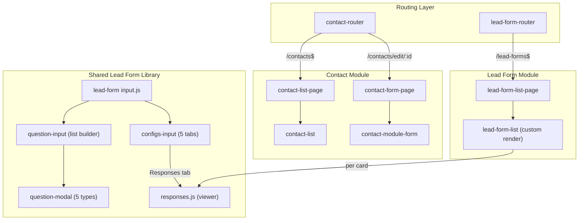
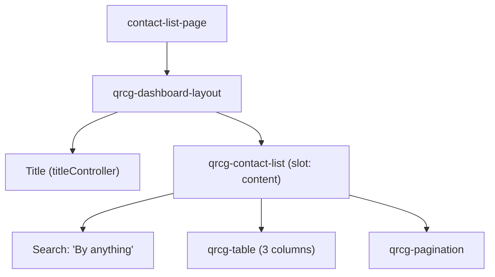
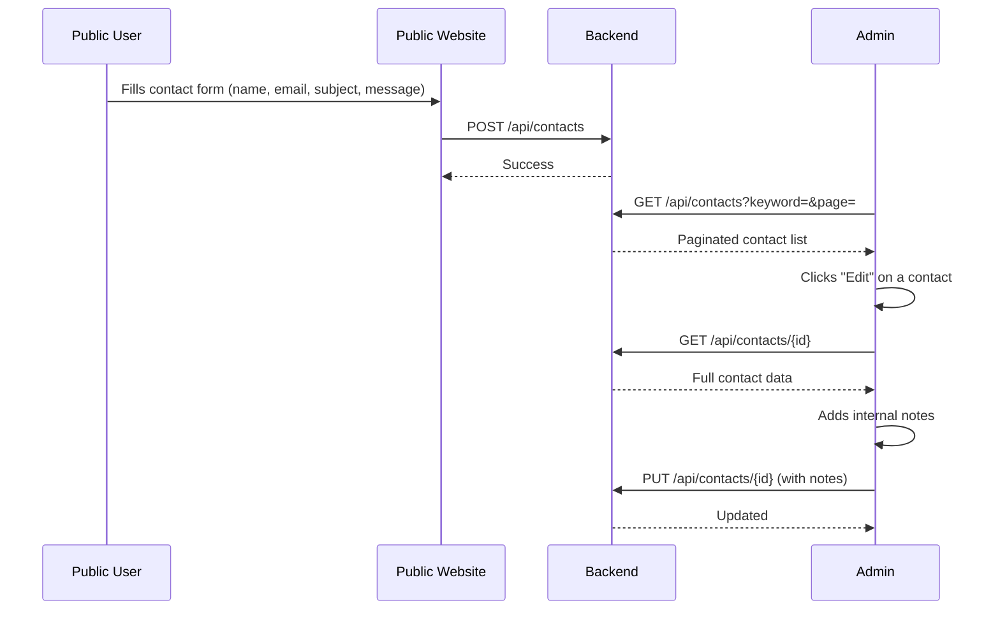
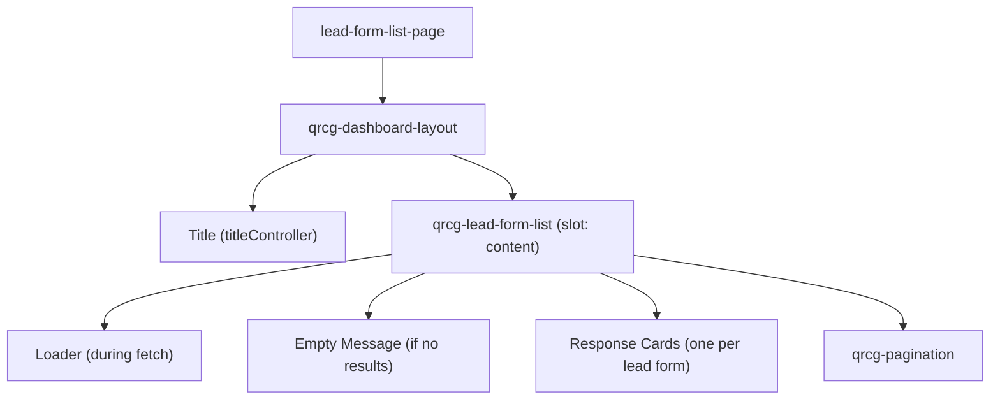
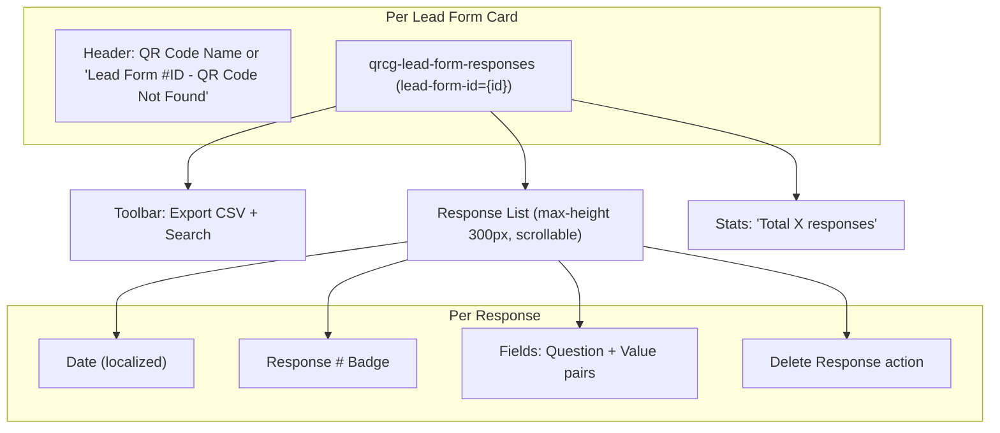
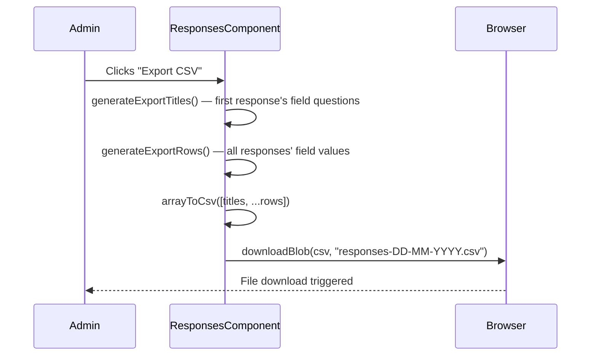
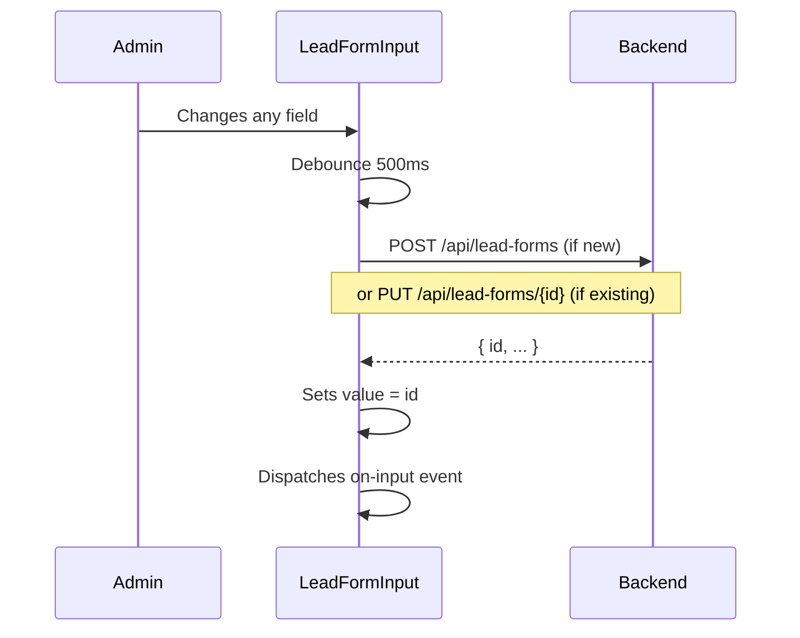
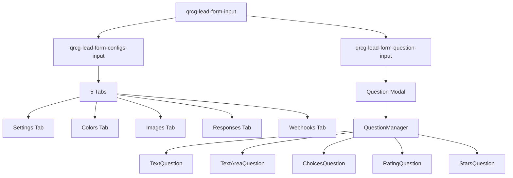
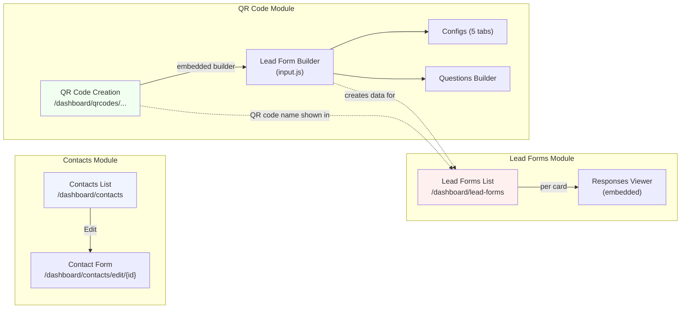

# QR Code Frontend — Contacts Tab Routes: Comprehensive Flow Documentation

> **Project**: `qr-code-frontend` (Lit + Vite Web Components)  
> **Analyzed Routes**:  
> 1. `/dashboard/contacts` — Contact Submissions Management  
> 2. `/dashboard/lead-forms` — Lead Form Responses Viewer  

---

## Architecture Overview

### Key Design Differences

| Aspect | Contacts | Lead Forms |
|---|---|---|
| **Purpose** | View/manage contact-us submissions | View form responses from QR-linked lead forms |
| **Create Route** | ❌ No `/new` route | ❌ No create/edit routes |
| **Edit Route** | ✅ `/edit/:id` (view + add notes) | ❌ None |
| **List Style** | Standard table | Custom card-based render |
| **Data Source** | Contact form submissions from public site | QR code lead form submissions |
| **Association** | Standalone | Linked to QR Code via `qrcode_name` |

---

## Route 1: `/dashboard/contacts` — Contact Submissions Management

### Routing & Permissions

| Property | Value |
|---|---|
| **Router** | [qrcg-contact-router.js](file:///d:/Karsaaz_QR/qr-code-frontend/src/contact-module/qrcg-contact-router.js) |
| **Route Patterns** | `/dashboard/contacts$` (list), `/dashboard/contacts/edit/(?<id>\\d+)` (edit) |
| **Permission** | None (default protected route) |
| **Important** | **No `/new` route** — contacts are collected from public-facing forms, not created in the dashboard |

### Page Layout

> [!NOTE]
> Unlike most other list pages, there is **no Create button** in the header. Contacts are received from public forms and can only be viewed/edited by admins.

### Table Columns

| # | Key | Label | Notes |
|---|---|---|---|
| 1 | `name` | Name | Submitter's name |
| 2 | `email` | Email | Submitter's email |
| 3 | `subject` | Subject | Contact subject |
| 4 | `actions` | Actions (7rem) | Edit, Delete |

### Row Actions

| Action | Behavior |
|---|---|
| **Edit** | → `/dashboard/contacts/edit/{id}` |
| **Delete** | Confirmation → `DELETE /api/contacts/{id}` |

---

### Sub-Route: `/dashboard/contacts/edit/:id` — Contact Detail / Notes Form

| Property | Value |
|---|---|
| **Form Page** | [qrcg-contact-form-page.js](file:///d:/Karsaaz_QR/qr-code-frontend/src/contact-module/qrcg-contact-form-page.js) |
| **Form Component** | [qrcg-contact-module-form.js](file:///d:/Karsaaz_QR/qr-code-frontend/src/contact-module/qrcg-contact-module-form.js) |
| **API Base Route** | `contacts` |

### Form Fields

| # | Field | Name | Component | Notes |
|---|---|---|---|---|
| 1 | Name | `name` | `qrcg-input` | Submitted by visitor |
| 2 | Email | `email` | `qrcg-input` | Submitted by visitor |
| 3 | Subject | `subject` | `qrcg-input` | Submitted by visitor |
| 4 | Message | `message` | `qrcg-textarea` | Full message content |
| 5 | Internal Notes | `notes` | `qrcg-textarea` | **Admin-only field** — "You can add notes for your own reference. The customer will not be notified." |

### Contact Data Flow

---

## Route 2: `/dashboard/lead-forms` — Lead Form Responses Viewer

### Routing & Permissions

| Property | Value |
|---|---|
| **Router** | [qrcg-lead-form-router.js](file:///d:/Karsaaz_QR/qr-code-frontend/src/lead-form-module/qrcg-lead-form-router.js) |
| **Route Pattern** | `/dashboard/lead-forms$` |
| **Permission** | `lead-form.list` |
| **Important** | **List-only** — no create or edit routes. Lead forms are created as part of QR code configuration. |

### Page Layout

> [!IMPORTANT]
> This page does **not** use a standard table. Instead, it renders each lead form as a **bordered card** with a header showing the associated QR code name. Each card embeds a full `qrcg-lead-form-responses` component that fetches and displays all form submissions independently.

### Card Rendering Structure

### Lead Form Card Header Logic

The header shows either:
- **QR Code name** if `row.qrcode_name` exists
- **"Lead Form #ID - QR Code Not Found"** if the associated QR code was deleted

---

### Lead Form Responses Component (Core)

[responses.js](file:///d:/Karsaaz_QR/qr-code-frontend/src/lead-form/components/responses.js) — The central component for viewing form submissions.

#### Features

| Feature | Description |
|---|---|
| **Keyword Search** | Client-side regex filter across all field values |
| **Export CSV** | Generates CSV with question headers + response values, triggers browser download |
| **Delete Response** | Per-response delete with confirmation → `DELETE /api/lead-form-responses/{id}` |
| **Response Count** | Shows "Total X response(s)" at the bottom |
| **Scrollable Area** | `.responses` container limited to `max-height: 300px` with overflow scrolling |
| **Alternating Rows** | Odd responses get `background: var(--gray-0)` |

#### Response Data Structure

Each response contains:
- **Date** — `created_at` displayed via `toLocaleString()`
- **Response #** — Sequential number badge (absolute positioned, top-right)
- **Fields** — Array of `{ question, value }` pairs displayed as question + value side by side
- **Delete action** — Link-style "Delete Response" button

#### Export CSV Flow

---

## Shared Lead Form Builder Library (`/src/lead-form/`)

> [!NOTE]
> The `/src/lead-form/` directory contains the **shared lead form builder** used when creating QR codes with lead form functionality. While the dashboard route only shows the **responses viewer**, this builder is the system that creates the forms whose responses appear on the `/dashboard/lead-forms` page.

### Lead Form Input (`input.js`)

[input.js](file:///d:/Karsaaz_QR/qr-code-frontend/src/lead-form/input.js) — Main entry point for the lead form builder.

#### Operating Modes

| Mode | Behavior |
|---|---|
| **`minimized`** (default) | Shows Enabled/Disabled toggle. When enabled, shows full config UI. |
| **`expanded`** | Always enabled, no toggle shown (used when form is primary content). |

#### Auto-Save Mechanism

This auto-creates the lead form record on first input, then auto-saves subsequent changes. The form ID is then associated with the QR code.

#### Component Hierarchy

---

### Configs Input — 5 Tabs

[configs-input.js](file:///d:/Karsaaz_QR/qr-code-frontend/src/lead-form/components/configs-input.js)

#### Tab 1: Settings

| Field | Name | Component | Notes |
|---|---|---|---|
| Trigger Button Text | `button_text` | `qrcg-input` | Placeholder: "Contact Me" (conditionally shown) |
| Submit Button Text | `submit_button_text` | `qrcg-input` | Placeholder: "Submit" |
| OK Button Text | `ok_button_text` | `qrcg-input` | Placeholder: "OK" |
| Header Text | `header_text` | `qrcg-input` | Placeholder: "Your company name" |
| Recipient Email | `recepient_email` | `qrcg-input` | Comma-separated emails for notification |
| Multiple Submission | `multiple_submission` | Balloon selector | Enabled/Disabled — "Allow multiple submissions per browser" |
| Submission Blocked Message | `submission_blocked_message` | `qrcg-input` | Only shown when Multiple Submission = Disabled |
| After Submit URL | `after_submit_url` | `qrcg-input` | "Redirect user after successful submit. Leave empty to stay on page." |

#### Tab 2: Colors

| Field | Name | Component |
|---|---|---|
| Background Color | `background_color` | `qrcg-color-picker` |
| Text Color | `text_color` | `qrcg-color-picker` |
| Placeholder Color | `placeholder_color` | `qrcg-color-picker` |
| Trigger Btn Background | `trigger_background_color` | `qrcg-color-picker` (conditional) |
| Trigger Btn Text | `trigger_text_color` | `qrcg-color-picker` (conditional) |
| Form Btns Background | `button_background_color` | `qrcg-color-picker` |
| Form Btns Text | `button_text_color` | `qrcg-color-picker` |

#### Tab 3: Images

| Field | Name | Component | Notes |
|---|---|---|---|
| Background Image | `background_image` | `qrcg-file-input` | Upload endpoint: `qrcodes/data-file` |
| Logo | `logo_image` | `qrcg-file-input` | Upload endpoint: `qrcodes/data-file` |

#### Tab 4: Responses

Embeds `qrcg-lead-form-responses` directly — the same component used in the dashboard lead-forms list. Shows collected responses with search, export, and delete capabilities.

#### Tab 5: Webhooks

| Field | Name | Component | Notes |
|---|---|---|---|
| Webhooks | `webhooks` | `qrcg-textarea` | "Multiple URLs, each in a line. Maximum 5 webhooks allowed." |

---

### Question Builder

#### Question Input

[question-input.js](file:///d:/Karsaaz_QR/qr-code-frontend/src/lead-form/components/question-input.js) — Extends `ImageListInput` for a repeatable list UI.

- Displays "Add Question" button
- Each item shows question text + type badge (uppercase, dark background)
- Clicking any item opens the Question Modal

#### Question Modal

[question-modal.js](file:///d:/Karsaaz_QR/qr-code-frontend/src/lead-form/components/question-modal.js) — Extends `ImageListModal`.

Type selector: `qrcg-balloon-selector` with 5 options. Based on selected type, renders type-specific fields via `LeadFormQuestionManager`.

#### Question Types — Field Reference

All question types inherit base fields from [base-question.js](file:///d:/Karsaaz_QR/qr-code-frontend/src/lead-form/questions/base-question.js):

**Base Fields (all types):**

| Field | Name | Component | Notes |
|---|---|---|---|
| Question | `text` | `qrcg-input` | "Add your question here" |
| Description | `description` | `qrcg-textarea` | "Optional description" |
| Required | `required` | Balloon selector | Required / Optional (default: Optional) |

**Type-Specific Fields:**

| Type | Extra Fields | Component | Notes |
|---|---|---|---|
| **Text** | `placeholder_text` | `qrcg-input` | "Type your answer here ..." |
| **Text Area** | `placeholder_text` | `qrcg-input` | "Type your answer here ..." |
| **Choices** | `choices` | `qrcg-textarea` | "Each choice in a line" |
| | `is_multiple` | Balloon selector | Multiple Choices / Single Choice (default: Single) |
| **Rating** | `rating_from` | `qrcg-input` (number) | Start value (default: 0) |
| | `rating_to` | `qrcg-input` (number) | End value (default: 5) |
| **Stars** | `number_of_stars` | `qrcg-input` (number) | Default: 5. Has plugin hook `ACTION_LEAD_FORM_AFTER_STARS_QUESTION` |

---

## Inter-Page Navigation & Relationship Map

### Cross-Module Dependencies

| Source | Target | Mechanism |
|---|---|---|
| **QR Code Builder** | Lead Forms API | Lead form builder (`input.js`) creates lead form records via `POST/PUT /api/lead-forms` |
| **Lead Forms List** | QR Code data | Each lead form card header shows `qrcode_name` from the associated QR code |
| **Lead Form Configs** → Responses Tab | Same responses component | `qrcg-lead-form-responses` reused in both dashboard list and QR code edit config |
| **Contact Form (public)** | Contacts List | Public contact form submissions populate the contacts list |

---

## Complete API Endpoint Reference

### Contacts

| Method | Endpoint | Used By | Purpose |
|---|---|---|---|
| `GET` | `/api/contacts?keyword=&page=` | Contact list | Paginated list, searchable "by anything" |
| `GET` | `/api/contacts/{id}` | Contact form | Fetch single contact |
| `PUT` | `/api/contacts/{id}` | Contact form | Update (add internal notes) |
| `DELETE` | `/api/contacts/{id}` | Row action | Delete contact |

### Lead Forms

| Method | Endpoint | Used By | Purpose |
|---|---|---|---|
| `GET` | `/api/lead-forms?page=` | Lead form list | Paginated list of all lead forms |
| `GET` | `/api/lead-forms/{id}` | Lead form input (builder) | Fetch single lead form config |
| `POST` | `/api/lead-forms` | Lead form input (auto-create) | Create new lead form |
| `PUT` | `/api/lead-forms/{id}` | Lead form input (auto-save) | Update lead form config/questions |

### Lead Form Responses

| Method | Endpoint | Used By | Purpose |
|---|---|---|---|
| `GET` | `/api/lead-forms/{id}/responses` | Responses component | Fetch all responses for a lead form |
| `DELETE` | `/api/lead-form-responses/{id}` | Per-response delete action | Delete a single response |

### File Uploads (Lead Form Builder)

| Method | Endpoint | Used By | Purpose |
|---|---|---|---|
| `POST` | `/api/qrcodes/data-file` | Configs — Images tab | Upload background image / logo |

---

## Key Component File Map

| Component | File | Role |
|---|---|---|
| **Contact Router** | [qrcg-contact-router.js](file:///d:/Karsaaz_QR/qr-code-frontend/src/contact-module/qrcg-contact-router.js) | List + edit routes (no create) |
| **Contact List Page** | [qrcg-contact-list-page.js](file:///d:/Karsaaz_QR/qr-code-frontend/src/contact-module/qrcg-contact-list-page.js) | Page wrapper (no Create button) |
| **Contact List** | [qrcg-contact-list.js](file:///d:/Karsaaz_QR/qr-code-frontend/src/contact-module/qrcg-contact-list.js) | 3-column table, search "by anything" |
| **Contact Form Page** | [qrcg-contact-form-page.js](file:///d:/Karsaaz_QR/qr-code-frontend/src/contact-module/qrcg-contact-form-page.js) | Form wrapper |
| **Contact Form** | [qrcg-contact-module-form.js](file:///d:/Karsaaz_QR/qr-code-frontend/src/contact-module/qrcg-contact-module-form.js) | 5 fields with internal notes |
| **Lead Form Router** | [qrcg-lead-form-router.js](file:///d:/Karsaaz_QR/qr-code-frontend/src/lead-form-module/qrcg-lead-form-router.js) | List-only route (permission gated) |
| **Lead Form List Page** | [qrcg-lead-form-list-page.js](file:///d:/Karsaaz_QR/qr-code-frontend/src/lead-form-module/qrcg-lead-form-list-page.js) | Simple page wrapper |
| **Lead Form List** | [qrcg-lead-form-list.js](file:///d:/Karsaaz_QR/qr-code-frontend/src/lead-form-module/qrcg-lead-form-list.js) | Custom card render with embedded responses |
| **Lead Form Input (Builder)** | [input.js](file:///d:/Karsaaz_QR/qr-code-frontend/src/lead-form/input.js) | Main builder component with auto-save |
| **Configs Input** | [configs-input.js](file:///d:/Karsaaz_QR/qr-code-frontend/src/lead-form/components/configs-input.js) | 5-tab config: Settings, Colors, Images, Responses, Webhooks |
| **Question Input** | [question-input.js](file:///d:/Karsaaz_QR/qr-code-frontend/src/lead-form/components/question-input.js) | Repeatable question list builder |
| **Question Modal** | [question-modal.js](file:///d:/Karsaaz_QR/qr-code-frontend/src/lead-form/components/question-modal.js) | Per-question editor (5 types) |
| **Responses Viewer** | [responses.js](file:///d:/Karsaaz_QR/qr-code-frontend/src/lead-form/components/responses.js) | Search, export CSV, delete, response display |
| **Question Manager** | [question-manager.js](file:///d:/Karsaaz_QR/qr-code-frontend/src/lead-form/questions/question-manager.js) | Registry for 5 question types |
| **Base Question** | [base-question.js](file:///d:/Karsaaz_QR/qr-code-frontend/src/lead-form/questions/base-question.js) | Common fields: text, description, required |
| **Text Question** | [text.js](file:///d:/Karsaaz_QR/qr-code-frontend/src/lead-form/questions/text.js) | + placeholder_text |
| **TextArea Question** | [textarea.js](file:///d:/Karsaaz_QR/qr-code-frontend/src/lead-form/questions/textarea.js) | + placeholder_text |
| **Choices Question** | [choices.js](file:///d:/Karsaaz_QR/qr-code-frontend/src/lead-form/questions/choices.js) | + choices (line-separated), single/multiple |
| **Rating Question** | [rating.js](file:///d:/Karsaaz_QR/qr-code-frontend/src/lead-form/questions/rating.js) | + rating_from, rating_to |
| **Stars Question** | [stars.js](file:///d:/Karsaaz_QR/qr-code-frontend/src/lead-form/questions/stars.js) | + number_of_stars, plugin hook |
