# QR Code Frontend — Content Tab Routes: Comprehensive Flow Documentation

> **Project**: `qr-code-frontend` (Lit + Vite Web Components)  
> **Analyzed Routes**:  
> 1. `/dashboard/blog-posts` — Blog Posts Management  
> 2. `/dashboard/content-blocks` — Content Blocks Management  
> 3. `/dashboard/translations` — Translations Management  
> 4. `/dashboard/custom-codes` — Custom Code Injection  
> 5. `/dashboard/pages` — Static Pages Management  
> 6. `/dashboard/dynamic-biolink-blocks` — Dynamic Biolink Blocks  

---

## Architecture Overview

```mermaid
graph TB
    subgraph Routing Layer
        BPR["blog-post-router"]
        CBR["content-blocks-router"]
        TR["translation-router"]
        CCR["custom-code-router"]
        PR["page-router"]
        DBR["dynamic-biolink-block-router"]
    end

    subgraph Blog Posts
        BPLP["blog-post-list-page"]
        BPFP["blog-post-form-page"]
    end

    subgraph Content Blocks
        CBLP["content-blocks-list-page"]
        CBFP["content-blocks-form-page"]
        CCM["copy-content-blocks-modal"]
    end

    subgraph Translations
        TLP["translation-list-page"]
        TFP["translation-form-page"]
    end

    subgraph Custom Codes
        CCLP["custom-code-list-page"]
        CCFP["custom-code-form-page"]
    end

    subgraph Pages
        PLP["page-list-page"]
        PFP["page-form-page"]
    end

    subgraph Dynamic Biolink Blocks
        DBLP["biolink-block-list-page"]
        DBFP["biolink-block-form-page"]
        FIM["field-input-modal"]
    end

    BPR -->|"/blog-posts$"| BPLP
    BPR -->|"/blog-posts/new\|edit/:id"| BPFP
    CBR -->|"/content-blocks$"| CBLP
    CBR -->|"/content-blocks/new\|edit/:id"| CBFP
    CBLP -->|"Copy All action"| CCM
    TR -->|"/translations$"| TLP
    TR -->|"/translations/new\|edit/:id"| TFP
    CCR -->|"/custom-codes$"| CCLP
    CCR -->|"/custom-codes/new\|edit/:id"| CCFP
    PR -->|"/pages$"| PLP
    PR -->|"/pages/new\|edit/:id"| PFP
    DBR -->|"/dynamic-biolink-blocks$"| DBLP
    DBR -->|"/dynamic-biolink-blocks/new\|edit/:id"| DBFP
    DBFP -->|"Add Field"| FIM
```

### Key Base Classes

| Base Class | Pattern | Used By |
|---|---|---|
| `QRCGDashboardList` | Table + Search + Pagination + Delete | All 6 list components |
| `QrcgDashboardForm` | CRUD form with auto-redirect | All 6 form components |
| `ImageListInput` | Repeatable item list with modal editor | Biolink block fields |
| `ImageListModal` | Modal for editing list items | Biolink block field modal |

---

## Route 1: `/dashboard/blog-posts` — Blog Posts Management

### Routing & Permissions

| Property | Value |
|---|---|
| **Router** | [qrcg-blog-post-router.js](file:///d:/Karsaaz_QR/qr-code-frontend/src/blog-post-module/qrcg-blog-post-router.js) |
| **Route Pattern** | `/dashboard/blog-posts$` |
| **Permission** | None (default protected route) |
| **Page Component** | [qrcg-blog-post-list-page.js](file:///d:/Karsaaz_QR/qr-code-frontend/src/blog-post-module/qrcg-blog-post-list-page.js) |
| **List Component** | [qrcg-blog-post-list.js](file:///d:/Karsaaz_QR/qr-code-frontend/src/blog-post-module/qrcg-blog-post-list.js) |

### Page Layout

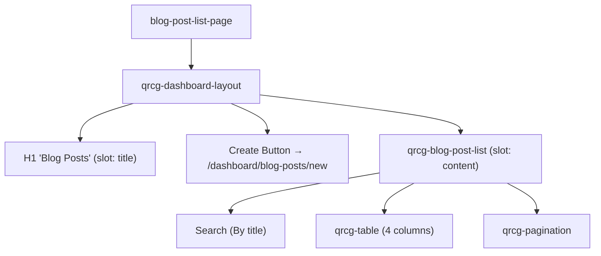

### Table Columns

| # | Key | Label | Notes |
|---|---|---|---|
| 1 | `id` | ID | 2rem |
| 2 | `title` | Title | — |
| 3 | `translation.name` | Language | Linked translation name |
| 4 | `published_at` | Published at | Shows date or `---` if unpublished |
| 5 | `actions` | Actions (7rem) | Edit, Delete |

### Row Actions (Default)

Uses inherited `QRCGDashboardList` default actions: **Edit** → `/dashboard/blog-posts/edit/{id}`, **Delete** → `DELETE /api/blog-posts/{id}`.

---

### Sub-Route: `/dashboard/blog-posts/new|edit/:id` — Blog Post Form

| Property | Value |
|---|---|
| **Permission** | None (default protected) |
| **Form Page** | [qrcg-blog-post-form-page.js](file:///d:/Karsaaz_QR/qr-code-frontend/src/blog-post-module/qrcg-blog-post-form-page.js) |
| **Form Component** | [qrcg-blog-post-form.js](file:///d:/Karsaaz_QR/qr-code-frontend/src/blog-post-module/qrcg-blog-post-form.js) |

### Form Page — Preview Button

The form page includes a **Preview** button (only visible in edit mode) that opens the public blog URL: `{app.url}/blog/post/{slug}` in a new tab. The slug is updated dynamically after each successful save.

### Form Fields

| # | Field | Name | Component | Notes |
|---|---|---|---|---|
| 1 | Title | `title` | `qrcg-input` | — |
| 2 | Content | `content` | `qrcg-markdown-input` | Markdown editor (10 rows) |
| 3 | Excerpt | `excerpt` | `qrcg-textarea` | "Optional excerpt for blog index page" |
| 4 | Meta Description | `meta_description` | `qrcg-textarea` | maxLength: 160 |
| 5 | Featured Image | `featured_image_id` | `qrcg-file-input` | Disabled until first save; upload endpoint: `blog-posts/{id}/upload-featured-image` |
| 6 | Published at | `published_at` | Date input | "Only posts with publish date in the past will be available on the front end" |
| 7 | Language | `translation_id` | `qrcg-relation-select` | Fetches: `GET /api/translations?is_active=true&pagination=false` |

### Blog Post Data Flow

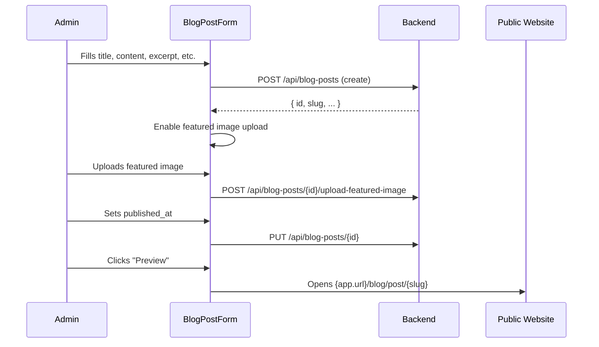

---

## Route 2: `/dashboard/content-blocks` — Content Blocks Management

### Routing & Permissions

| Property | Value |
|---|---|
| **Router** | [qrcg-content-blocks-router.js](file:///d:/Karsaaz_QR/qr-code-frontend/src/content-blocks-module/qrcg-content-blocks-router.js) |
| **Route Pattern** | `/dashboard/content-blocks$` |
| **Permission** | None (default protected) |
| **Page Component** | [qrcg-content-blocks-list-page.js](file:///d:/Karsaaz_QR/qr-code-frontend/src/content-blocks-module/qrcg-content-blocks-list-page.js) |
| **List Component** | [qrcg-content-blocks-list.js](file:///d:/Karsaaz_QR/qr-code-frontend/src/content-blocks-module/qrcg-content-blocks-list.js) |

### Page Layout

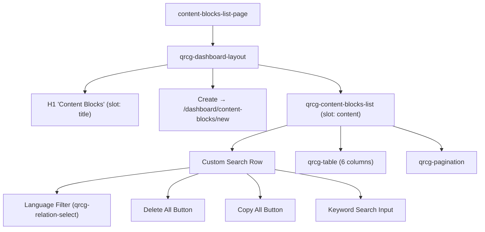

### Custom Search UI

The content-blocks list overrides the default search form with a custom row containing:

1. **Language Filter** — `qrcg-relation-select` fetching `GET /api/translations?paginate=false`, updates URL with `?translation_id={id}` query parameter
2. **Delete All** — Deletes all content blocks of the selected language
3. **Copy All** — Opens Copy Content Blocks Modal
4. **Keyword Search** — "Search by title or position"

> [!IMPORTANT]
> The language filter updates the URL query parameter `translation_id`, which triggers a full data refetch. This allows filtering content blocks by language and sharing filtered URLs.

### Table Columns

| # | Key | Label | Notes |
|---|---|---|---|
| 1 | `title` | Title | — |
| 2 | `position` | Position | Site position identifier |
| 3 | `translation.name` | Language | Default: "English (default)" |
| 4 | `sort_order` | Sort order | — |
| 5 | `created_at` | Created | — |
| 6 | `actions` | Actions (7rem) | Edit, Delete |

### Bulk Actions

| Action | Behavior |
|---|---|
| **Delete All** | Requires language selection → Confirmation → `DELETE /api/content-blocks/of-translation/{translation_id}` → toast + refetch |
| **Copy All** | Opens `QrcgCopyContentBlocksModal` |

### Copy Content Blocks Modal

[qrcg-copy-content-blocks-modal.js](file:///d:/Karsaaz_QR/qr-code-frontend/src/content-blocks-module/qrcg-copy-content-blocks-modal.js)

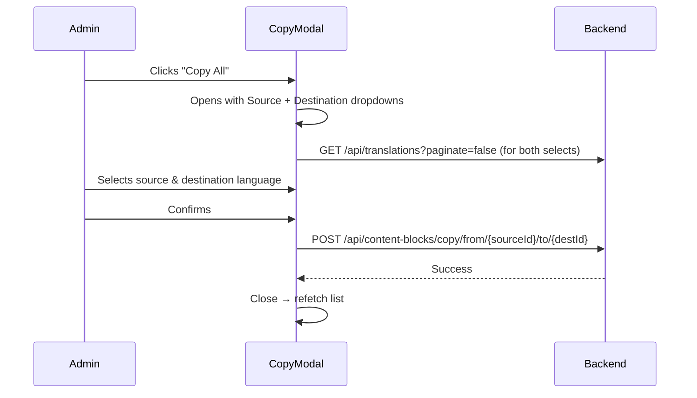

Fields: **Source language** (relation select) and **Destination language** (relation select). Both fetch from `GET /api/translations?paginate=false`.

---

### Sub-Route: `/dashboard/content-blocks/new|edit/:id` — Content Block Form

| Property | Value |
|---|---|
| **Form Page** | [qrcg-content-blocks-form-page.js](file:///d:/Karsaaz_QR/qr-code-frontend/src/content-blocks-module/qrcg-content-blocks-form-page.js) |
| **Form Component** | [qrcg-content-blocks-form.js](file:///d:/Karsaaz_QR/qr-code-frontend/src/content-blocks-module/qrcg-content-blocks-form.js) |

### Form Fields

| # | Field | Name | Component | Notes |
|---|---|---|---|---|
| 1 | Title | `title` | `qrcg-input` | Placeholder: "Block title" |
| 2 | Position | `position` | `qrcg-select` | Options from `Config.get('content-manager.positions')` — driven by system config |
| 3 | Sort Order | `sort_order` | `qrcg-input` | "Controls the order of each block in the selected position" |
| 4 | Content | `content` | `qrcg-markdown-input` | Markdown editor |
| 5 | Language | `translation_id` | `qrcg-relation-select` | Fetches: `GET /api/translations?is_active=true&pagination=false` |

---

## Route 3: `/dashboard/translations` — Translations Management

### Routing & Permissions

| Property | Value |
|---|---|
| **Router** | [qrcg-translation-router.js](file:///d:/Karsaaz_QR/qr-code-frontend/src/translation-module/qrcg-translation-router.js) |
| **Route Pattern** | `/dashboard/translations$` |
| **Permission** | `translation.list-all` |
| **Page Component** | [qrcg-translation-list-page.js](file:///d:/Karsaaz_QR/qr-code-frontend/src/translation-module/qrcg-translation-list-page.js) |
| **List Component** | [qrcg-translation-list.js](file:///d:/Karsaaz_QR/qr-code-frontend/src/translation-module/qrcg-translation-list.js) |

### Page Layout

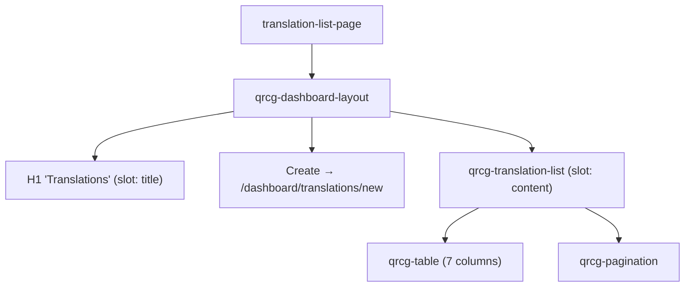

### Table Columns

| # | Key | Label | Notes |
|---|---|---|---|
| 1 | `id` | ID | 2rem |
| 2 | `name` | Name | e.g. "English", "Arabic" |
| 3 | `locale` | Locale | e.g. "en", "ar" |
| 4 | `is_active` | Active | YES/NO badge |
| 5 | `is_main` | Main Language | YES/NO badge |
| 6 | `completeness` | Completeness | Displayed as `{value}%` |
| 7 | `actions` | Actions (20rem) | 5 actions (widest actions column) |

### Row Actions (5)

| # | Action | Behavior |
|---|---|---|
| 1 | **Edit** | → `/dashboard/translations/edit/{id}` |
| 2 | **Delete** | Confirmation → `DELETE /api/translations/{id}` |
| 3 | **Activate / Disable** | Toggle — Confirmation → `POST /api/translations/{id}/toggle-activate` → refetch |
| 4 | **Auto Translate** | If Google API key not configured → redirect to System Settings. Otherwise: Confirmation → `POST /api/translations/{id}/auto-translate` → toast "check completeness after a few minutes" |
| 5 | **Set Main Language** | Confirmation → `POST /api/translations/{id}/set-main` → refetch |

### Auto Translate Flow

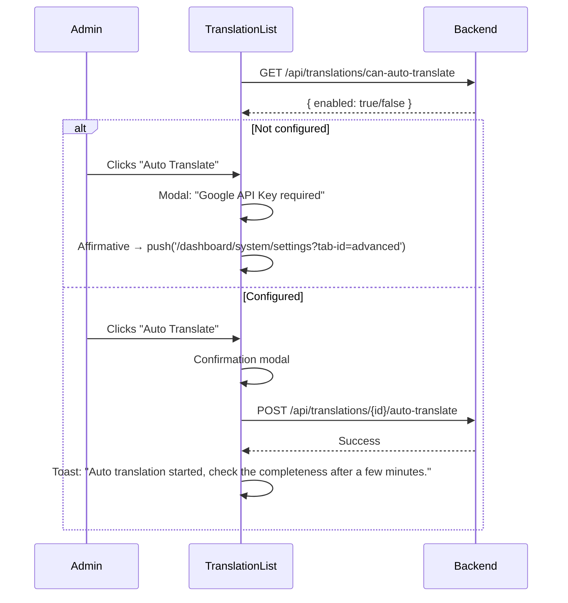

> [!NOTE]
> On component mount, the list checks `GET /api/translations/can-auto-translate` to determine if Google Translate API is configured. This controls whether clicking "Auto Translate" triggers translation or redirects to system settings.

---

### Sub-Route: `/dashboard/translations/new|edit/:id` — Translation Form

| Property | Value |
|---|---|
| **Permission** | `translation.store` |
| **Form Page** | [qrcg-translation-form-page.js](file:///d:/Karsaaz_QR/qr-code-frontend/src/translation-module/qrcg-translation-form-page.js) |
| **Form Component** | [qrcg-translation-form.js](file:///d:/Karsaaz_QR/qr-code-frontend/src/translation-module/qrcg-translation-form.js) |

### Help Section (above form fields)

The form displays two informational comments:
1. **Help** — Download link for the default translation JSON file; "modify it and upload below"
2. **Hint** — Cross-navigation links to [Blog Posts](/dashboard/blog-posts) and [Content Blocks](/dashboard/content-blocks) for translating website content

### Form Fields

| # | Field | Name | Component | Notes |
|---|---|---|---|---|
| 1 | Name | `name` | `qrcg-input` | Disabled for default translation |
| 2 | Display Name | `display_name` | `qrcg-input` | "Used in the language picker component. Can be in any language." Disabled for default |
| 3 | Locale | `locale` | `qrcg-input` | Disabled for default |
| 4 | Direction | `direction` | Balloon selector | Options: "Right to Left" (rtl), "Left to Right" (ltr) |
| 5 | Flag Image | `flag_file_id` | `qrcg-file-input` | Upload endpoint: `files`, attachable_type: "Translation" |
| 6 | Translation File | `translation_file_id` | `qrcg-file-input` | Upload endpoint: `translations/{id}/upload`, accepts `.json` only, disabled until first save, readonly for default translation |

### Default Translation Handling

When `data.is_default` is true, all form inputs except file uploads are **disabled** — the default/English translation is read-only for name, display_name, and locale fields.

---

## Route 4: `/dashboard/custom-codes` — Custom Code Injection

### Routing & Permissions

| Property | Value |
|---|---|
| **Router** | [qrcg-custom-code-router.js](file:///d:/Karsaaz_QR/qr-code-frontend/src/custom-code-module/qrcg-custom-code-router.js) |
| **Route Pattern** | `/dashboard/custom-codes$` |
| **Permission** | `custom-code.list-all` |
| **Page Component** | [qrcg-custom-code-list-page.js](file:///d:/Karsaaz_QR/qr-code-frontend/src/custom-code-module/qrcg-custom-code-list-page.js) |
| **List Component** | [qrcg-custom-code-list.js](file:///d:/Karsaaz_QR/qr-code-frontend/src/custom-code-module/qrcg-custom-code-list.js) |

### Page Layout

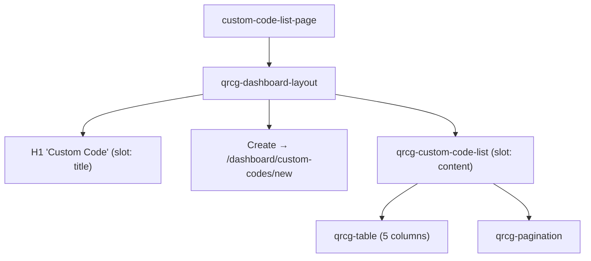

### Table Columns

| # | Key | Label | Notes |
|---|---|---|---|
| 1 | `id` | ID | 2rem |
| 2 | `name` | Name | e.g. "Facebook Pixel" |
| 3 | `language` | Language | javascript, html, or css |
| 4 | `position` | Position | Site injection point |
| 5 | `sort_order` | Sort order | — |
| 6 | `actions` | Actions (7rem) | Edit, Delete |

---

### Sub-Route: `/dashboard/custom-codes/new|edit/:id` — Custom Code Form

| Property | Value |
|---|---|
| **Permission** | `custom-code.update-any` |
| **Form Page** | [qrcg-custom-code-form-page.js](file:///d:/Karsaaz_QR/qr-code-frontend/src/custom-code-module/qrcg-custom-code-form-page.js) |
| **Form Component** | [qrcg-custom-code-form.js](file:///d:/Karsaaz_QR/qr-code-frontend/src/custom-code-module/qrcg-custom-code-form.js) |

### Form Fields

| # | Field | Name | Component | Notes |
|---|---|---|---|---|
| 1 | Name | `name` | `qrcg-input` | Placeholder: "e.g. Facebook Pixel" |
| 2 | Language | `language` | `qrcg-select` | Options: JavaScript, HTML, CSS |
| 3 | Position | `position` | `qrcg-searchable-select` | Options fetched from `GET /api/custom-codes/positions` |
| 4 | Sort Order | `sort_order` | `qrcg-input` (number) | "Control the sort order of the code block" |
| 5 | Code | `code` | `qrcg-code-input` | **Language-aware syntax highlighting** — dynamically switches based on the Language field selection |

### Code Editor Language Sync

The `qrcg-code-input` component receives the current `language` value from the form data, providing real-time syntax highlighting that matches the selected language (JavaScript, HTML, or CSS).

---

## Route 5: `/dashboard/pages` — Static Pages Management

### Routing & Permissions

| Property | Value |
|---|---|
| **Router** | [qrcg-page-router.js](file:///d:/Karsaaz_QR/qr-code-frontend/src/page-module/qrcg-page-router.js) |
| **Route Pattern** | `/dashboard/pages$` |
| **Permission** | `page.list-all` |
| **Page Component** | [qrcg-page-list-page.js](file:///d:/Karsaaz_QR/qr-code-frontend/src/page-module/qrcg-page-list-page.js) |
| **List Component** | [qrcg-page-list.js](file:///d:/Karsaaz_QR/qr-code-frontend/src/page-module/qrcg-page-list.js) |

### Page Layout

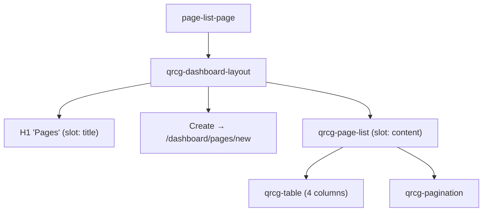

### Table Columns

| # | Key | Label | Notes |
|---|---|---|---|
| 1 | `id` | ID | 2rem |
| 2 | `title` | Title | — |
| 3 | `slug` | Slug | URL path segment |
| 4 | `published` | Published | YES/NO badge |
| 5 | `actions` | Actions (7rem) | Edit, Delete |

---

### Sub-Route: `/dashboard/pages/new|edit/:id` — Page Form

| Property | Value |
|---|---|
| **Permission** | `page.update-any` |
| **Form Page** | [qrcg-page-form-page.js](file:///d:/Karsaaz_QR/qr-code-frontend/src/page-module/qrcg-page-form-page.js) |
| **Form Component** | [qrcg-page-form.js](file:///d:/Karsaaz_QR/qr-code-frontend/src/page-module/qrcg-page-form.js) |

### Form Fields

| # | Field | Name | Component | Notes |
|---|---|---|---|---|
| 1 | Title | `title` | `qrcg-input` | **Auto-slugify**: typing title auto-generates slug via `slugify()` |
| 2 | Slug | `slug` | `qrcg-input` | Shows live URL preview: `{app.url}/{slug}` with link to public page |
| 3 | HTML Content | `html_content` | `qrcg-code-input` | HTML code editor |
| 4 | Meta Description | `meta_description` | `qrcg-textarea` | maxlength: 160 |
| 5 | Published | `published` | `qrcg-checkbox` | Toggle publication status |

### Auto-Slug Feature

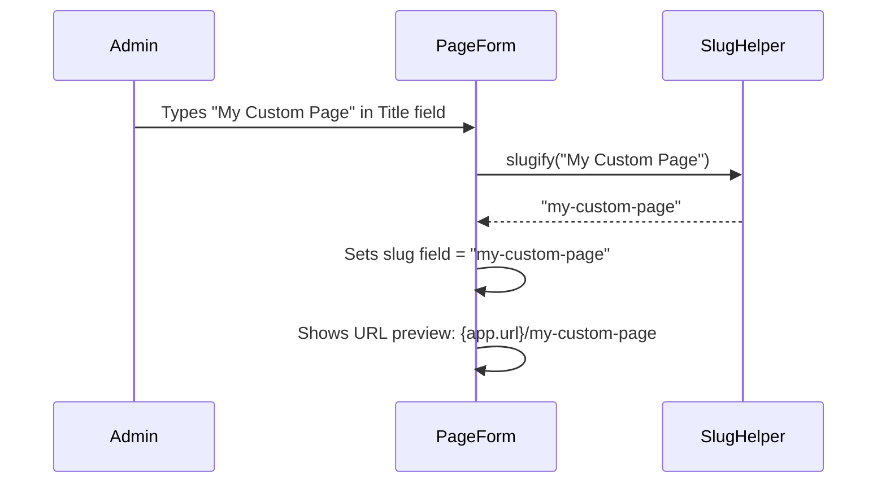

---

## Route 6: `/dashboard/dynamic-biolink-blocks` — Dynamic Biolink Blocks

### Routing & Permissions

| Property | Value |
|---|---|
| **Router** | [qrcg-dynamic-biolink-block-router.js](file:///d:/Karsaaz_QR/qr-code-frontend/src/dynamic-biolink-block-module/qrcg-dynamic-biolink-block-router.js) |
| **Route Pattern** | `/dashboard/dynamic-biolink-blocks$` |
| **Permission** | `dynamic-biolink-block.list-all` |
| **Page Component** | [qrcg-dynamic-biolink-block-list-page.js](file:///d:/Karsaaz_QR/qr-code-frontend/src/dynamic-biolink-block-module/qrcg-dynamic-biolink-block-list-page.js) |
| **List Component** | [qrcg-dynamic-biolink-block-list.js](file:///d:/Karsaaz_QR/qr-code-frontend/src/dynamic-biolink-block-module/qrcg-dynamic-biolink-block-list.js) |

### Page Layout

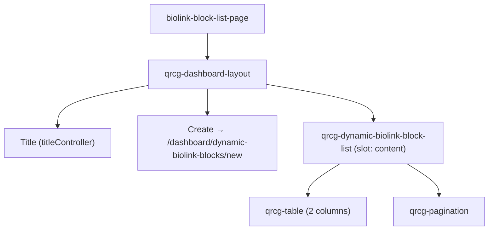

### Table Columns

| # | Key | Label | Notes |
|---|---|---|---|
| 1 | `id` | ID | 2rem |
| 2 | `name` | Name | Block name |
| 3 | `actions` | Actions (7rem) | Edit, Delete |

> [!NOTE]
> This is the most minimal list — only 2 data columns. The complexity is in the form, which supports dynamic field definitions.

---

### Sub-Route: `/dashboard/dynamic-biolink-blocks/new|edit/:id` — Biolink Block Form

| Property | Value |
|---|---|
| **Permission** | `dynamic-biolink-block.update-any` |
| **Form Page** | [qrcg-dynamic-biolink-block-form-page.js](file:///d:/Karsaaz_QR/qr-code-frontend/src/dynamic-biolink-block-module/qrcg-dynamic-biolink-block-form-page.js) |
| **Form Component** | [qrcg-dynamic-biolink-block-form.js](file:///d:/Karsaaz_QR/qr-code-frontend/src/dynamic-biolink-block-module/qrcg-dynamic-biolink-block-form.js) |

### Form Sections (3)

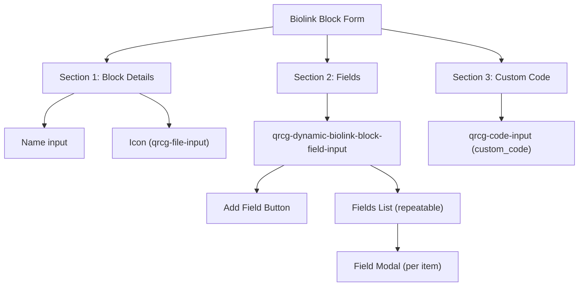

#### Section 1: Block Details

| Field | Name | Component | Notes |
|---|---|---|---|
| Name | `name` | `qrcg-input` | Block name |
| Icon | `icon_id` | `qrcg-file-input` | Upload endpoint: `dynamic-biolink-blocks/store-file` |

#### Section 2: Fields (Dynamic List Builder)

[field-input/input.js](file:///d:/Karsaaz_QR/qr-code-frontend/src/dynamic-biolink-block-module/field-input/input.js) extends `ImageListInput`

Provides a repeatable list of fields with "Add Field" button. Each field opens a modal for editing.

#### Field Modal

[field-input/modal.js](file:///d:/Karsaaz_QR/qr-code-frontend/src/dynamic-biolink-block-module/field-input/modal.js) extends `ImageListModal`

| Field | Name | Component | Notes |
|---|---|---|---|
| Icon | `icon_id` | `qrcg-file-input` | Upload endpoint: `dynamic-biolink-blocks/store-file`, recommended 200x200 |
| Name | `name` | `qrcg-input` | Field name |
| Placeholder | `placeholder` | `qrcg-input` | Input placeholder text |
| Type | `type` | Balloon selector | Options: Text, Text Area, Image, Custom Code |

#### Section 3: Custom Code

| Field | Name | Component | Notes |
|---|---|---|---|
| Custom Code | `custom_code` | `qrcg-code-input` | "Added on every Bio Link page where this dynamic block is included" |

### Field Building Flow

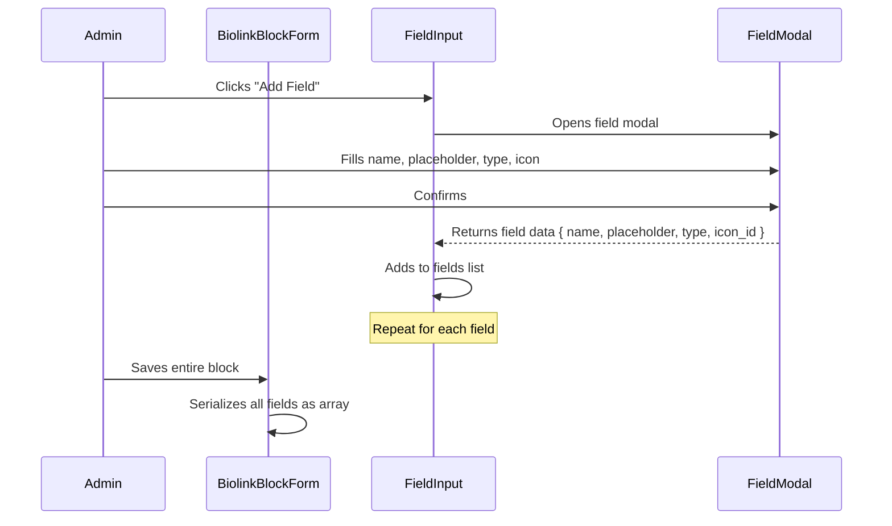

---

## Inter-Page Navigation Map

```mermaid
graph LR
    subgraph Blog Posts
        BPL["Blog Posts List"] -->|Create| BPF["Blog Post Form"]
        BPL -->|Edit| BPF
        BPF -->|Preview| PBP[/"Public: /blog/post/{slug}"/]
    end

    subgraph Content Blocks
        CBL["Content Blocks List"] -->|Create| CBF["Content Block Form"]
        CBL -->|Edit| CBF
        CBL -->|Copy All| CCM["Copy Modal"]
        CBL -->|Delete All| DAPI["DELETE /api/content-blocks/of-translation/{id}"]
    end

    subgraph Translations
        TL["Translations List"] -->|Create| TF["Translation Form"]
        TL -->|Edit| TF
        TL -->|Auto Translate (no key)| SS["/dashboard/system/settings?tab-id=advanced"]
        TF -->|Hint links| BPL
        TF -->|Hint links| CBL
    end

    subgraph Custom Codes
        CCL["Custom Codes List"] -->|Create| CCF["Custom Code Form"]
        CCL -->|Edit| CCF
    end

    subgraph Pages
        PL["Pages List"] -->|Create| PF["Page Form"]
        PL -->|Edit| PF
        PF -->|URL preview| PPP[/"Public: /{slug}"/]
    end

    subgraph Dynamic Biolink Blocks
        DBL["Biolink Blocks List"] -->|Create| DBF["Biolink Block Form"]
        DBL -->|Edit| DBF
        DBF -->|Add Field| FM["Field Modal"]
    end

    %% Cross-module links
    TF -.->|"cross-nav"| BPL
    TF -.->|"cross-nav"| CBL
    CBL -.->|"uses translations API"| TL
    BPF -.->|"uses translations API"| TL
    CBF -.->|"uses translations API"| TL
```

### Cross-Module Dependencies

| Source Module | Target Module | Mechanism |
|---|---|---|
| **Translations Form** | Blog Posts List | Direct link: "Do not forget to translate the blog" |
| **Translations Form** | Content Blocks List | Direct link: "Do not forget to translate the content blocks" |
| **Translations List** | System Settings | Redirect when Google API key missing (Auto Translate) |
| **Blog Post Form** | Translations API | Language dropdown: `GET /api/translations?is_active=true` |
| **Content Block Form** | Translations API | Language dropdown: `GET /api/translations?is_active=true` |
| **Content Blocks List** | Translations API | Language filter: `GET /api/translations?paginate=false` |

---

## Complete API Endpoint Reference

### Blog Posts

| Method | Endpoint | Used By | Purpose |
|---|---|---|---|
| `GET` | `/api/blog-posts?keyword=&page=` | Blog post list | Paginated list |
| `GET` | `/api/blog-posts/{id}` | Blog post form | Fetch single |
| `POST` | `/api/blog-posts` | Blog post form | Create |
| `PUT` | `/api/blog-posts/{id}` | Blog post form | Update |
| `DELETE` | `/api/blog-posts/{id}` | Row action | Delete |
| `POST` | `/api/blog-posts/{id}/upload-featured-image` | Form file input | Upload featured image |

### Content Blocks

| Method | Endpoint | Used By | Purpose |
|---|---|---|---|
| `GET` | `/api/content-blocks?keyword=&page=&translation_id=` | Content blocks list | Paginated + language-filtered list |
| `GET` | `/api/content-blocks/{id}` | Content blocks form | Fetch single |
| `POST` | `/api/content-blocks` | Content blocks form | Create |
| `PUT` | `/api/content-blocks/{id}` | Content blocks form | Update |
| `DELETE` | `/api/content-blocks/{id}` | Row action | Delete |
| `DELETE` | `/api/content-blocks/of-translation/{translation_id}` | "Delete All" bulk action | Delete all blocks of a language |
| `POST` | `/api/content-blocks/copy/from/{sourceId}/to/{destId}` | Copy modal | Copy blocks from source to destination language |

### Translations

| Method | Endpoint | Used By | Purpose |
|---|---|---|---|
| `GET` | `/api/translations?keyword=&page=` | Translation list | Paginated list |
| `GET` | `/api/translations?paginate=false` | Copy modal, content-block language filter | All translations (unpaginated) |
| `GET` | `/api/translations?is_active=true&pagination=false` | Blog form, content-block form language dropdowns | Active translations |
| `GET` | `/api/translations/{id}` | Translation form | Fetch single |
| `POST` | `/api/translations` | Translation form | Create |
| `PUT` | `/api/translations/{id}` | Translation form | Update |
| `DELETE` | `/api/translations/{id}` | Row action | Delete |
| `POST` | `/api/translations/{id}/toggle-activate` | "Activate/Disable" row action | Toggle active status |
| `POST` | `/api/translations/{id}/auto-translate` | "Auto Translate" row action | Trigger Google auto-translation |
| `POST` | `/api/translations/{id}/set-main` | "Set Main Language" row action | Set as main website language |
| `GET` | `/api/translations/can-auto-translate` | List component (on mount) | Check if Google API key is configured |
| `POST` | `/api/translations/{id}/upload` | Translation form file input | Upload JSON translation file |

### Custom Codes

| Method | Endpoint | Used By | Purpose |
|---|---|---|---|
| `GET` | `/api/custom-codes?keyword=&page=` | Custom code list | Paginated list |
| `GET` | `/api/custom-codes/{id}` | Custom code form | Fetch single |
| `POST` | `/api/custom-codes` | Custom code form | Create |
| `PUT` | `/api/custom-codes/{id}` | Custom code form | Update |
| `DELETE` | `/api/custom-codes/{id}` | Row action | Delete |
| `GET` | `/api/custom-codes/positions` | Custom code form | Fetch available injection positions |

### Pages

| Method | Endpoint | Used By | Purpose |
|---|---|---|---|
| `GET` | `/api/pages?keyword=&page=` | Page list | Paginated list |
| `GET` | `/api/pages/{id}` | Page form | Fetch single |
| `POST` | `/api/pages` | Page form | Create |
| `PUT` | `/api/pages/{id}` | Page form | Update |
| `DELETE` | `/api/pages/{id}` | Row action | Delete |

### Dynamic Biolink Blocks

| Method | Endpoint | Used By | Purpose |
|---|---|---|---|
| `GET` | `/api/dynamic-biolink-blocks?keyword=&page=` | Biolink block list | Paginated list |
| `GET` | `/api/dynamic-biolink-blocks/{id}` | Biolink block form | Fetch single |
| `POST` | `/api/dynamic-biolink-blocks` | Biolink block form | Create |
| `PUT` | `/api/dynamic-biolink-blocks/{id}` | Biolink block form | Update |
| `DELETE` | `/api/dynamic-biolink-blocks/{id}` | Row action | Delete |
| `POST` | `/api/dynamic-biolink-blocks/store-file` | Form + field modal file inputs | Upload icon file |

---

## Key Component File Map

| Component | File | Role |
|---|---|---|
| **Blog Post Router** | [qrcg-blog-post-router.js](file:///d:/Karsaaz_QR/qr-code-frontend/src/blog-post-module/qrcg-blog-post-router.js) | List + form routes |
| **Blog Post List Page** | [qrcg-blog-post-list-page.js](file:///d:/Karsaaz_QR/qr-code-frontend/src/blog-post-module/qrcg-blog-post-list-page.js) | Page wrapper with Create |
| **Blog Post List** | [qrcg-blog-post-list.js](file:///d:/Karsaaz_QR/qr-code-frontend/src/blog-post-module/qrcg-blog-post-list.js) | 4-column table, search by title |
| **Blog Post Form Page** | [qrcg-blog-post-form-page.js](file:///d:/Karsaaz_QR/qr-code-frontend/src/blog-post-module/qrcg-blog-post-form-page.js) | Form wrapper with Preview button |
| **Blog Post Form** | [qrcg-blog-post-form.js](file:///d:/Karsaaz_QR/qr-code-frontend/src/blog-post-module/qrcg-blog-post-form.js) | 7 fields: title, markdown, excerpt, meta, image, date, language |
| **Content Blocks Router** | [qrcg-content-blocks-router.js](file:///d:/Karsaaz_QR/qr-code-frontend/src/content-blocks-module/qrcg-content-blocks-router.js) | List + form routes |
| **Content Blocks List Page** | [qrcg-content-blocks-list-page.js](file:///d:/Karsaaz_QR/qr-code-frontend/src/content-blocks-module/qrcg-content-blocks-list-page.js) | Page wrapper with Create |
| **Content Blocks List** | [qrcg-content-blocks-list.js](file:///d:/Karsaaz_QR/qr-code-frontend/src/content-blocks-module/qrcg-content-blocks-list.js) | 6-column table, language filter, Delete All, Copy All |
| **Content Blocks Form Page** | [qrcg-content-blocks-form-page.js](file:///d:/Karsaaz_QR/qr-code-frontend/src/content-blocks-module/qrcg-content-blocks-form-page.js) | Simple form wrapper |
| **Content Blocks Form** | [qrcg-content-blocks-form.js](file:///d:/Karsaaz_QR/qr-code-frontend/src/content-blocks-module/qrcg-content-blocks-form.js) | 5 fields: title, position, sort, markdown, language |
| **Copy Content Blocks Modal** | [qrcg-copy-content-blocks-modal.js](file:///d:/Karsaaz_QR/qr-code-frontend/src/content-blocks-module/qrcg-copy-content-blocks-modal.js) | Source→Destination language copy |
| **Translation Router** | [qrcg-translation-router.js](file:///d:/Karsaaz_QR/qr-code-frontend/src/translation-module/qrcg-translation-router.js) | List + form routes |
| **Translation List Page** | [qrcg-translation-list-page.js](file:///d:/Karsaaz_QR/qr-code-frontend/src/translation-module/qrcg-translation-list-page.js) | Page wrapper with Create |
| **Translation List** | [qrcg-translation-list.js](file:///d:/Karsaaz_QR/qr-code-frontend/src/translation-module/qrcg-translation-list.js) | 7-column table, 5 row actions, auto-translate capability check |
| **Translation Form Page** | [qrcg-translation-form-page.js](file:///d:/Karsaaz_QR/qr-code-frontend/src/translation-module/qrcg-translation-form-page.js) | Simple form wrapper |
| **Translation Form** | [qrcg-translation-form.js](file:///d:/Karsaaz_QR/qr-code-frontend/src/translation-module/qrcg-translation-form.js) | 6 fields + help text, default translation file download, cross-links |
| **Custom Code Router** | [qrcg-custom-code-router.js](file:///d:/Karsaaz_QR/qr-code-frontend/src/custom-code-module/qrcg-custom-code-router.js) | List + form routes |
| **Custom Code List Page** | [qrcg-custom-code-list-page.js](file:///d:/Karsaaz_QR/qr-code-frontend/src/custom-code-module/qrcg-custom-code-list-page.js) | Page wrapper with Create |
| **Custom Code List** | [qrcg-custom-code-list.js](file:///d:/Karsaaz_QR/qr-code-frontend/src/custom-code-module/qrcg-custom-code-list.js) | 5-column table |
| **Custom Code Form Page** | [qrcg-custom-code-form-page.js](file:///d:/Karsaaz_QR/qr-code-frontend/src/custom-code-module/qrcg-custom-code-form-page.js) | Simple form wrapper |
| **Custom Code Form** | [qrcg-custom-code-form.js](file:///d:/Karsaaz_QR/qr-code-frontend/src/custom-code-module/qrcg-custom-code-form.js) | 5 fields with language-aware code editor |
| **Page Router** | [qrcg-page-router.js](file:///d:/Karsaaz_QR/qr-code-frontend/src/page-module/qrcg-page-router.js) | List + form routes |
| **Page List Page** | [qrcg-page-list-page.js](file:///d:/Karsaaz_QR/qr-code-frontend/src/page-module/qrcg-page-list-page.js) | Page wrapper with Create |
| **Page List** | [qrcg-page-list.js](file:///d:/Karsaaz_QR/qr-code-frontend/src/page-module/qrcg-page-list.js) | 4-column table with Published badge |
| **Page Form Page** | [qrcg-page-form-page.js](file:///d:/Karsaaz_QR/qr-code-frontend/src/page-module/qrcg-page-form-page.js) | Simple form wrapper |
| **Page Form** | [qrcg-page-form.js](file:///d:/Karsaaz_QR/qr-code-frontend/src/page-module/qrcg-page-form.js) | 5 fields with auto-slugify + URL preview |
| **Biolink Block Router** | [qrcg-dynamic-biolink-block-router.js](file:///d:/Karsaaz_QR/qr-code-frontend/src/dynamic-biolink-block-module/qrcg-dynamic-biolink-block-router.js) | List + form routes |
| **Biolink Block List Page** | [qrcg-dynamic-biolink-block-list-page.js](file:///d:/Karsaaz_QR/qr-code-frontend/src/dynamic-biolink-block-module/qrcg-dynamic-biolink-block-list-page.js) | Page wrapper with Create |
| **Biolink Block List** | [qrcg-dynamic-biolink-block-list.js](file:///d:/Karsaaz_QR/qr-code-frontend/src/dynamic-biolink-block-module/qrcg-dynamic-biolink-block-list.js) | Minimal 2-column table |
| **Biolink Block Form Page** | [qrcg-dynamic-biolink-block-form-page.js](file:///d:/Karsaaz_QR/qr-code-frontend/src/dynamic-biolink-block-module/qrcg-dynamic-biolink-block-form-page.js) | Simple form wrapper |
| **Biolink Block Form** | [qrcg-dynamic-biolink-block-form.js](file:///d:/Karsaaz_QR/qr-code-frontend/src/dynamic-biolink-block-module/qrcg-dynamic-biolink-block-form.js) | 3 sections: details, fields builder, custom code |
| **Field Input** | [field-input/input.js](file:///d:/Karsaaz_QR/qr-code-frontend/src/dynamic-biolink-block-module/field-input/input.js) | Repeatable field list builder (extends ImageListInput) |
| **Field Modal** | [field-input/modal.js](file:///d:/Karsaaz_QR/qr-code-frontend/src/dynamic-biolink-block-module/field-input/modal.js) | Per-field editor: name, placeholder, type, icon |
