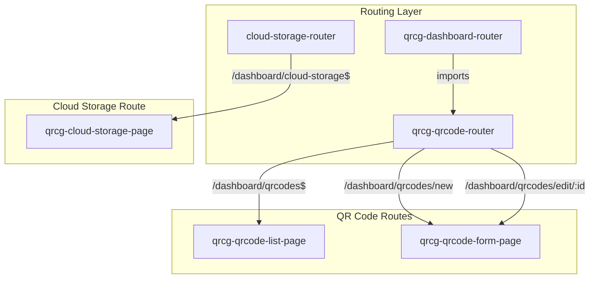
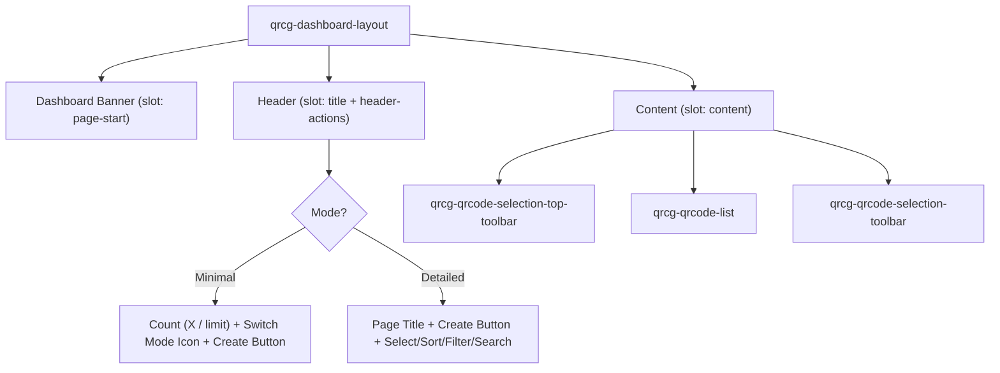
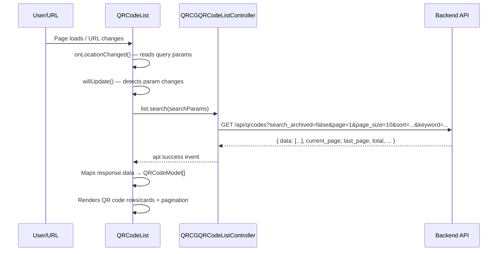
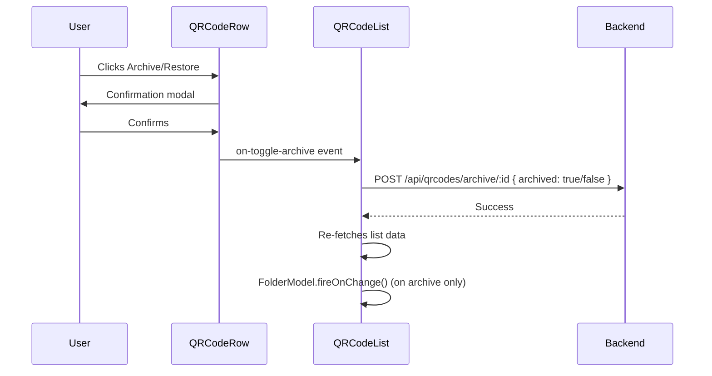
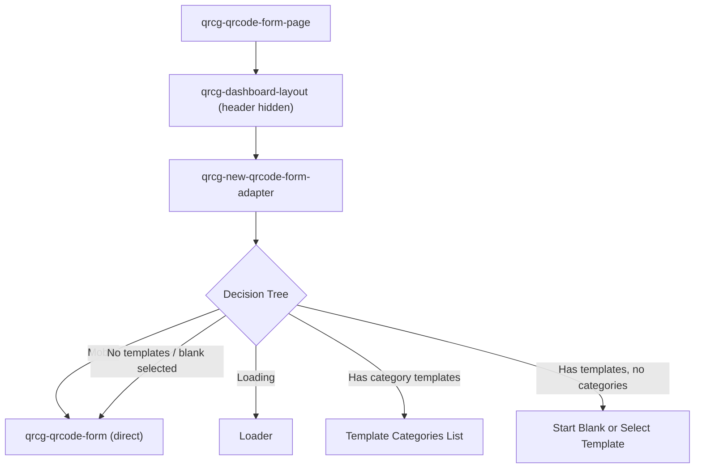
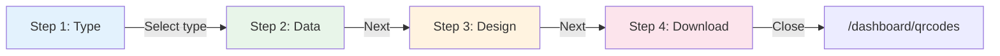
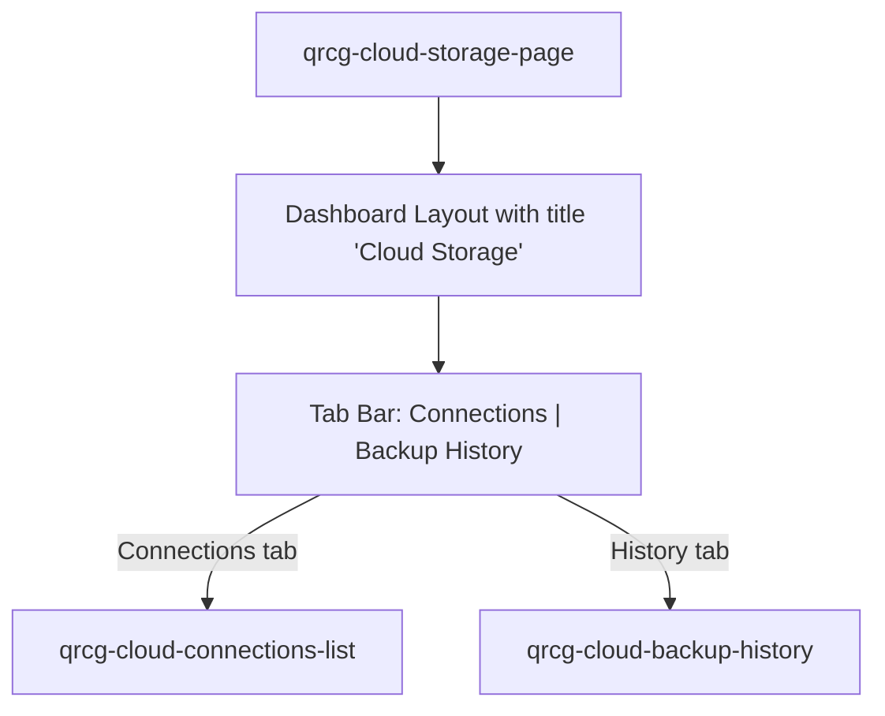
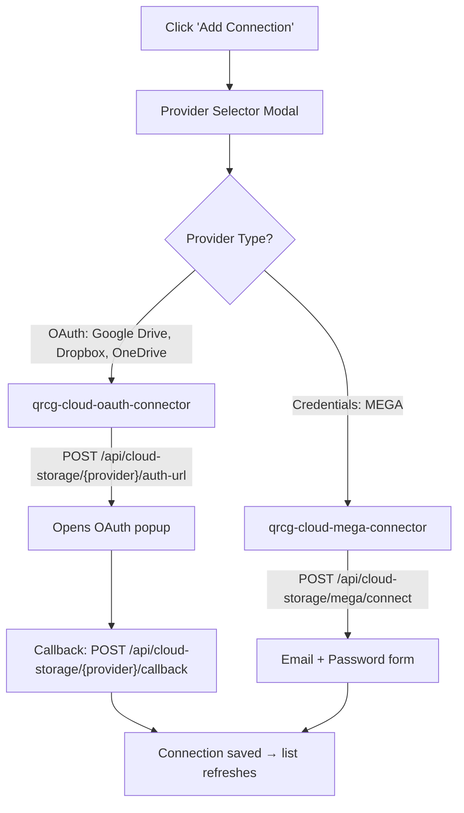
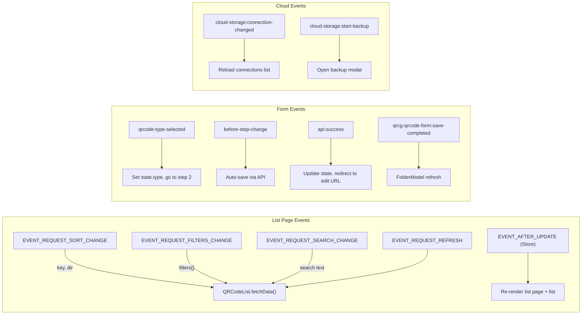

# QR Code Frontend — Four Routes: Comprehensive Flow Documentation

> **Project**: `qr-code-frontend` (Lit + Vite Web Components)  
> **Analyzed Routes**:  
> 1. `/dashboard/qrcodes` — Active QR Codes List  
> 2. `/dashboard/qrcodes?archived=true` — Archived QR Codes List  
> 3. `/dashboard/qrcodes/new` — Create New QR Code  
> 4. `/dashboard/cloud-storage` — Cloud Storage Management  

---

## Architecture Overview



---

## Route 1: `/dashboard/qrcodes` — Active QR Codes List

### Routing & Permissions

| Property | Value |
|---|---|
| **Router** | [qrcg-qrcode-router.js](file:///d:/Karsaaz_QR/qr-code-frontend/src/qrcode-module/qrcg-qrcode-router.js) |
| **Route Pattern** | `/dashboard/qrcodes$` |
| **Permission** | `qrcode.list` |
| **Page Component** | [qrcg-qrcode-list-page.js](file:///d:/Karsaaz_QR/qr-code-frontend/src/qrcode-module/qrcg-qrcode-list-page.js) |

### Page Title
Set dynamically in `qrcg-qrcode-list.js`: **"Existing QRs"** (when no `archived` query param is present).

### UI Structure



### Display Modes

The list page has two display modes, persisted in `localStorage.qrcodeListPageStoreMode`:

| Mode | Header | QR Code Rendering | Default |
|---|---|---|---|
| **Minimal** | Shows `totalCount / planLimit QR Codes` + switch icon + create button | `qrcg-qrcode-minimal-card` | Config-driven |
| **Detailed** | Full header with title, create button, select, sort, filter, search | `qrcg-qrcode-row` (full card with actions) | Config-driven |

### Store: `QrcgQRCodeListPageStore` (Singleton)

[qrcg-qrcode-list-page-store.js](file:///d:/Karsaaz_QR/qr-code-frontend/src/qrcode-module/qrcg-qrcode-list-page-store.js)

- **State**: `mode`, `isSelectionEnabled`, `pageSize` (default 10, 5 on mobile), `showQRCodePreview`, `qrcodes[]`
- **Selection**: `selectedQRCodeIds`, `clearSelectedQRCodeIds()`, `selectAll()`
- **Events**: Proxy-based auto-notification via `EVENT_AFTER_UPDATE`

### Header Actions (Detailed Mode)

| Action | Component | Behavior |
|---|---|---|
| **Create QR** | `<qrcg-button>` | Navigates to `/dashboard/qrcodes/new`. Hidden on archived view. |
| **Bulk Create** | `<qrcg-button>` | Navigates to `/dashboard/bulk-operations`. Feature-gated (`bulk-qrcode-creation`). Hidden on mobile. |
| **Select** | `<qrcg-button>` | Toggles `store.isSelectionEnabled` — shows checkboxes on each QR row |
| **Sort** | `<qrcg-button>` → `QrcgDropdown` | Opens dropdown with 8 sort options (see below) |
| **Filters** | `<qrcg-button>` → `QrcgQrcodeFiltersModal` | Opens filter modal (see below) |
| **Search** | `<qrcg-input>` | Live text search dispatches `EVENT_REQUEST_SEARCH_CHANGE` |

### Sort Options

| Label | Sort Key | Direction |
|---|---|---|
| Name (A-Z) | `name` | `asc` |
| Name (Z-A) | `name` | `desc` |
| Type (A-Z) | `type` | `asc` |
| Type (Z-A) | `type` | `desc` |
| Most Scans | `scans_count` | `desc` |
| Fewest Scans | `scans_count` | `asc` |
| Most Recent | `created_at` | `desc` |
| Oldest | `created_at` | `asc` |

### Filters Modal

[qrcg-qrcode-filters-modal.js](file:///d:/Karsaaz_QR/qr-code-frontend/src/qrcode-module/qrcg-qrcode-filters-modal/qrcg-qrcode-filters-modal.js)

| Filter | Input Type | Notes |
|---|---|---|
| **Keyword** | Text input | Searches by name or slug |
| **Number of Scans** | Number range input (min/max) | JSON-serialized |
| **Filter By Type** | Balloon selector (Yes/No) | Conditionally shows type multi-select |
| **QR Code Type** | Balloon selector (multiple) | All available QR types from `QRCodeTypeManager` |
| **User** | Searchable relation select | Super admin only |

Actions: **Apply Filters** and **Clear Filters**.

### QR Code List Component

[qrcg-qrcode-list.js](file:///d:/Karsaaz_QR/qr-code-frontend/src/qrcode-module/qrcg-qrcode-list.js)

#### Data Fetching Flow



#### API Endpoint: `GET /api/qrcodes`

| Parameter | Source | Description |
|---|---|---|
| `search_archived` | URL `?archived=true` | `false` for active, `true` for archived |
| `page` | URL `?page=N` | Current page number |
| `page_size` | Store | 10 (desktop) or 5 (mobile) |
| `folder_id` | URL `?folder_id=N` | Filter by folder |
| `sort` | Sort dropdown | Format: `key,dir` (e.g. `name,asc`) |
| `keyword` | Search/Filter | Search by name/slug |
| `type` | Filter modal | QR code type filter |
| `user_id` | Filter modal | Admin-only user filter |
| `scans_count` | Filter modal | JSON range `{"min":X,"max":Y}` |

### QR Code Row Actions (Detailed Mode)

[qrcg-qrcode-row.js](file:///d:/Karsaaz_QR/qr-code-frontend/src/qrcode-module/qrcg-qrcode-row.js)

Each row displays: Preview image, QR name, type badge, dynamic badge, scan count, dates, folder info, security info, and a dropdown menu with:

| Action | API Call | Notes |
|---|---|---|
| **Edit** | Navigation | `/dashboard/qrcodes/edit/:id` |
| **Copy** | `POST /api/qrcodes` (save clone) | Duplicates QR code, adds to page 1 |
| **Delete** | `DELETE /api/qrcodes/:id` | With confirmation modal |
| **Archive/Restore** | `POST /api/qrcodes/archive/:id` | Body: `{ archived: true/false }` |
| **Download PNG** | Download | Via `qrcg-download-qrcode-modal` |
| **Download SVG** | Download | SVG download |
| **Preview** | Modal | `qrcg-qrcode-preview-modal` |
| **Share** | Modal | `qrcg-qrcode-share-modal` |
| **Pin Code** | Modal | `qrcg-pincode-modal` — security feature |
| **Status Toggle** | `POST /api/qrcodes/status/:id` | Enable/disable QR code |
| **Stats** | Navigation | `/dashboard/qrcodes/stats/:id` |

### Trial Users
If user is on trial (`onTrial()`), the list is replaced with: *"QR Code listing is not available during trial period."*

---

## Route 2: `/dashboard/qrcodes?archived=true` — Archived QR Codes

### Differences from Active List

| Aspect | Active (`/dashboard/qrcodes`) | Archived (`?archived=true`) |
|---|---|---|
| **Page Title** | "Existing QRs" | "Archived QRs" |
| **Create Button** | Visible | **Hidden** (URL check `archived=true`) |
| **API Parameter** | `search_archived: false` | `search_archived: true` |
| **Row Archive Action** | Shows "Archive" | Shows "Restore" |

Everything else (sort, filter, search, pagination, row actions) is identical.

### Archive/Restore Flow



---

## Route 3: `/dashboard/qrcodes/new` — Create New QR Code

### Routing & Permissions

| Property | Value |
|---|---|
| **Route Pattern** | `/dashboard/qrcodes/new` or `/dashboard/qrcodes/edit/(?<id>\d+)` |
| **Permission** | `qrcode.store` |
| **Page Component** | [qrcg-qrcode-form-page.js](file:///d:/Karsaaz_QR/qr-code-frontend/src/qrcode-module/qrcg-qrcode-form-page.js) |

### Page Structure



### Form Adapter: Template Selection

[qrcg-new-qrcode-form-adapter.js](file:///d:/Karsaaz_QR/qr-code-frontend/src/qrcode-module/qrcg-new-qrcode-form-adapter.js)

When creating a new QR code (URL contains `/new`), the adapter first checks for templates:

1. **API Call**: `GET /api/template-categories?no-pagination=true` — fetches all template categories
2. **Template Loading**: `QrcgQRCodeTemplatesList.loadTemplates()` — loads available templates

Based on results:

| Condition | View Rendered |
|---|---|
| Mobile device | Skip templates, show form directly |
| Category selected (via `?template-category-id=X`) | Show `qrcg-qrcode-templates-list` for that category |
| Has template categories | Grid of category cards + "Click here to start from scratch" |
| Has ≥2 templates but no categories | Two options: "Create Using Template" / "Create Blank QR Code" |
| No templates or "blank" selected | Direct form |

### QR Code Form: Multi-Step Wizard

[qrcg-qrcode-form.js](file:///d:/Karsaaz_QR/qr-code-frontend/src/qrcode-module/qrcg-qrcode-form.js)



#### Step 1: Type Selection

[qrcg-qrcode-type-selector.js](file:///d:/Karsaaz_QR/qr-code-frontend/src/qrcode-module/qrcg-qrcode-type-selector.js)

- Displays all available QR code types from `QRCodeTypeManager`
- Types can be filtered by **category** and **keyword search**
- Types can be disabled based on subscription plan configuration
- Account credit validation (if billing mode is account credit)
- Fires `qrcode-type-selected` event → advances to Step 2

#### Step 2: Data Entry

- Renders type-specific form via `QRCodeTypeManager(state.type).resolve().renderForm()`
- Each QR type has its own form component (e.g., URL, WiFi, VCard, etc.)
- **Auto-save**: Data is saved when navigating away from this step

#### Step 3: Design Customization

- Renders type-specific designer via `QRCodeTypeManager(state.type).resolve().renderDesigner()`
- QR code visual customization (colors, shapes, logo, etc.)
- **Auto-save** on step change

#### Step 4: Download / Publish

- `qrcg-download-qrcode` component
- Download formats: PNG, SVG
- QR code naming

### Form State Management

Global state object (`lit-element-state`):

```javascript
{
    id: null,           // QR code ID (null for new)
    type: null,         // Selected QR type
    data: {},           // Type-specific form data
    design: {},         // Design customization data
    name: '',           // QR code name
    currentStep: 'type', // Current wizard step
    loading: false,
    remoteRecord: null  // Last saved server state
}
```

### API Calls During Form Flow

| Action | Method | Endpoint | When |
|---|---|---|---|
| **Fetch existing** | `GET` | `/api/qrcodes/:id` | On edit page load |
| **Create** | `POST` | `/api/qrcodes` | First save (no `id`) |
| **Update** | `PUT` | `/api/qrcodes/:id` | Subsequent saves |
| **Template categories** | `GET` | `/api/template-categories?no-pagination=true` | Adapter init |
| **File upload** | (via form) | Input triggers refetch | On `QRCG-FILE-INPUT` change |

### Post-Save Behavior

After first save (create), the URL is redirected to `/dashboard/qrcodes/edit/:id` so subsequent saves become updates.

### Additional Form Actions (Header)

Shown via a settings toggle icon:
- **View Stats** link → `/dashboard/qrcodes/stats/:id`
- **Use Template** button → `UseTemplateModal`
- **Save as Template** button → `QrcgQrCodeTemplateModal`

---

## Route 4: `/dashboard/cloud-storage` — Cloud Storage Management

### Routing & Permissions

| Property | Value |
|---|---|
| **Router** | [router.js](file:///d:/Karsaaz_QR/qr-code-frontend/src/cloud-storage-module/router.js) |
| **Route Pattern** | `/dashboard/cloud-storage$` |
| **Permission** | Protected route (default auth) |
| **Page Component** | [qrcg-cloud-storage-page.js](file:///d:/Karsaaz_QR/qr-code-frontend/src/cloud-storage-module/qrcg-cloud-storage-page.js) |
| **Sub-route** | `/cloud-storage/callback` → OAuth callback handler |

### Page Structure



### Tab 1: Connections

[qrcg-cloud-connections-list.js](file:///d:/Karsaaz_QR/qr-code-frontend/src/cloud-storage-module/qrcg-cloud-connections-list.js)

#### UI Layout
- **Header**: "Connected Providers" + "Add Connection" button
- **Grid**: Responsive card grid (`minmax(280px, 1fr)`)
- **Empty State**: "No cloud storage connections yet."

#### Connection Card

[qrcg-cloud-connection-card.js](file:///d:/Karsaaz_QR/qr-code-frontend/src/cloud-storage-module/qrcg-cloud-connection-card.js)

Each card shows:
- **Provider icon + name** (Google Drive, Dropbox, OneDrive, MEGA)
- **Account email**
- **Status badge**: Connected (green) | Token Expired (yellow) | Inactive (red)
- **Actions**: Backup (disabled if expired/inactive) | Test | Remove

| Action | API Call | Notes |
|---|---|---|
| **Test** | `POST /api/cloud-storage/connections/:id/test` | Shows toast: working/failed |
| **Remove** | `DELETE /api/cloud-storage/connections/:id` | With confirmation modal |
| **Backup** | Bubbles `cloud-storage:start-backup` event | Opens backup modal |

#### Add Connection Flow

[qrcg-cloud-provider-selector.js](file:///d:/Karsaaz_QR/qr-code-frontend/src/cloud-storage-module/qrcg-cloud-provider-selector.js)



**Supported Providers:**

| Provider | ID | Auth Type | Icon |
|---|---|---|---|
| Google Drive | `google_drive` | OAuth | `/assets/cloud-storage/google-drive.svg` |
| Dropbox | `dropbox` | OAuth | `/assets/cloud-storage/dropbox.svg` |
| OneDrive | `onedrive` | OAuth | `/assets/cloud-storage/onedrive.svg` |
| MEGA | `mega` | Credentials (email+password) | `/assets/cloud-storage/mega.svg` |

### Tab 2: Backup History

[qrcg-cloud-backup-history.js](file:///d:/Karsaaz_QR/qr-code-frontend/src/cloud-storage-module/qrcg-cloud-backup-history.js)

#### UI Layout
- **Header**: "Backup History" + "Refresh" button
- **Table** with columns: Provider, Status, QR Codes, Format, Size, Date, Actions
- **Empty state**: "No backup history yet."

#### Status Badges

| Status | Badge Class | Color |
|---|---|---|
| `completed` | `badge-success` | Green |
| `processing` | `badge-info` | Blue |
| `pending` | `badge-info` | Blue |
| `failed` | `badge-error` | Red |
| `cancelled` | `badge-warning` | Yellow |

#### Cancel Action
For `pending`/`processing` jobs: `DELETE /api/cloud-storage/backup-jobs/:id`

### Backup Modal

[qrcg-cloud-backup-modal.js](file:///d:/Karsaaz_QR/qr-code-frontend/src/cloud-storage-module/qrcg-cloud-backup-modal.js)

Two-step modal: **Configure** → **Progress**

#### Configure Step

| Field | Type | Default | Description |
|---|---|---|---|
| Cloud Provider | Select dropdown | First active connection | Only shows active, non-expired connections |
| Export Format | Select | `json` | Options: JSON, ZIP |
| Include designs | Checkbox | ✅ | QR code design data |
| Include analytics | Checkbox | ✅ | Analytics/scan data |
| Include images | Checkbox | ❌ | SVG + PNG files (increases size) |
| QR Code IDs | (pre-filled) | All | Can be pre-filtered if selected from list |

#### API Call
`POST /api/cloud-storage/backup` with body:
```json
{
    "connection_id": 1,
    "format": "json",
    "include_designs": true,
    "include_analytics": true,
    "include_images": false,
    "qr_code_ids": []  // optional, empty = all
}
```

#### Progress Step
`qrcg-cloud-backup-progress` component polls `GET /api/cloud-storage/backup-jobs/:id` to track status.

---

## Complete API Endpoint Reference

### QR Code Endpoints (via `QRCGApiConsumer` with base `qrcodes`)

| Method | Endpoint | Used By | Purpose |
|---|---|---|---|
| `GET` | `/api/qrcodes?...params` | List page | Fetch paginated QR codes |
| `GET` | `/api/qrcodes/:id` | Form page | Fetch single QR code |
| `POST` | `/api/qrcodes` | Form page | Create new QR code |
| `PUT` | `/api/qrcodes/:id` | Form page | Update existing QR code |
| `DELETE` | `/api/qrcodes/:id` | Row action | Delete QR code |
| `POST` | `/api/qrcodes/archive/:id` | Row action | Archive/restore QR code |
| `GET` | `/api/template-categories?no-pagination=true` | Form adapter | Load template categories |

### Cloud Storage Endpoints (via `cloud-storage-api.js`)

| Method | Endpoint | Used By | Purpose |
|---|---|---|---|
| `GET` | `/api/cloud-storage/connections` | Connections list, Backup modal | List connections |
| `DELETE` | `/api/cloud-storage/connections/:id` | Connection card | Remove connection |
| `POST` | `/api/cloud-storage/connections/:id/test` | Connection card | Test connection |
| `POST` | `/api/cloud-storage/{provider}/auth-url` | OAuth connector | Get OAuth URL |
| `POST` | `/api/cloud-storage/{provider}/callback` | OAuth callback | Complete OAuth flow |
| `POST` | `/api/cloud-storage/{provider}/refresh` | (available) | Refresh expired token |
| `POST` | `/api/cloud-storage/mega/connect` | Mega connector | Connect via credentials |
| `POST` | `/api/cloud-storage/mega/test` | (available) | Test Mega connection |
| `POST` | `/api/cloud-storage/backup` | Backup modal | Create backup job |
| `GET` | `/api/cloud-storage/backup-jobs` | Backup history | List all backup jobs |
| `GET` | `/api/cloud-storage/backup-jobs/:id` | Backup progress | Poll job status |
| `DELETE` | `/api/cloud-storage/backup-jobs/:id` | Backup history | Cancel backup job |

---

## Event-Driven Communication Map



---

## Key Component File Map

| Component | File | Role |
|---|---|---|
| QR List Page | [qrcg-qrcode-list-page.js](file:///d:/Karsaaz_QR/qr-code-frontend/src/qrcode-module/qrcg-qrcode-list-page.js) | Page layout + header |
| QR List | [qrcg-qrcode-list.js](file:///d:/Karsaaz_QR/qr-code-frontend/src/qrcode-module/qrcg-qrcode-list.js) | Data fetching + rendering |
| QR Row | [qrcg-qrcode-row.js](file:///d:/Karsaaz_QR/qr-code-frontend/src/qrcode-module/qrcg-qrcode-row.js) | Individual QR card (detailed) |
| QR Minimal Card | [qrcg-qrcode-minimal-card.js](file:///d:/Karsaaz_QR/qr-code-frontend/src/qrcode-module/qrcg-qrcode-minimal-card.js) | Individual QR card (minimal) |
| List Store | [qrcg-qrcode-list-page-store.js](file:///d:/Karsaaz_QR/qr-code-frontend/src/qrcode-module/qrcg-qrcode-list-page-store.js) | Singleton state manager |
| List Controller | [qrcg-qrcode-list-controller.js](file:///d:/Karsaaz_QR/qr-code-frontend/src/qrcode-module/qrcg-qrcode-list-controller.js) | API consumer for list |
| Filters Modal | [qrcg-qrcode-filters-modal.js](file:///d:/Karsaaz_QR/qr-code-frontend/src/qrcode-module/qrcg-qrcode-filters-modal/qrcg-qrcode-filters-modal.js) | Filter configuration |
| Form Page | [qrcg-qrcode-form-page.js](file:///d:/Karsaaz_QR/qr-code-frontend/src/qrcode-module/qrcg-qrcode-form-page.js) | Form page wrapper |
| Form Adapter | [qrcg-new-qrcode-form-adapter.js](file:///d:/Karsaaz_QR/qr-code-frontend/src/qrcode-module/qrcg-new-qrcode-form-adapter.js) | Template selection logic |
| QR Form | [qrcg-qrcode-form.js](file:///d:/Karsaaz_QR/qr-code-frontend/src/qrcode-module/qrcg-qrcode-form.js) | Multi-step wizard |
| Type Selector | [qrcg-qrcode-type-selector.js](file:///d:/Karsaaz_QR/qr-code-frontend/src/qrcode-module/qrcg-qrcode-type-selector.js) | QR type picker with search/filter |
| Cloud Page | [qrcg-cloud-storage-page.js](file:///d:/Karsaaz_QR/qr-code-frontend/src/cloud-storage-module/qrcg-cloud-storage-page.js) | Cloud storage management |
| Connections List | [qrcg-cloud-connections-list.js](file:///d:/Karsaaz_QR/qr-code-frontend/src/cloud-storage-module/qrcg-cloud-connections-list.js) | List cloud connections |
| Connection Card | [qrcg-cloud-connection-card.js](file:///d:/Karsaaz_QR/qr-code-frontend/src/cloud-storage-module/qrcg-cloud-connection-card.js) | Individual provider card |
| Provider Selector | [qrcg-cloud-provider-selector.js](file:///d:/Karsaaz_QR/qr-code-frontend/src/cloud-storage-module/qrcg-cloud-provider-selector.js) | Add connection modal |
| Backup Modal | [qrcg-cloud-backup-modal.js](file:///d:/Karsaaz_QR/qr-code-frontend/src/cloud-storage-module/qrcg-cloud-backup-modal.js) | Configure + run backup |
| Backup History | [qrcg-cloud-backup-history.js](file:///d:/Karsaaz_QR/qr-code-frontend/src/cloud-storage-module/qrcg-cloud-backup-history.js) | Backup jobs table |
| Cloud Storage API | [cloud-storage-api.js](file:///d:/Karsaaz_QR/qr-code-frontend/src/core/cloud-storage-api.js) | All cloud API functions |
| API Consumer | [qrcg-api-consumer.js](file:///d:/Karsaaz_QR/qr-code-frontend/src/core/qrcg-api-consumer.js) | Generic REST helper |
