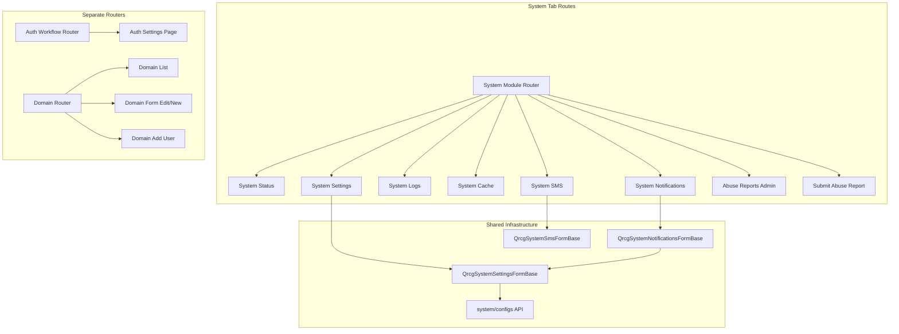
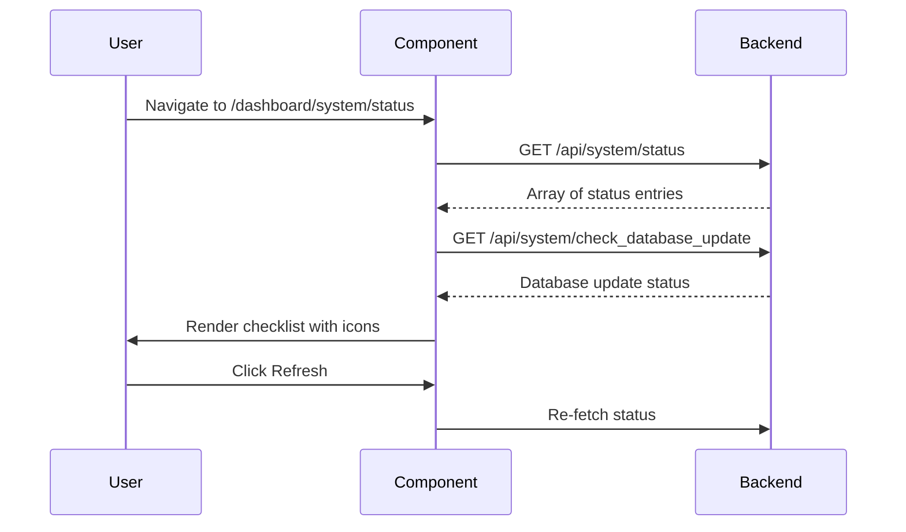
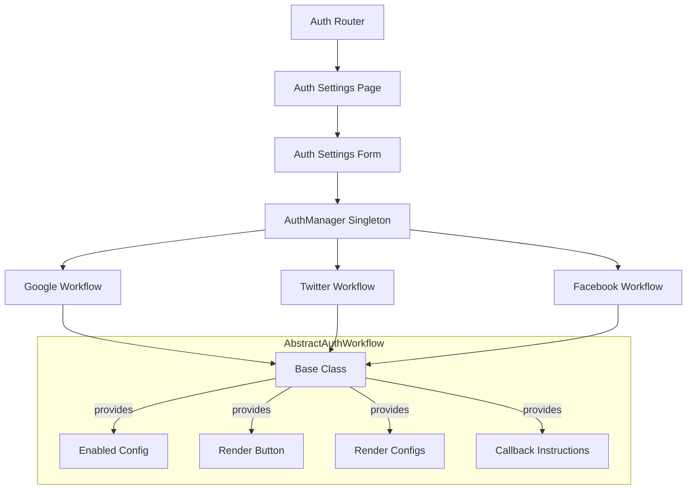
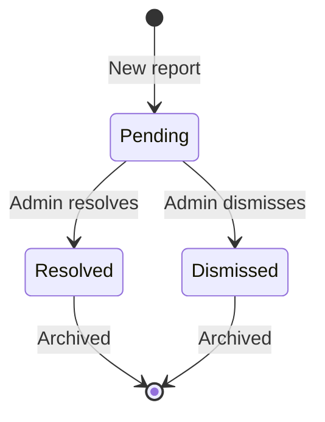
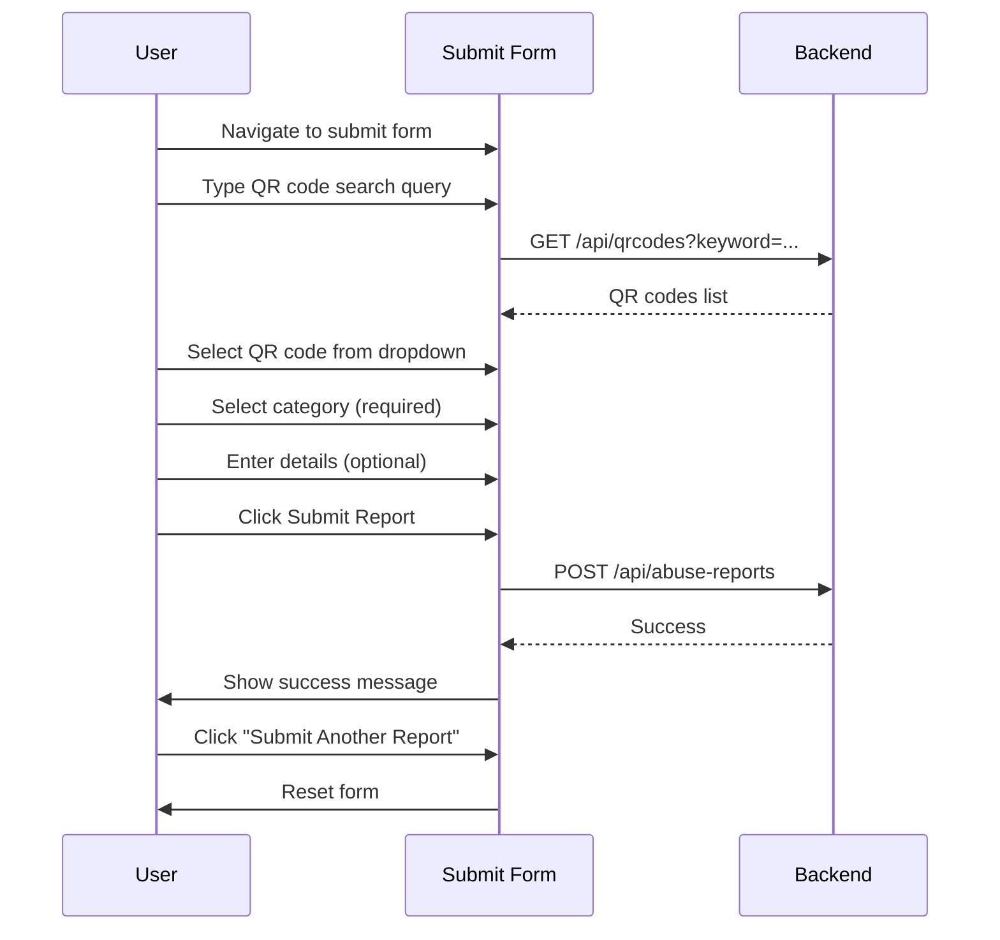
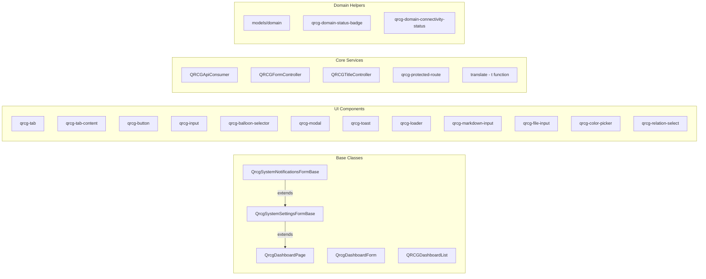

# System Tab Routes Documentation

Comprehensive documentation of all system administration and settings routes in the `qr-code-frontend` project.

---

## Table of Contents

1. [Architecture Overview](#1-architecture-overview)
2. [System Module Router](#2-system-module-router)
3. [System Status (`/dashboard/system/status`)](#3-system-status)
4. [System Settings (`/dashboard/system/settings`)](#4-system-settings)
5. [System Logs (`/dashboard/system/logs`)](#5-system-logs)
6. [System Cache (`/dashboard/system/cache`)](#6-system-cache)
7. [System Notifications (`/dashboard/system/notifications`)](#7-system-notifications)
8. [System SMS (`/dashboard/system/sms`)](#8-system-sms)
9. [Auth Workflow (`/dashboard/system/auth-workflow`)](#9-auth-workflow)
10. [Abuse Reports (`/dashboard/admin/abuse-reports`)](#10-abuse-reports)
11. [Domains (`/dashboard/domains`)](#11-domains)
12. [API Endpoints Reference](#12-api-endpoints-reference)
13. [Component Dependency Map](#13-component-dependency-map)

---

## 1. Architecture Overview



### Key Design Patterns

| Pattern | Description |
|---------|-------------|
| **Tabbed Settings** | Settings, Notifications, and SMS use `qrcg-tab`/`qrcg-tab-content` for multi-section forms |
| **Config Key-Value Store** | All settings share `POST /api/system/configs` endpoint with flat key-value pairs |
| **Protected Routes** | Every route uses `qrcg-protected-route` with specific permission strings |
| **Base Class Inheritance** | Settings tabs → `QrcgSystemSettingsFormBase`, Notification tabs → `QrcgSystemNotificationsFormBase` |
| **Separate Routers** | Auth-workflow and Domain module boot their own routers independently via `boot()` |

---

## 2. System Module Router

**File:** `src/system-module/qrcg-system-module-router.js`

### Route Table

| Route Pattern | Component | Permission | Description |
|---------------|-----------|------------|-------------|
| `/dashboard/system$` | *Redirect* → `/dashboard/system/status` | — | Base URL redirect |
| `/dashboard/system/status$` | `qrcg-system-status` | `system.status` | Server health check |
| `/dashboard/system/settings$` | `qrcg-system-settings-form` | `system.settings` | 10-tab settings |
| `/dashboard/system/notifications$` | `qrcg-system-notifications-form` | `system.notifications` | 9-tab notifications |
| `/dashboard/system/sms$` | `qrcg-system-sms-form` | `system.sms-portals` | SMS portal config |
| `/dashboard/system/logs$` | `qrcg-system-logs-page` | `system.logs` | Log viewer |
| `/dashboard/system/cache$` | `qrcg-system-cache-page` | `system.cache` | Cache management |
| `/dashboard/admin/abuse-reports$` | `qrcg-abuse-reports` | `system.status` | Admin abuse list |
| `/dashboard/admin/abuse-reports/submit$` | `qrcg-submit-abuse-report` | `system.status` | Submit abuse form |

> **⚠️ Note:** Abuse reports routes use `system.status` permission instead of a more specific one like `admin.abuse-reports`.

### Separate Routers

| Router File | Route Pattern | Component | Permission |
|-------------|---------------|-----------|------------|
| `auth-workflow/auth-router.js` | `/dashboard/system/auth-workflow$` | `qrcg-auth-settings-page` | `system.settings` |
| `domain-module/qrcg-domain-router.js` | `/dashboard/domains$` | `qrcg-domain-list-page` | `domain.list-all` |
| `domain-module/qrcg-domain-router.js` | `/dashboard/domains/new\|edit/(?<id>\\d+)` | `qrcg-domain-form-page` | `domain.update-any` |
| `domain-module/qrcg-domain-router.js` | `/dashboard/domains/add` | `qrcg-domain-add-page` | `domain.add` |

---

## 3. System Status

**Route:** `/dashboard/system/status`  
**Component:** `qrcg-system-status` (`src/system-module/qrcg-system-status.js`, 285 lines)  
**Base Class:** `QrcgDashboardPage`

### Functionality

Displays a server health checklist by fetching status entries from the backend.

### UI Structure

```
┌─────────────────────────────────────────────┐
│ System Status                    [Refresh]  │
├─────────────────────────────────────────────┤
│ ✅ Database Connection                      │
│ ✅ Storage Writable                         │
│ ❌ SMTP Configuration                       │
│ ⚠️ Database Update Available    [Action]    │
│ ...                                         │
└─────────────────────────────────────────────┘
```

### Status Entry Types

| Icon | Status | Meaning |
|------|--------|---------|
| ✅ `mdiCheckboxMarked` | `success` | Check passed |
| ❌ `mdiAlertOctagon` | `fail` | Check failed |
| ⚠️ `mdiAlertOctagon` | *action required* | Needs user action (e.g., DB update) |

### API Calls

| Method | Endpoint | Purpose |
|--------|----------|---------|
| `GET` | `/api/system/status` | Fetch all status entries |
| `GET` | `/api/system/check_database_update` | Check for pending DB migrations |

### User Flow



---

## 4. System Settings

**Route:** `/dashboard/system/settings`  
**Component:** `qrcg-system-settings-form` (`src/system-module/qrcg-system-settings-form.js`, 119 lines)

### Tab Architecture

All 10 sub-components extend `QrcgSystemSettingsFormBase` which handles:
- **Fetching** configs from `GET /api/system/configs`
- **Saving** via `POST /api/system/configs` with key-value data
- **File uploads** via `POST /api/system/configs/upload?key={name}`
- **Input sync** between form inputs and data model
- **Enter key** triggers save

### Tab Summary

| # | Tab Name | Component | File | Key Config Sections |
|---|----------|-----------|------|---------------------|
| 1 | **General** | `qrcg-system-settings-form-general` | `general.js` (153 lines) | App Name, Slogan, Powered By, Meta Description, Keywords, Timezone, Frontend URL, Login-as-Home, Pricing URL, Frontend Links |
| 2 | **Dashboard** | `qrcg-system-settings-form-dashboard-area` | `dashboard-area.js` (228 lines) | Top Banner (No/Image/Video + title/subtitle/color/height), QR Code List Mode (Detailed/Minimal), Welcome Popup (enabled, video, text, show times), Sidebar Account Widget Style |
| 3 | **Authentication** | `qrcg-system-settings-form-authentication` | `authentication.js` (223 lines) | Login/Register Section, Firebase Config, Authentication Types |
| 4 | **Appearance** | `qrcg-system-settings-form-appearance` | `appearance.js` (260 lines) | Dashboard Styles, Login Page Styles, Frontend Styles, Color Palettes, Others |
| 5 | **Logo & Favicon** | `qrcg-system-settings-form-logo-favicon` | `logo-favicon.js` | Logo/Favicon file uploads |
| 6 | **Menus** | `qrcg-system-settings-form-menus` | `menus.js` | Menu configuration |
| 7 | **QR Code Types** | `qrcg-system-settings-form-qrcode-types` | `qrcode-types.js` | Enable/disable QR code types |
| 8 | **Email (SMTP)** | `qrcg-system-settings-form-smtp` | `smtp.js` (168 lines) | SMTP Details + Send Test Email |
| 9 | **Storage** | `qrcg-system-settings-form-storage` | `storage.js` (126 lines) | Local/S3 storage config + Test Connection |
| 10 | **Advanced** | `qrcg-system-settings-form-advanced` | `advanced.js` (710 lines) | Password Rules, Account Lock, Login Security, Performance, Integrations, Subscriptions, Others, Auth0 |

### Detailed Tab Breakdown

#### 4.1 General Settings

| Config Key | Input Type | Description |
|------------|-----------|-------------|
| `app.name` | Text | Application name |
| `app.slogan` | Text | Application slogan |
| `app.powered_by_name` | Text | Powered-by label |
| `meta.description` | Textarea | Home page meta description |
| `meta.keywords` | Textarea | Home page meta keywords |
| Timezone | `qrcg-timezone-select` | Application timezone |
| `app.frontend_url` | Text | Custom frontend URL |
| `app.use_login_as_home` | Balloon Selector | Use login page as homepage |
| `app.pricing_plans_url` | Text | Pricing plans page URL |
| `app.show_frontend_links` | Balloon Selector | Show/hide frontend links |

#### 4.2 Dashboard Settings

| Section | Config Keys | Description |
|---------|------------|-------------|
| **Top Banner** | `dashboard.top_banner_option`, `dashboard.top_banner_image`, `dashboard.top_banner_video`, `dashboard.top_banner_title`, `dashboard.top_banner_subtitle`, `dashboard.top_banner_text_color`, `dashboard.top_banner_height` | No Banner / Image / Video with title, subtitle, color, height |
| **QR Code List** | `dashboard.qrcode_list_mode` | Detailed or Minimal mode |
| **Welcome Popup** | `dashboard.welcome_popup_enabled`, `dashboard.welcome_modal_video`, `dashboard.welcome_modal_text`, `dashboard.welcome_modal_show_times` | Popup with video, text (HTML), show count |
| **Sidebar** | `dashboard.sidebar_account_widget_style` | Minimal or Detailed account widget |

#### 4.3 Email (SMTP) Settings

| Config Key | Input Type | Options |
|------------|-----------|---------|
| `mail.mailers.smtp.host` | Text | e.g., `mail.domain.tld` |
| `mail.mailers.smtp.username` | Text | SMTP username |
| `mail.mailers.smtp.password` | Password | SMTP password |
| `mail.mailers.smtp.encryption` | Balloon | None / SSL / TLS |
| `mail.mailers.smtp.port` | Balloon | 25 / 587 / 465 |
| `mail.from.address` | Text | Sender email |
| `mail.from.name` | Text | Sender name |
| `mail.mailers.smtp.timeout` | Number | Timeout in seconds |
| `mail.mailers.smtp.auth_type` | Balloon | Auto / PLAIN / LOGIN / XOAUTH2 / OAUTHBEARER / CRAM-MD5 |

**SMTP Test Component** (`qrcg-system-smtp-settings-test`): Sends test email via `POST /api/system/test-smtp` with recipient email, subject, and message. Displays SMTP debug log in a result box.

#### 4.4 Storage Settings

| Config Key | Input Type | Description |
|------------|-----------|-------------|
| `app.storage_type` | Balloon | Local / S3 Object Storage |
| `filesystems.s3.key` | Text | AWS Access Key ID |
| `filesystems.s3.secret` | Text | AWS Secret Access Key |
| `filesystems.s3.region` | Text | AWS Region |
| `filesystems.s3.bucket` | Text | AWS Bucket |
| `filesystems.s3.url` | Text | Custom URL (non-AWS S3) |
| `filesystems.s3.endpoint` | Text | Custom Endpoint (non-AWS S3) |

**Test Connection:** `POST /api/system/test-storage` validates S3 configuration.

#### 4.5 Advanced Settings (8 Sections)

| Section | Key Areas |
|---------|-----------|
| **Password Rules** | Min length, require uppercase/lowercase/numbers/symbols |
| **Account Lock** | Max failed attempts, lock duration |
| **Login Security** | Captcha, rate limiting, 2FA |
| **Performance** | Caching, optimization flags |
| **Integrations** | Third-party service configs |
| **Subscription Management** | Trial periods, plan limits |
| **Others** | Miscellaneous settings |
| **Auth0** | Auth0 integration config |

---

## 5. System Logs

**Route:** `/dashboard/system/logs`  
**Component:** `qrcg-system-logs-page` (`src/system-module/qrcg-system-logs-page.js`, 265 lines)  
**Base Class:** `QrcgDashboardPage`

### UI Structure

```
┌──────────────────────────────────────────────────┐
│ System Logs                                      │
├──────────────────────────────────────────────────┤
│ File Size: 2.3 MB                                │
│ ┌──────────────────────────────────────────────┐ │
│ │ [2024-01-15] Error: ...                      │ │
│ │ [2024-01-15] Info: ...                       │ │
│ │ ... (last 500 lines, disabled textarea)      │ │
│ └──────────────────────────────────────────────┘ │
│ [Download Log File]  [Clear Logs]  [Refresh]     │
└──────────────────────────────────────────────────┘
```

### Features

| Action | API Call | Notes |
|--------|---------|-------|
| **Fetch Logs** | `GET /api/system/logs` | Response is Base64-encoded, decoded and displayed |
| **Download** | `POST /api/system/log-file` | Returns download link |
| **Clear** | `DELETE /api/system/log-file` | Requires `confirm()` dialog |
| **Refresh** | `GET /api/system/logs` | Re-fetches log content |

---

## 6. System Cache

**Route:** `/dashboard/system/cache`  
**Component:** `qrcg-system-cache-page` (`src/system-module/qrcg-system-cache-page.js`, 173 lines)  
**Base Class:** `QrcgDashboardPage`

### UI Structure

```
┌─────────────────────────────────────────────┐
│ System Cache                                │
├─────────────────────────────────────────────┤
│ Views Cache:                                │
│   [Clear]  [Rebuild]                        │
│                                             │
│ Config Cache:                               │
│   [Clear]  [Rebuild]                        │
└─────────────────────────────────────────────┘
```

### Cache Operations

| Cache Type | Clear Endpoint | Rebuild Endpoint |
|------------|---------------|-----------------|
| `view` | `POST /api/system/clear-cache/view` | `POST /api/system/rebuild-cache/view` |
| `config` | `POST /api/system/clear-cache/config` | `POST /api/system/rebuild-cache/config` |

Feedback via `showToast()` on success/failure.

---

## 7. System Notifications

**Route:** `/dashboard/system/notifications`  
**Component:** `qrcg-system-notifications-form` (`src/system-module/qrcg-system-notifications-form.js`, 127 lines)

### Tab Architecture

All notification tabs extend `QrcgSystemNotificationsFormBase` which provides:
- **Slug-based field naming:** `notifications.{slug}.{fieldName}`
- **Standard fields per tab:** Enabled toggle, Email Subject, Email Body (markdown), SMS Body (textarea)
- **Template variables:** e.g., `PLANS_PAGE_URL` → pricing page link
- **Instructions panel** with available variables documentation

### Notification Tabs

| # | Tab Name | Slug | File | Custom Fields |
|---|----------|------|------|---------------|
| 1 | Trial Expired | `trial-expired` | `trial-expired.js` | — |
| 2 | Subscription Expiring Soon | `subscription-expiring-soon` | `subscription-expiring-soon.js` | Additional timing fields |
| 3 | Subscription Expired | `subscription-expired` | `subscription-expired.js` | — |
| 4 | Dynamic QR Codes Limit | `dynamic-qrcode-limit-reached` | `dynamic-qrcode-limit-reached.js` | — |
| 5 | Scan Limit Reached | `scan-limit-reached` | `scan-limit-reached.js` | — |
| 6 | Invite User | `invite-user` | `invite-user.js` | Invitation-specific fields |
| 7 | Bulk Operation Completed | `bulk-operation-completed` | `bulk-operation-completed.js` | Operation result fields |
| 8 | Lead Form Response | `lead-form-response` | `lead-form-response.js` | Response data fields |
| 9 | Custom Form Response | `custom-form-response` | `custom-form-response.js` | Response data fields |

### Common Form Layout Per Tab

```
┌──────────────────────────────────────────────┐
│ [Tab Title]                                  │
├──────────────────────────────────────────────┤
│ Instructions: [context-specific help text]   │
│ Available Variables:                         │
│   PLANS_PAGE_URL → pricing page link         │
│                                              │
│ Enabled: [ON] [OFF]                          │
│                                              │
│ [Custom fields per notification type]        │
│                                              │
│ Email Subject: [_______________]             │
│ Email Body: [Markdown editor_________]       │
│ SMS Body: [textarea__________________]       │
│           ↳ Requires SMS portal API keys     │
│                                              │
│                               [Save Changes] │
└──────────────────────────────────────────────┘
```

### Config Key Pattern
```
notifications.{slug}.enabled       → ON/OFF toggle
notifications.{slug}.email_subject → Email subject line
notifications.{slug}.email_body    → Markdown email body
notifications.{slug}.sms_body      → SMS message text
```

---

## 8. System SMS

**Route:** `/dashboard/system/sms`  
**Component:** `qrcg-system-sms-form` (`src/system-module/qrcg-system-sms-form.js`, 38 lines)

### Tab: RB Soft SMS Payment Gateway

**Component:** `rbsoft-sms-portal` (`src/system-module/qrcg-system-sms-form/rbsoft-sms-portal.js`)  
**Base Class:** `QrcgSystemSmsFormBase`  
**Slug:** `rbsoft-sms-portal`

| Field | Config Key | Placeholder |
|-------|-----------|-------------|
| API Key | `sms-portals.rbsoft-sms-portal.api_key` | `171779****` |
| Server | `sms-portals.rbsoft-sms-portal.server` | `https://yourdomain.com/workspace` |

Config keys follow pattern: `sms-portals.{slug}.{fieldName}`

---

## 9. Auth Workflow

**Route:** `/dashboard/system/auth-workflow`  
**Router:** `src/auth-workflow/auth-router.js` (boots independently via `QrcgAuthWorkflowRouter.boot()`)  
**Permission:** `system.settings`

### Architecture



### Auth Manager (`src/auth-workflow/auth-manager.js`)

- **Singleton** pattern with `AuthManager.instance()`
- **Registered workflows:** Google, Twitter, Facebook
- **Enabled workflows** determined by `window.QRCG_ENABLED_WORKFLOWS` array
- Methods: `getWorkflows()`, `getEnabledWorkflows()`, `renderButtons(context)`, `hasButtons()`

### Auth Workflow Config Keys

Config keys use namespace: `auth-workflow.{provider}.{field}`

| Provider | Config Fields | Callback URL |
|----------|---------------|--------------|
| **Google** | `auth-workflow.google.enabled`, `auth-workflow.google.client_id`, `auth-workflow.google.client_secret` | `/auth-workflow/google/callback` |
| **Twitter** | `auth-workflow.twitter.enabled`, `auth-workflow.twitter.client_id`, `auth-workflow.twitter.client_secret` | `/auth-workflow/twitter/callback` |
| **Facebook** | `auth-workflow.facebook.enabled`, `auth-workflow.facebook.client_id`, `auth-workflow.facebook.client_secret` | `/auth-workflow/facebook/callback` |

### Auth Settings Form UI

```
┌──────────────────────────────────────────────────────┐
│ Auth Settings                                        │
├──────────────────────────────────────────────────────┤
│ ┌── Google ─────────────────────────────────────────┐│
│ │ Callback URL: https://app.com/auth-workflow/      ││
│ │               google/callback  [Copy]             ││
│ │ Enabled: [Enabled] [Disabled]                     ││
│ │ Client ID: [________________________]             ││
│ │ Client Secret: [____________________]             ││
│ └───────────────────────────────────────────────────┘│
│ ┌── Twitter ────────────────────────────────────────┐│
│ │ ...                                               ││
│ └───────────────────────────────────────────────────┘│
│ ┌── Facebook ───────────────────────────────────────┐│
│ │ ...                                               ││
│ └───────────────────────────────────────────────────┘│
│                                       [Save Changes] │
└──────────────────────────────────────────────────────┘
```

All configs are saved through parent class `QrcgSystemSettingsFormBase` → `POST /api/system/configs`.

---

## 10. Abuse Reports

### 10.1 Admin Abuse Reports List

**Route:** `/dashboard/admin/abuse-reports`  
**Component:** `qrcg-abuse-reports` (`src/dashboard/pages/admin/qrcg-abuse-reports.js`, 434 lines)  
**Base Class:** `QrcgDashboardPage`

#### UI Structure

```
┌─────────────────────────────────────────────────────────────┐
│ Abuse Reports                                    [Refresh]  │
├─────────────────────────────────────────────────────────────┤
│ [Pending] [Resolved] [Dismissed] [All]                      │
├──────┬──────────┬──────────┬────────┬──────┬────────┬──────┤
│ Date │ Category │ Details  │ QR Code│  IP  │ Status │Action│
├──────┼──────────┼──────────┼────────┼──────┼────────┼──────┤
│ 1/15 │ ⚖️ fraud │ User...  │ View#1 │ x.x  │PENDING │[R][D]│
│ 1/14 │ 🚨 scam  │ Phish... │Deleted │ y.y  │RESOLVED│ Arch │
│ ...  │          │          │        │      │        │      │
├──────┴──────────┴──────────┴────────┴──────┴────────┴──────┤
│              [Previous] Page 1 of 3 [Next]                  │
└─────────────────────────────────────────────────────────────┘
```

#### Features

| Feature | Description |
|---------|-------------|
| **Status Filters** | Pending (default), Resolved, Dismissed, All |
| **Pagination** | Previous/Next with page indicator |
| **QR Code Link** | Links to `/dashboard/qrcode/{id}` or shows "Deleted/Unknown" |
| **Resolve Modal** | Shows report details, admin notes textarea, confirms resolution |
| **Dismiss Modal** | Admin notes textarea, confirms dismissal as false alarm |

#### API Calls

| Method | Endpoint | Parameters | Purpose |
|--------|----------|------------|---------|
| `GET` | `/api/admin/abuse-reports` | `page={n}`, `status={filter}` | Fetch paginated reports |
| `PUT` | `/api/admin/abuse-reports/{id}/status` | `status`, `admin_notes` | Update report status |

#### Status Flow



### 10.2 Submit Abuse Report

**Route:** `/dashboard/admin/abuse-reports/submit`  
**Component:** `qrcg-submit-abuse-report` (`src/dashboard/pages/qrcg-submit-abuse-report.js`, 495 lines)

#### UI Structure

```
┌──────────────────────────────────────────────────┐
│ Report Abuse                                     │
├──────────────────────────────────────────────────┤
│ If you've encountered a QR code that violates... │
│                                                  │
│ Search Your QR Code:                             │
│ ┌─────────────────────────────────────────────┐  │
│ │ [Type to search your QR codes...]           │  │
│ │ ┌─ Dropdown ──────────────────────────────┐ │  │
│ │ │ QR Code Name  (ID: 42 • Hash: abc123)   │ │  │
│ │ │ Another QR    (ID: 15)                   │ │  │
│ │ └─────────────────────────────────────────┘ │  │
│ └─────────────────────────────────────────────┘  │
│                                                  │
│ Category: *                                      │
│ ┌────────────┬─────────────────┐                 │
│ │ 🚨 Scam    │ 💳 Fraud         │                 │
│ │ 🎭 Impersn │ ⚖️ Illegal       │                 │
│ │ ©️ Copyrght│ 📝 Other         │                 │
│ └────────────┴─────────────────┘                 │
│                                                  │
│ Details (Optional):                              │
│ [Please provide additional info...]              │
│                                                  │
│ [████████ Submit Report ████████]                 │
└──────────────────────────────────────────────────┘
```

#### Categories

| Value | Icon | Label |
|-------|------|-------|
| `scam` | 🚨 | Scam |
| `fraud` | 💳 | Fraud |
| `impersonation` | 🎭 | Impersonation |
| `illegal` | ⚖️ | Illegal Content |
| `copyright` | ©️ | Copyright |
| `other` | 📝 | Other |

#### API Calls

| Method | Endpoint | Payload |
|--------|----------|---------|
| `GET` | `/api/qrcodes?keyword={q}&page_size=10` | QR code search for autocomplete |
| `POST` | `/api/abuse-reports` | `{ qrcode_id, qrcode_hash, category, details }` |

#### User Flow



---

## 11. Domains

**Router:** `src/domain-module/qrcg-domain-router.js` (boots independently via `QrcgDomainRouter.boot()`)

### 11.1 Domain List

**Route:** `/dashboard/domains`  
**Component:** `qrcg-domain-list` (`src/domain-module/qrcg-domain-list.js`, 166 lines)  
**Base Class:** `QRCGDashboardList` with `baseRoute: 'domains'`

#### Table Columns

| Column | Key | Notes |
|--------|-----|-------|
| ID | `id` | Width: 2rem |
| Host | `host` | Domain hostname |
| Availability | `availability` | Public/Private |
| Status | `status` | Rendered as `qrcg-domain-status-badge` |
| Default? | `is_default` | Boolean badge (Yes/No) |
| Owner | `owner` | Links to `/dashboard/users/edit/{userId}` |
| Actions | — | Width: 7rem, Edit/Delete |

#### Features

- **Status Filter:** Balloon selector with "All" + statuses from `getDomainStatuses()` model
- **Search:** By host or owner name (placeholder text)
- **Status query param:** Updates URL with `?status={value}` on filter change

### 11.2 Domain Form (Admin Edit/New)

**Route:** `/dashboard/domains/new` or `/dashboard/domains/edit/{id}`  
**Component:** `qrcg-domain-form` (`src/domain-module/qrcg-domain-form.js`, 214 lines)  
**Base Class:** `QrcgDashboardForm` with `apiBaseRoute: 'domains'`

#### Form Fields

| Field | Name | Type | Notes |
|-------|------|------|-------|
| Connectivity Status | — | `qrcg-domain-connectivity-status` | Inline DNS/App check |
| Host | `host` | Text | Placeholder: `domain.com` |
| Protocol | `protocol` | Balloon | `http` / `https` |
| Sort Order | `sort_order` | Number | Controls domain ordering |
| Is Default | — | Display + Button | "Set as default" action |
| Status | `status` | Display + Modal | Opens `QrcgDomainChangeStatusModal` |
| Availability | — | Display + Modal | Opens `QrcgDomainChangeAvailabilityModal` |
| Instructions | — | Info box | Contextual guidance |
| Home Page QR Code | `home_page_qrcode_id` | Relation Select | Select from all QR codes |

#### Domain Modals

**Change Status Modal (`qrcg-domain-change-status-modal.js`):**
- API: `PUT /api/domains/{id}/update-status` with `{ status }`
- Uses `getDomainStatuses()` to populate balloon selector
- Toast: "Status changed successfully"

**Change Availability Modal (`qrcg-domain-change-availability-modal.js`):**
- API: `PUT /api/domains/{id}/update-availability` with `{ availability }`
- Options: Public (all users) / Private (domain owner)
- Toast: "Availability changed successfully"

**Set Default Action:**
- API: `PUT /api/domains/{id}/set-default`
- Requires `confirm()` dialog
- Toast: "Domain has been set as the default domain"

### 11.3 Domain Add (User-Facing)

**Route:** `/dashboard/domains/add`  
**Component:** `qrcg-domain-add` (`src/domain-module/qrcg-domain-add.js`, 173 lines)

#### UI Structure

```
┌──────────────────────────────────────────────────────┐
│ Add your domain                                      │
├──────────────────────────────────────────────────────┤
│ Make your dynamic QR codes white labeled by serving  │
│ them from your own domain...                         │
│                                                      │
│ Help: Add a CNAME Record pointing to app.example.com │
│ (may take up to 24 hours)                            │
│                                                      │
│ [Connectivity Status Checker]                        │
│                                                      │
│ Domain Name: [qr.your-website.com______]             │
│ ↳ Enter your domain then click on save.              │
│                                                      │
│ ┌── List of your domains ─────────────────────────┐  │
│ │ http://qr.example.com  [DRAFT] ⚠️               │  │
│ │   "Add CNAME Record, then click Test Connection" │  │
│ │   [Delete] [Test Connection]                     │  │
│ │                                                  │  │
│ │ https://scan.brand.com [ACTIVE] ✅               │  │
│ │   [Delete] [Test Connection]                     │  │
│ └──────────────────────────────────────────────────┘  │
│                                             [Save]    │
└──────────────────────────────────────────────────────┘
```

#### My Domains List (`qrcg-my-domains-list.js`, 243 lines)
- API: `GET /api/domains/my-domains` (user's own domains only)
- Per-domain actions: Delete (with confirmation for non-draft), Test Connection
- Status instructions: "Draft" → add CNAME, "In-Progress" → check back in 24h
- Delete: `DELETE /api/domains/{id}` (no confirmation for draft status)

### 11.4 Domain Connectivity Status

**Component:** `qrcg-domain-connectivity-status` (`src/domain-module/qrcg-domain-connectivity-status.js`, 376 lines)

Checks two conditions via `GET /api/domains/{id}/check-connectivity`:

| Check | Success | Error |
|-------|---------|-------|
| **DNS Configured** | ✅ CNAME found | ❌ Shows CNAME instructions (Type, Value, Current Value) |
| **App Accessible** | ✅ "Domain is connected" | ❌ Shows virtual host setup instructions |

#### Events Fired

| Event | When |
|-------|------|
| `qrcg-domain-connectivity-status:success` | Both DNS and app accessible |
| `qrcg-domain-connectivity-status:error` | Either check fails |

Auto-transitions domain from `draft` → `in-progress` on successful connectivity.

---

## 12. API Endpoints Reference

### System Module APIs

| Method | Endpoint | Used By | Purpose |
|--------|----------|---------|---------|
| `GET` | `/api/system/status` | Status Page | Fetch health checklist |
| `GET` | `/api/system/check_database_update` | Status Page | Check pending migrations |
| `GET` | `/api/system/configs` | Settings/Notifications/SMS/Auth | Fetch all configs |
| `POST` | `/api/system/configs` | Settings/Notifications/SMS/Auth | Save configs (key-value) |
| `POST` | `/api/system/configs/upload?key={name}` | Settings (files) | Upload config files |
| `GET` | `/api/system/logs` | Logs Page | Fetch log content (Base64) |
| `POST` | `/api/system/log-file` | Logs Page | Get download link |
| `DELETE` | `/api/system/log-file` | Logs Page | Clear log file |
| `POST` | `/api/system/clear-cache/{type}` | Cache Page | Clear view/config cache |
| `POST` | `/api/system/rebuild-cache/{type}` | Cache Page | Rebuild view/config cache |
| `POST` | `/api/system/test-smtp` | SMTP Settings | Send test email |
| `POST` | `/api/system/test-storage` | Storage Settings | Test S3 connection |

### Domain Module APIs

| Method | Endpoint | Used By | Purpose |
|--------|----------|---------|---------|
| `GET` | `/api/domains` | Domain List | Fetch all domains (admin) |
| `GET` | `/api/domains/my-domains` | Domain Add | Fetch user's domains |
| `GET` | `/api/domains/{id}` | Connectivity | Fetch domain details |
| `POST` | `/api/domains` | Domain Add | Create new domain |
| `PUT` | `/api/domains/{id}` | Domain Form | Update domain |
| `DELETE` | `/api/domains/{id}` | Domain List/Add | Delete domain |
| `GET` | `/api/domains/{id}/check-connectivity` | Connectivity | Check DNS + app access |
| `PUT` | `/api/domains/{id}/update-status` | Status Modal / Add | Change domain status |
| `PUT` | `/api/domains/{id}/update-availability` | Availability Modal | Change public/private |
| `PUT` | `/api/domains/{id}/set-default` | Domain Form | Set as default domain |

### Abuse Reports APIs

| Method | Endpoint | Used By | Purpose |
|--------|----------|---------|---------|
| `GET` | `/api/admin/abuse-reports` | Admin List | Fetch paginated reports |
| `PUT` | `/api/admin/abuse-reports/{id}/status` | Admin List | Resolve/dismiss report |
| `POST` | `/api/abuse-reports` | Submit Form | Create new abuse report |
| `GET` | `/api/qrcodes?keyword={q}&page_size=10` | Submit Form | Search QR codes for report |

---

## 13. Component Dependency Map



### Permission Matrix

| Feature | Required Permission |
|---------|-------------------|
| System Status | `system.status` |
| System Settings | `system.settings` |
| System Notifications | `system.notifications` |
| System SMS | `system.sms-portals` |
| System Logs | `system.logs` |
| System Cache | `system.cache` |
| Auth Workflow | `system.settings` |
| Abuse Reports (Admin) | `system.status` |
| Submit Abuse Report | `system.status` |
| Domain List | `domain.list-all` |
| Domain Edit/New | `domain.update-any` |
| Domain Add (User) | `domain.add` |

---

*Generated from source analysis of `qr-code-frontend` system module, domain module, and auth-workflow.*
