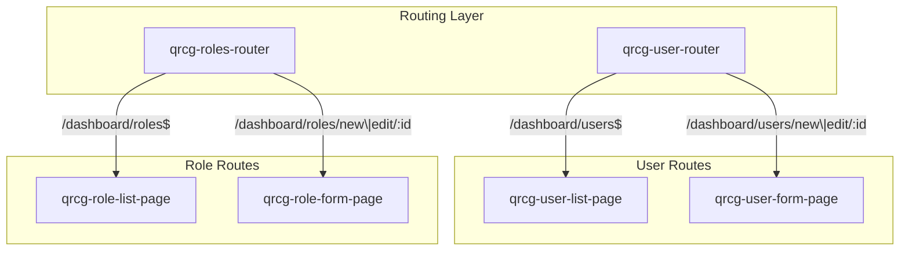
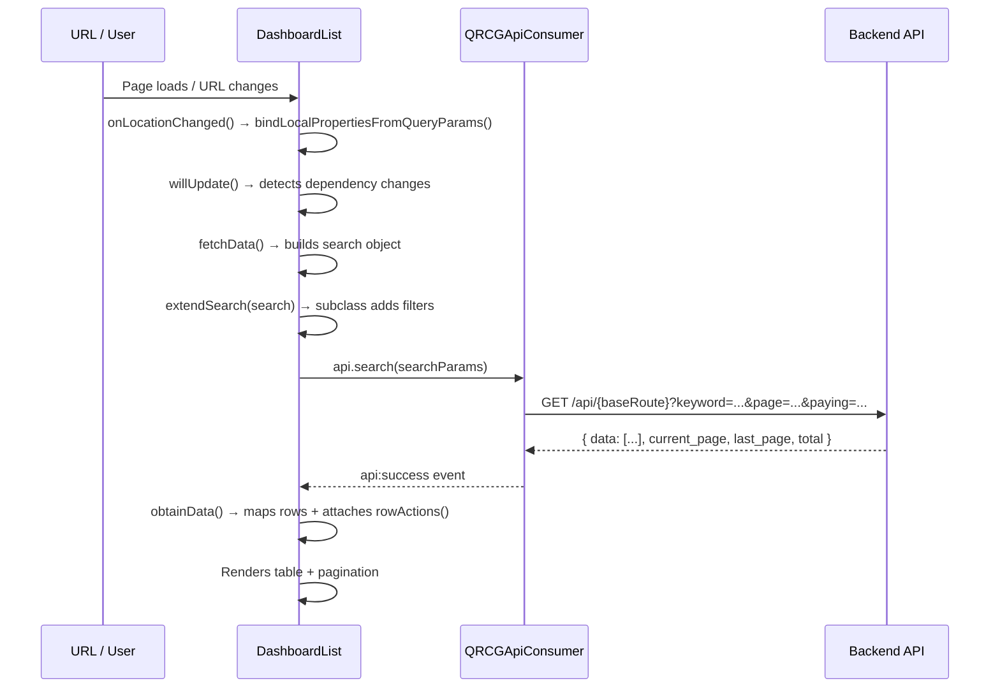
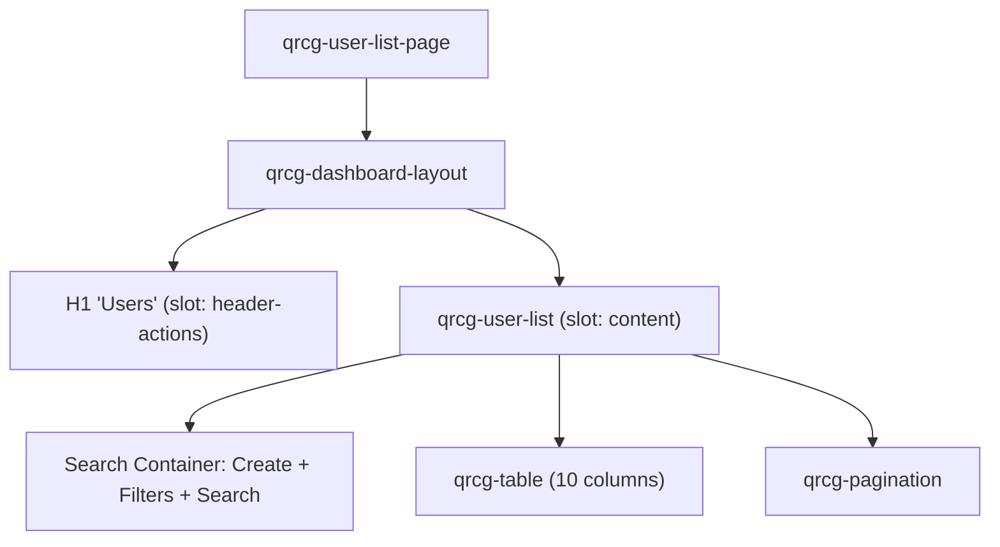
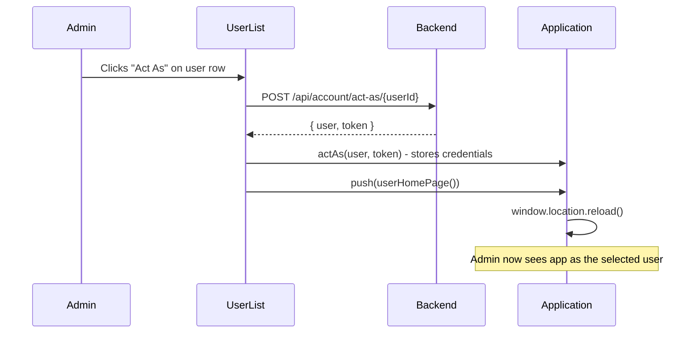
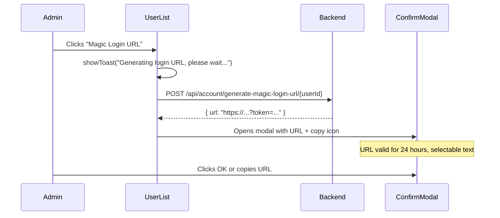
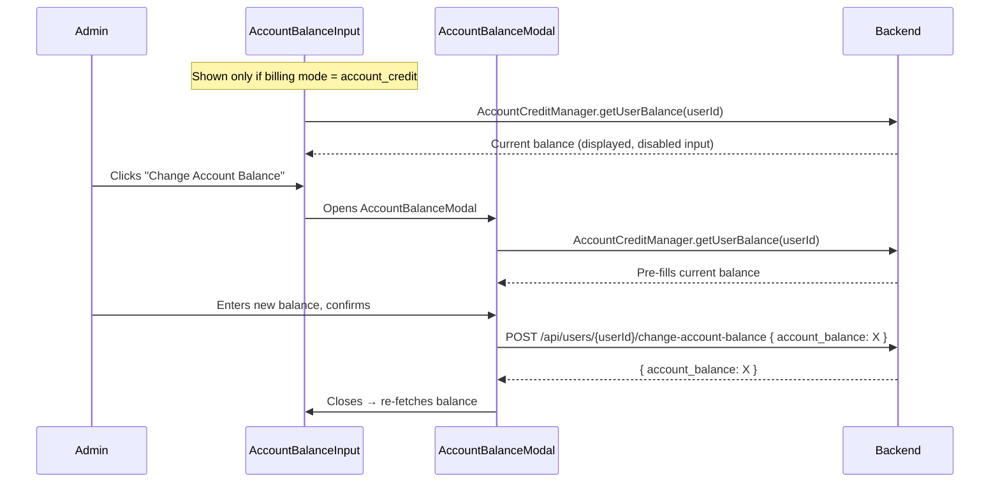
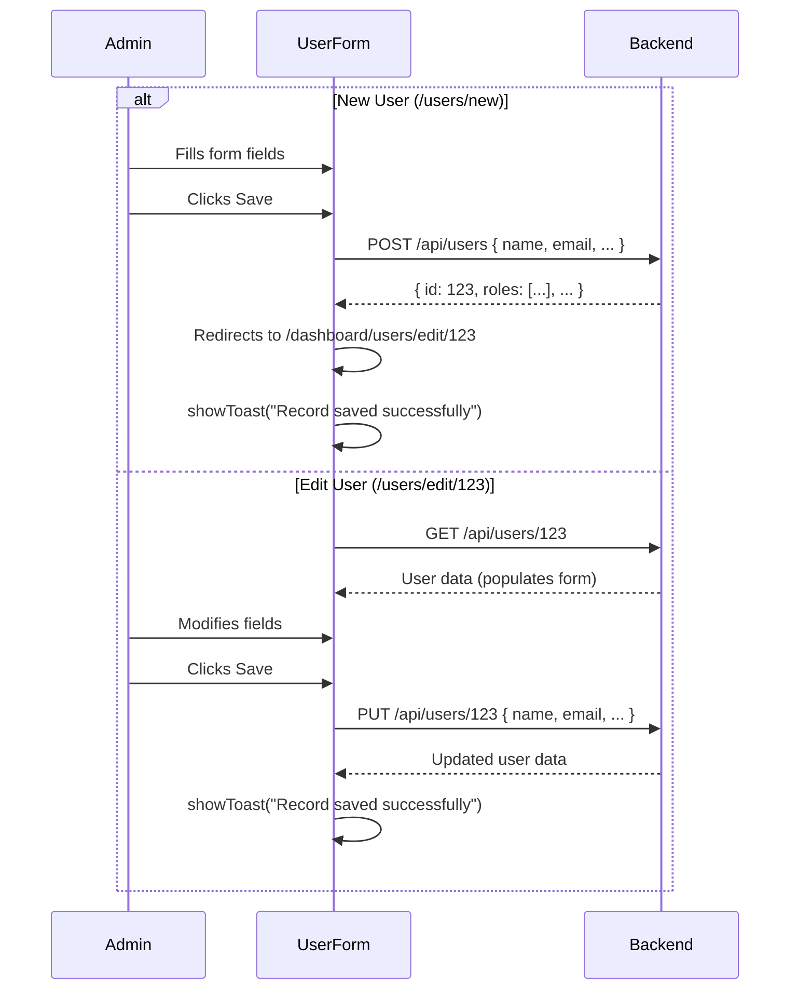
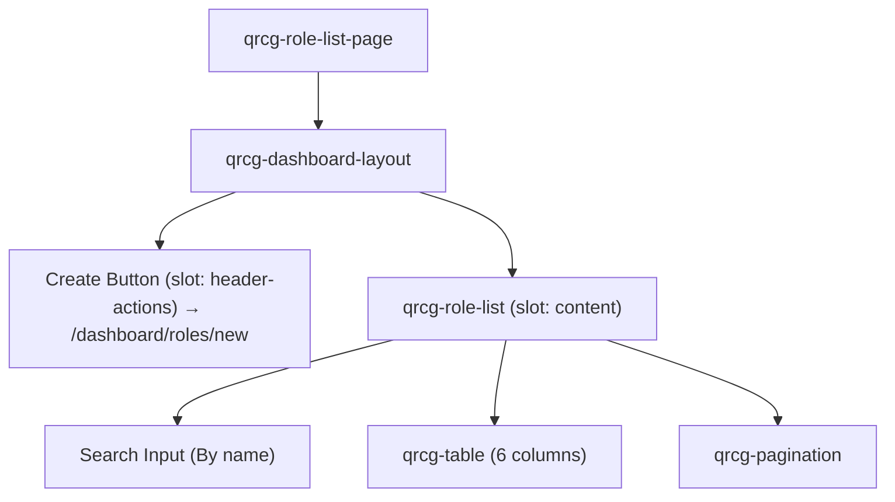
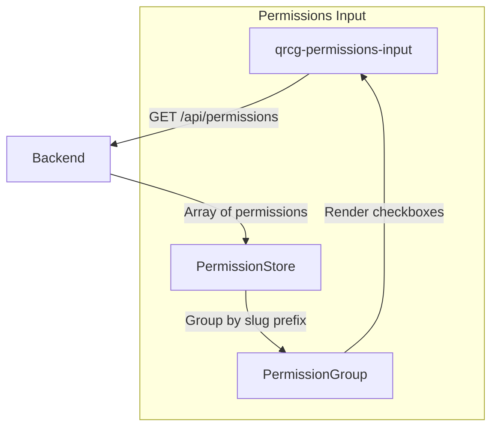
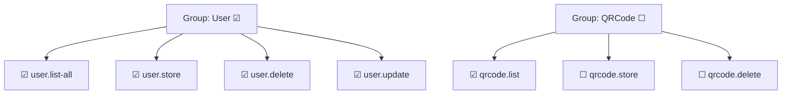

# QR Code Frontend — Users & Roles Routes: Comprehensive Flow Documentation

> **Project**: `qr-code-frontend` (Lit + Vite Web Components)  
> **Analyzed Routes**:  
> 1. `/dashboard/users` — All Users List  
> 2. `/dashboard/users?paying=true` — Paying Users only  
> 3. `/dashboard/users?paying=false` — Non-Paying Users only  
> 4. `/dashboard/roles` — Roles Management  

---

## Architecture Overview



Both modules follow the same base pattern: a **List Page** using `QRCGDashboardList` for table rendering and a **Form Page** using `QrcgDashboardForm` for CRUD operations. Both base classes use `QRCGApiConsumer` for API communication.

---

## Shared Base Classes

### `QRCGDashboardList` (Table + Search + Pagination)

[qrcg-dashboard-list.js](file:///d:/Karsaaz_QR/qr-code-frontend/src/dashboard/qrcg-dashboard-list.js)

Provides:
- **Table**: `<qrcg-table>` with configurable columns and row actions
- **Search**: Keyword search input with debounced fetching
- **Pagination**: `<qrcg-pagination>` component reads `page` from query params
- **CRUD**: Uses `QRCGApiConsumer` with configurable `baseRoute`
- **Delete**: Confirmation modal → `DELETE /api/{baseRoute}/{id}` → auto-refetch
- **URL Sync**: `page` and other query params synced to URL via `onLocationChanged`

#### Data Fetching Flow (shared by Users and Roles)



### `QrcgDashboardForm` (CRUD Form)

[qrcg-dashboard-form.js](file:///d:/Karsaaz_QR/qr-code-frontend/src/dashboard/qrcg-dashboard-form.js)

Provides:
- **Auto-fetch**: Reads route `id` param → `GET /api/{baseRoute}/{id}`
- **Create/Update**: Detects new vs edit from URL (`/new` vs `/edit/:id`)
- **Auto-redirect**: After `POST` (create), redirects to `/dashboard/{baseRoute}/edit/{id}`
- **Validation**: `QRCGApiConsumer` handles validation errors → shows per-input errors
- **Breadcrumbs**: Auto-generated from URL path
- **Title**: Auto-generated: "New User" / "Edit User" based on URL
- **Buttons**: Save + Close (navigates to list URL)
- **Success Toast**: "Record saved successfully"

---

## Route 1 & 2 & 3: `/dashboard/users` — Users List

### Routing & Permissions

| Property | Value |
|---|---|
| **Router** | [qrcg-user-router.js](file:///d:/Karsaaz_QR/qr-code-frontend/src/users-module/qrcg-user-router.js) |
| **Route Pattern** | `/dashboard/users$` |
| **Permission** | `user.list-all` |
| **Page Component** | [qrcg-user-list-page.js](file:///d:/Karsaaz_QR/qr-code-frontend/src/users-module/qrcg-user-list-page.js) |
| **List Component** | [qrcg-user-list.js](file:///d:/Karsaaz_QR/qr-code-frontend/src/users-module/qrcg-user-list.js) |

### Sub-Routes (Same Page, Query Param Variations)

| Route | Query Param | Behavior |
|---|---|---|
| `/dashboard/users` | None | Lists **all** users |
| `/dashboard/users?paying=true` | `paying=true` | Lists only **paying** users (with active subscriptions) |
| `/dashboard/users?paying=false` | `paying=false` | Lists only **non-paying** users (free/no subscription) |

The `paying` parameter is read via `queryParam('paying')` in `bindLocalPropertiesFromQueryParams()` and passed to the API via `extendSearch()`.

### Page Layout



### Table Columns

| # | Key | Label | Width | Notes |
|---|---|---|---|---|
| 1 | `id` | ID | 2rem | — |
| 2 | `name` | Name | auto | — |
| 3 | `email` | Email | auto | — |
| 4 | `mobile_number` | Mobile | auto | — |
| 5 | `roles[0].name` | Role | auto | First role name (deep accessor) |
| 6 | `qrcodes_count` | QRs | auto | Total QR codes owned |
| 7 | `scans` | Scans | auto | Total scan count |
| 8 | `main_user` | Main User | auto | `parent_user.name` or "---" |
| 9 | `created_at` | Created at | auto | Formatted via `toLocaleDateString()` |
| 10 | `actions` | Actions | 17rem | Row action links |

### Search & Filter Bar

| Element | Component | Behavior |
|---|---|---|
| **Create** | `<qrcg-button href="/dashboard/users/new">` | Navigates to new user form |
| **Filters** | `<qrcg-button>` with filter icon | Opens `UserFilterModal` |
| **Search** | `<qrcg-input>` (from base class) | Searches by name or email |

### Filter Modal

[user-filter/modal.js](file:///d:/Karsaaz_QR/qr-code-frontend/src/users-module/user-filter/modal.js)

| Filter | Input Type | Description |
|---|---|---|
| **Number of QR Codes** | `qrcg-number-range-input` | Min/max range filter for user's QR code count |

Filter values are JSON-stringified and sent as query params to the API.

### Row Actions (6 Admin Actions)

Each row in the users table has the following action links:

| # | Action | API Call | Description |
|---|---|---|---|
| 1 | **Act As** | `POST /api/account/act-as/{userId}` | Impersonates the user. Stores new token, reloads app to user's home page. |
| 2 | **Edit** | Navigation | → `/dashboard/users/edit/{id}` |
| 3 | **Magic Login URL** | `POST /api/account/generate-magic-login-url/{userId}` | Generates a one-time login URL (valid 24h). Displayed in a modal with copy button. |
| 4 | **Delete** | `DELETE /api/users/{id}` | Confirmation modal warns: "This will delete all related **QR Codes**, **subscriptions** and **transactions**." |
| 5 | **Reset Role** | `POST /api/users/{userId}/reset-role` | Clears user's assigned role. Confirmation required. |
| 6 | **Reset Scan Limits** | `POST /api/users/{userId}/reset-scans-limit` | Resets scan counters. Confirmation required. |

### Act As Flow



### Magic Login URL Flow



### API Endpoint: `GET /api/users`

| Parameter | Source | Description |
|---|---|---|
| `keyword` | Search input | Search by name or email |
| `page` | URL query param | Current page number |
| `paying` | URL `?paying=true/false` | Filter by payment status |
| `number_of_qrcodes` | Filter modal | JSON range `{"min":X,"max":Y}` |
| `path` | Auto-generated | Current URL for pagination links |

---

## Sub-Route: `/dashboard/users/new` & `/dashboard/users/edit/:id` — User Form

### Routing & Permissions

| Property | Value |
|---|---|
| **Route Pattern** | `/dashboard/users/new\|/dashboard/users/edit/(?<id>\d+)` |
| **Permission** | `user.store` |
| **Page Component** | [qrcg-user-form-page.js](file:///d:/Karsaaz_QR/qr-code-frontend/src/users-module/qrcg-user-form-page.js) |
| **Form Component** | [qrcg-user-form.js](file:///d:/Karsaaz_QR/qr-code-frontend/src/users-module/qrcg-user-form.js) |

### Form Fields

| # | Field | Name Attr | Type | Notes |
|---|---|---|---|---|
| 1 | **Name** | `name` | Text | Placeholder: "Full name" |
| 2 | **Email** | `email` | Email | Placeholder: "email@example.com" |
| 3 | **Mobile** | (config) | Mobile | Rendered via `QrcgMobileInput.renderBasedOnConfigs()` — conditional |
| 4 | **Password** | `password` | Password | "leave empty to keep it unchanged" |
| 5 | **Confirm Password** | `password_confirmation` | Password | — |
| 6 | **Role** | `role_id` | Relation Select | Fetches roles from `GET /api/roles`. Hidden if `is_sub` (shows "Sub User" label instead). |
| 7 | **Verify Email** | — | Button / Display | Shows "Email verified at: [date]" if verified, or "Verify Email" button if not |
| 8 | **Account Balance** | — | Display + Button | Only shown when billing mode = `account_credit`. Shows current balance + "Change Account Balance" button |
| 9 | **Sub Users** | — | `<qrcg-subusers>` | Lists/manages sub-users for this user |

### Verify Email Action

| API Call | Method | Endpoint |
|---|---|---|
| Verify Email | `POST` | `/api/users/verify-email/{userId}` |

After success, the form re-fetches the user record to update the verification status.

### Account Balance System

Only visible when the platform uses `AccountCredit` billing mode.

[qrcg-account-balance-input.js](file:///d:/Karsaaz_QR/qr-code-frontend/src/users-module/qrcg-account-balance-input.js) → [qrcg-account-balance-modal.js](file:///d:/Karsaaz_QR/qr-code-frontend/src/users-module/qrcg-account-balance-modal.js)



### User Form CRUD Flow



---

## Route 4: `/dashboard/roles` — Roles List

### Routing & Permissions

| Property | Value |
|---|---|
| **Router** | [router.js](file:///d:/Karsaaz_QR/qr-code-frontend/src/roles-module/router.js) |
| **Route Pattern** | `/dashboard/roles$` |
| **Permission** | `role.list-all` |
| **Page Component** | [list-page.js](file:///d:/Karsaaz_QR/qr-code-frontend/src/roles-module/list-page.js) |
| **List Component** | [list.js](file:///d:/Karsaaz_QR/qr-code-frontend/src/roles-module/list.js) |

### Page Layout



### Table Columns

| # | Key | Label | Width | Notes |
|---|---|---|---|---|
| 1 | `id` | ID | 2rem | — |
| 2 | `name` | Name | auto | Rendered via `<qrcg-role-name>` with badges |
| 3 | `permission_count` | Permissions | auto | Number of assigned permissions |
| 4 | `user_count` | Users | auto | Number of users with this role |
| 5 | `created_at` | Created at | auto | — |
| 6 | `actions` | Actions | 17rem | Edit / Delete (hidden for read-only roles) |

### Role Name Component

[role-name.js](file:///d:/Karsaaz_QR/qr-code-frontend/src/roles-module/role-name/role-name.js)

Renders the role name plus badges:
- **"Read Only"** badge (styled) — for system roles that cannot be edited/deleted
- **"Super Admin"** badge (styled) — for the super admin role

### Row Actions

| Action | Condition | Behavior |
|---|---|---|
| **Edit** | `!row.read_only` | → `/dashboard/roles/edit/{id}` |
| **Delete** | `!row.read_only` | Confirmation modal → `DELETE /api/roles/{id}` |

> [!IMPORTANT]
> **Read-only roles** (system roles like Admin, Super Admin) show **no action buttons** — they cannot be edited or deleted.

### API Endpoint: `GET /api/roles`

| Parameter | Source | Description |
|---|---|---|
| `keyword` | Search input | Search by role name |
| `page` | URL query param | Current page |
| `path` | Auto-generated | Current URL |

---

## Sub-Route: `/dashboard/roles/new` & `/dashboard/roles/edit/:id` — Role Form

### Routing & Permissions

| Property | Value |
|---|---|
| **Route Pattern** | `/dashboard/roles/new\|/dashboard/roles/edit/(?<id>\d+)` |
| **Permission** | `role.store` |
| **Page Component** | [form-page.js](file:///d:/Karsaaz_QR/qr-code-frontend/src/roles-module/form-page.js) |
| **Form Component** | [form.js](file:///d:/Karsaaz_QR/qr-code-frontend/src/roles-module/form.js) |

### Form Fields

| # | Field | Name Attr | Type | Description |
|---|---|---|---|---|
| 1 | **Name** | `name` | Text | Role name (e.g., "Editor", "Manager") |
| 2 | **Home Page Path** | `home_page` | Text | Default landing page for this role (placeholder: `/dashboard/qrcodes`) |
| 3 | **Permissions** | `permission_ids` | Custom input | Grouped permission checkboxes |

### Permissions Input System

[permissions-input.js](file:///d:/Karsaaz_QR/qr-code-frontend/src/roles-module/permissions-input/permissions-input.js)



#### How Permissions Are Grouped

Permissions come from the API as flat objects with slugs like:
- `user.list-all`, `user.store`, `user.delete`
- `qrcode.list`, `qrcode.store`, `qrcode.delete`
- `role.list-all`, `role.store`

The `PermissionStore` groups them by **the part before the dot**:

| Group Slug | Display Name | Permissions |
|---|---|---|
| `user` | User | list-all, store, delete, ... |
| `qrcode` | Qrcode | list, store, delete, ... |
| `role` | Role | list-all, store, ... |

#### Group Selection

Each group has a **group-level checkbox** that selects/deselects **all permissions** in the group at once. Individual permissions can also be toggled independently.



#### API Endpoint

| Method | Endpoint | Used By | Purpose |
|---|---|---|---|
| `GET` | `/api/permissions` | Permissions input | Fetch all available permissions |

### Role Form CRUD Flow

Same as User form — uses `QrcgDashboardForm` base:
- **Create**: `POST /api/roles` → redirects to `/dashboard/roles/edit/{id}`
- **Update**: `PUT /api/roles/{id}`
- **Fetch**: `GET /api/roles/{id}`

Payload:
```json
{
    "name": "Editor",
    "home_page": "/dashboard/qrcodes",
    "permission_ids": [1, 2, 5, 8, 12]
}
```

---

## Complete API Endpoint Reference

### User Endpoints

| Method | Endpoint | Used By | Purpose |
|---|---|---|---|
| `GET` | `/api/users?keyword=&paying=&page=&number_of_qrcodes=` | User list | Paginated/filtered user list |
| `GET` | `/api/users/{id}` | User form | Fetch single user |
| `POST` | `/api/users` | User form | Create new user |
| `PUT` | `/api/users/{id}` | User form | Update user |
| `DELETE` | `/api/users/{id}` | Row action | Delete user + related data |
| `POST` | `/api/account/act-as/{userId}` | Row action | Impersonate user |
| `POST` | `/api/account/generate-magic-login-url/{userId}` | Row action | Generate one-time login URL |
| `POST` | `/api/users/{userId}/reset-role` | Row action | Clear user's role |
| `POST` | `/api/users/{userId}/reset-scans-limit` | Row action | Reset scan counters |
| `POST` | `/api/users/verify-email/{userId}` | User form | Verify email address |
| `POST` | `/api/users/{userId}/change-account-balance` | Account balance modal | Update account credit balance |

### Role Endpoints

| Method | Endpoint | Used By | Purpose |
|---|---|---|---|
| `GET` | `/api/roles?keyword=&page=` | Role list | Paginated role list |
| `GET` | `/api/roles/{id}` | Role form | Fetch single role |
| `POST` | `/api/roles` | Role form | Create new role |
| `PUT` | `/api/roles/{id}` | Role form | Update role |
| `DELETE` | `/api/roles/{id}` | Row action | Delete role |
| `GET` | `/api/permissions` | Permissions input | Fetch all available permissions |

---

## Key Component File Map

| Component | File | Role |
|---|---|---|
| User Router | [qrcg-user-router.js](file:///d:/Karsaaz_QR/qr-code-frontend/src/users-module/qrcg-user-router.js) | Routes `/dashboard/users` and `/dashboard/users/new\|edit/:id` |
| User List Page | [qrcg-user-list-page.js](file:///d:/Karsaaz_QR/qr-code-frontend/src/users-module/qrcg-user-list-page.js) | Page wrapper with dashboard layout |
| User List | [qrcg-user-list.js](file:///d:/Karsaaz_QR/qr-code-frontend/src/users-module/qrcg-user-list.js) | Table with 10 columns, filters, 6 row actions |
| User Form Page | [qrcg-user-form-page.js](file:///d:/Karsaaz_QR/qr-code-frontend/src/users-module/qrcg-user-form-page.js) | Form page wrapper |
| User Form | [qrcg-user-form.js](file:///d:/Karsaaz_QR/qr-code-frontend/src/users-module/qrcg-user-form.js) | 7 fields + account balance + subusers |
| User Filter Modal | [user-filter/modal.js](file:///d:/Karsaaz_QR/qr-code-frontend/src/users-module/user-filter/modal.js) | Number of QR codes range filter |
| Account Balance Input | [qrcg-account-balance-input.js](file:///d:/Karsaaz_QR/qr-code-frontend/src/users-module/qrcg-account-balance-input.js) | Shows balance + change button (billing-mode-gated) |
| Account Balance Modal | [qrcg-account-balance-modal.js](file:///d:/Karsaaz_QR/qr-code-frontend/src/users-module/qrcg-account-balance-modal.js) | Change user's account credit balance |
| Roles Router | [router.js](file:///d:/Karsaaz_QR/qr-code-frontend/src/roles-module/router.js) | Routes `/dashboard/roles` and `/dashboard/roles/new\|edit/:id` |
| Roles List Page | [list-page.js](file:///d:/Karsaaz_QR/qr-code-frontend/src/roles-module/list-page.js) | Page wrapper with Create button |
| Roles List | [list.js](file:///d:/Karsaaz_QR/qr-code-frontend/src/roles-module/list.js) | Table with 6 columns, read-only protection |
| Role Name | [role-name.js](file:///d:/Karsaaz_QR/qr-code-frontend/src/roles-module/role-name/role-name.js) | Name + Read Only / Super Admin badges |
| Role Form Page | [form-page.js](file:///d:/Karsaaz_QR/qr-code-frontend/src/roles-module/form-page.js) | Form page wrapper |
| Role Form | [form.js](file:///d:/Karsaaz_QR/qr-code-frontend/src/roles-module/form.js) | Name + Home Page + Permissions |
| Permissions Input | [permissions-input.js](file:///d:/Karsaaz_QR/qr-code-frontend/src/roles-module/permissions-input/permissions-input.js) | Grouped permission checkboxes |
| Permission Store | [permission-store.js](file:///d:/Karsaaz_QR/qr-code-frontend/src/roles-module/permissions-input/permission-store.js) | Groups permissions by slug prefix |
| Permission Group | [permission-group.js](file:///d:/Karsaaz_QR/qr-code-frontend/src/roles-module/permissions-input/permission-group.js) | Individual group with select-all |
| Dashboard List (Base) | [qrcg-dashboard-list.js](file:///d:/Karsaaz_QR/qr-code-frontend/src/dashboard/qrcg-dashboard-list.js) | Shared: table, search, pagination, delete |
| Dashboard Form (Base) | [qrcg-dashboard-form.js](file:///d:/Karsaaz_QR/qr-code-frontend/src/dashboard/qrcg-dashboard-form.js) | Shared: CRUD, auto-redirect, breadcrumbs |
